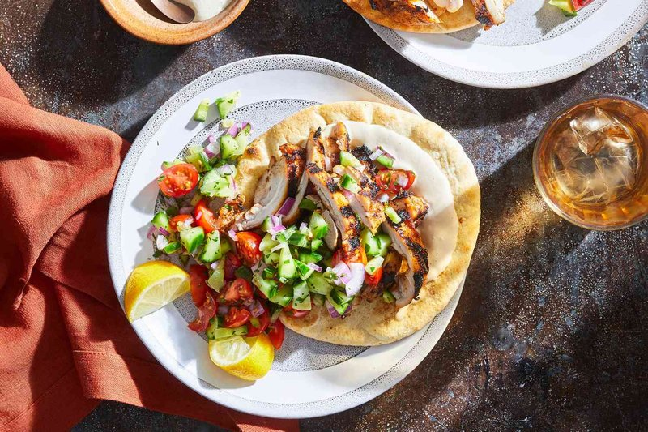

# Chicken Shawarma

*The Israeli street staple: boneless chicken thighs marinated overnight in baharat, garlic, turmeric, lemon and yogurt, then stack-roasted, sliced into pita.*

**Serves:** 4

**Prep Time:** 20 minutes (plus 6 hours marinating)

**Cook Time:** 30 minutes

## Overview
Chicken thighs marinate 6+ hours in baharat, turmeric, paprika, cumin, garlic, yogurt, lemon, olive oil. Stacked or spread on a tray (the home shortcut), roasted hot 25 minutes turning once, finished briefly under the grill until charred edges. Sliced thin and stuffed into pita with all the accompaniments.

## Ingredients

### Marinade
- 1 kg boneless skinless chicken thighs (whole)
- 4 tablespoons olive oil
- 4 tablespoons natural yogurt
- 1 lemon (juice)
- 6 garlic cloves (crushed)
- 1 tablespoon ground [Baharat](../../base-ingredients/spices/baharat.md)
- 1 tablespoon ground turmeric
- 1 tablespoon sweet paprika
- 1 ½ teaspoons ground cumin
- 1 teaspoon ground coriander
- ½ teaspoon ground cardamom
- 1 ½ teaspoons salt
- 1 teaspoon ground black pepper

### To serve
- 4 pita breads (large, warmed; split open)
- [Hummus](side-dishes/hummus.md)
- Salata (Israeli chopped salad)
- Pickled cucumbers (dill or sour)
- Pickled turnips (optional, pink lift)
- Tahina sauce (tahini + lemon + garlic + water)
- Amba (mango pickle, optional)
- Zhug (or sahawiq, chilli sauce)

## Method

### Stage 1 - Marinate
1. Whisk all marinade ingredients in a wide bowl.
1. Add chicken thighs; turn to coat thoroughly.
1. Cover; refrigerate 6 hours, ideally overnight.

### Stage 2 - Roast
1. Heat oven to 220°C (200°C fan).
1. Lay marinated chicken flat on a wire rack over a foil-lined tray.
1. Roast 22 minutes.

### Stage 3 - Finish under grill
1. Switch to grill on high heat.
1. Grill 4-5 minutes until edges are charred and the surface is darkly bronzed.

### Stage 4 - Rest and slice
1. Rest chicken 5 minutes.
1. Slice thin against the grain.

### Stage 5 - Assemble
1. Open warmed pitas like a pocket.
1. Spread hummus inside.
1. Pile shawarma; top with salata, pickles, tahina sauce drizzle, zhug, amba.
1. Wrap; eat.

## Notes
- **Thigh not breast:** Chicken thighs stay juicy through the marinade and high-heat cook. Breast goes dry.
- **High heat + grill finish:** Approximates the charred-vertical-spit edges of street shawarma.
- **Don't skip the amba:** Mango pickle is the Israeli signature touch that distinguishes Tel Aviv shawarma from its Levantine cousins.

## Storage
- Refrigerate cooked 3 days; reheat in a hot pan.
- Marinated raw chicken keeps 48 hours.
