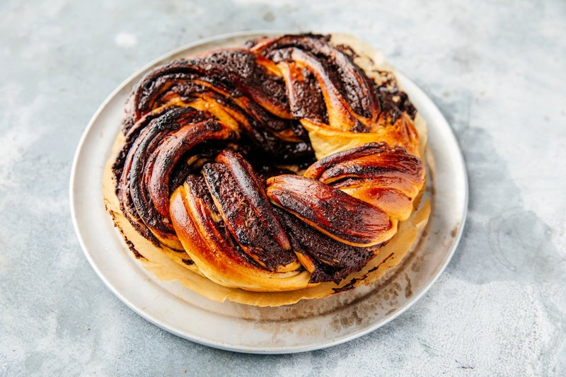

# Chocolate Babka

*The Polish-Jewish bakery braid: enriched dough rolled around dark chocolate and cinnamon, twisted into a tin and baked tall.*

**Serves:** Makes 2 large loaves

**Prep Time:** 45 minutes (plus 3 hours rising)

**Cook Time:** 35 minutes

## Overview
Brioche-style dough: bread flour, yeast, milk, eggs, butter, sugar, salt. Kneads 10 min till elastic; rises 1 ½ hours. Chocolate filling: dark chocolate + butter melted with cocoa, sugar, cinnamon, cools to spreadable. Dough divides in half; each rolls to a rectangle 40 × 25 cm; filling spreads to edges; rolls up tight; cuts lengthways down the middle; the two halves twist around each other (the iconic babka braid). Lifts into a buttered loaf tin; rises for 45 min; bakes for 35 min at 180°C. Sugar syrup brushes over hot.

## Ingredients

### Dough
- 500 g strong white bread flour
- 7 g instant yeast
- 80 g caster sugar
- 1 ½ teaspoons salt
- 180 ml warm milk
- 2 eggs (large)
- 1 egg yolk (large)
- 120 g unsalted butter (softened, cubed)
- 1 teaspoon vanilla extract

### Chocolate filling
- 150 g unsalted butter
- 200 g dark chocolate (70%)
- 100 g caster sugar
- 30 g cocoa powder
- 2 teaspoons ground cinnamon
- ½ teaspoon salt

### Sugar syrup glaze
- 80 g caster sugar
- 80 ml water
- 1 teaspoon vanilla extract

## Method

### Stage 1 - Dough
1. In a stand mixer with dough hook, combine flour, yeast, sugar and salt.
1. Pour in warm milk, eggs, egg yolk and vanilla.
1. Mix on low 3 minutes till shaggy.
1. Add the softened butter cubes 1-2 at a time, mixing on medium speed; let each absorb before adding the next.
1. Once all butter is in, knead on medium 8-10 minutes till smooth, elastic, and slightly tacky.
1. Tip into a lightly oiled bowl; cover; rise 1 ½ hours till doubled.

### Stage 2 - Chocolate filling
1. Melt the butter and chocolate together in a heatproof bowl over simmering water (or in a microwave in 30-second bursts).
1. Whisk in the sugar, cocoa, cinnamon and salt.
1. Cool to a spreadable paste (15 minutes at room temp).

### Stage 3 - Shape
1. Knock back the risen dough; divide in half.
1. Roll one portion on a lightly floured surface to a rectangle 40 × 25 cm.
1. Spread half the chocolate filling evenly to the edges (use an offset spatula).
1. Roll up from the long edge into a tight cylinder.
1. Pinch the seam to seal.
1. With a sharp knife, cut the cylinder lengthways down the middle (exposing the swirls).
1. Twist the two halves around each other 2-3 times, keeping the cut sides up so the pattern shows.
1. Lift into a buttered 23 cm loaf tin (line with parchment for easy release).
1. Repeat for the second portion.

### Stage 4 - Second rise
1. Cover loosely; rise 45-60 minutes till the dough rises to the rim of the tin.

### Stage 5 - Bake
1. Heat the oven to 180°C (160°C fan).
1. Bake 30-35 minutes till deep gold and a skewer comes out with melted chocolate but no raw dough.
1. If the top browns too fast, cover loosely with foil after 20 minutes.

### Stage 6 - Sugar syrup
1. While baking, combine sugar and water in a small pan; bring to a simmer; cook 2 minutes; off heat; stir in vanilla.

### Stage 7 - Glaze
1. As soon as the babka comes out, brush generously with the warm sugar syrup.
1. The crust drinks the syrup, giving the iconic glossy moist top.

### Stage 8 - Cool
1. Cool 20 minutes in the tin.
1. Lift out using the parchment.
1. Slice when fully cool (warm babka shreds; cold babka cuts clean).

## Notes
- **Soft butter into the dough slowly:** the brioche technique. Adding all butter at once breaks the dough's gluten structure; piece by piece lets it absorb cleanly.
- **Cool the chocolate filling to SPREADABLE, not hot:** hot filling melts the dough during rolling. Spreadable = the consistency of softened cream cheese.
- **Cut and twist for the swirl:** the dramatic cross-section comes from cutting the rolled cylinder open and twisting the halves. A solid spiral roll looks less impressive sliced.
- **Sugar syrup gives the glossy top:** without it the babka is pale and matte. Don't skip.

## Storage
- Keeps 3 days at room temperature wrapped in foil.
- Wrap remaining slices individually; freeze 2 months; thaw at room temp 1 hour.
- French-toast stale babka is one of life's great pleasures.
