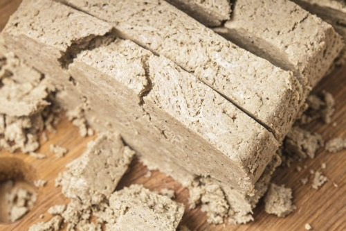

# Halva

*Eastern Mediterranean sesame halva: hot sugar syrup pulled into tahini until it marbles, then set in slabs and sliced with strong coffee.*

**Serves:** Makes about 700 g (cut into 20 small pieces)

**Prep Time:** 20 minutes (plus 4 hours setting)

**Cook Time:** 15 minutes

## Overview
Halva is the Middle Eastern tahini fudge, flaky-melting blocks of crystallised sugar syrup whipped into tahini, perfumed with cardamom and topped with pistachios, sold by weight at every market across the Levant. A sugar syrup cooks to soft-ball stage (118°C). Tahini warms slightly. The hot syrup pours into the tahini and mixes with a wooden spoon just until ribbons form, this is the critical moment. Over-mix and halva turns to crumbs; under-mix and it stays soft. Pour into a lined tin; sprinkle pistachios on top; set at room temperature for four hours. Cut into thick squares; eat with strong coffee.

## Ingredients
- 500 g tahini (smooth, well-stirred, old separated tahini won't work)
- 400 g caster sugar
- 150 ml water
- 1 tablespoon liquid glucose (or honey, prevents crystallisation)
- 1 teaspoon vanilla extract
- A pinch of salt
- 50 g pistachios (chopped, for topping)

### Optional swirls
- 50 g dark chocolate (melted, for marbling)

### Equipment
- Candy thermometer
- 20 × 10 cm loaf tin (lined with parchment)

## Method

### Stage 1 - Warm tahini
1. Stir the tahini in its jar very thoroughly until completely smooth (any separated oil must be re-incorporated).
1. Tip into a heavy bowl; place over a pan of warm (not hot) water to bring it to about 35°C, body temperature.

### Stage 2 - Sugar syrup
1. In a heavy saucepan, combine the sugar, water and glucose.
1. Place over medium heat; stir until the sugar dissolves.
1. Stop stirring; clip on a thermometer.
1. Simmer until it reaches 118°C (soft-ball stage, about 5-7 minutes).

### Stage 3 - Combine
1. Add the salt and vanilla to the warm tahini.
1. While the syrup is still at 118°C, pour it into the tahini in a slow steady stream while stirring with a wooden spoon.
1. Stir JUST until the mixture comes together into a thick, slightly streaky paste, about 10-15 strokes.
1. STOP MIXING. Over-mixing turns halva grainy and crumbly.
1. The mixture should be marbled with light and dark streaks, not uniformly smooth.

### Stage 4 - Add swirls (optional)
1. Pour the halva mixture into the parchment-lined tin.
1. If using chocolate, drizzle the melted chocolate in lines across the surface and pull a skewer through to marble.
1. Scatter pistachios over the top; press lightly so they adhere.

### Stage 5 - Set
1. Rest at room temperature 4 hours.
1. Then refrigerate at least 12 hours (overnight is better) to fully set.

### Stage 6 - Serve
1. Lift out using the parchment.
1. Slice into thin slabs with a sharp knife.
1. Eat at room temperature.

## Notes
- **Tahini quality is everything:** old, oil-separated tahini won't bind. Fresh, well-stirred, brand-name tahini (Soom, Al Arz, Joyva) gives the best results.
- **Stop stirring at first sign of ribbons:** this is the single hardest thing. Over-stir = crumbly halva; under-stir = soft / weeping halva. Practice helps.
- **Soft-ball stage is non-negotiable:** lower syrup temp gives unset halva; higher gives brittle. Use a thermometer.
- **Don't refrigerate during initial setting:** halva sets best at cool room temperature first. Refrigeration too early gives a chalky texture.

## Storage
- Keeps 1 month at cool room temperature in a sealed container.
- Don't refrigerate long-term, it goes hard and chalky.
- Cut just before serving for clean slices.
- Crumbles excellently over yogurt with a drizzle of date syrup (silan).
