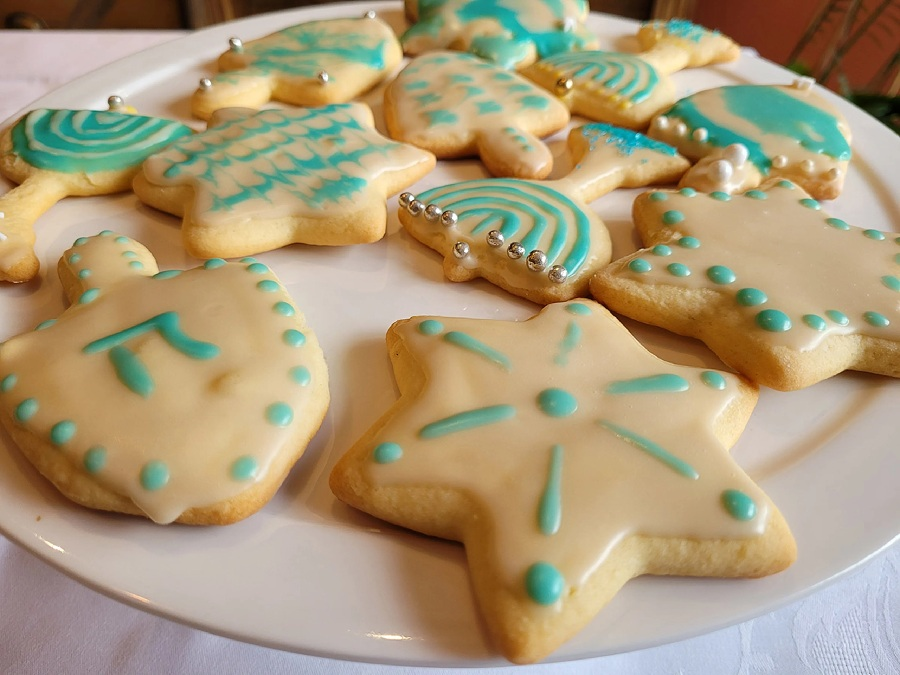

# Hanukkah Biscuits

*Buttery sugar-cookie biscuits cut into menorahs, dreidels, Stars of David. Iced in blue and white, scattered with sprinkles, decorated by the kids while the table is busy with the rest of the cooking. Eaten by the trayful through the eight nights.*

**Serves:** 12 biscuits

**Prep Time:** 30 minutes (plus 1 hour chilling)

**Cook Time:** 12 minutes

## Overview
A classic vanilla shortbread-style dough rolled and stamped with festival cutters. Butter and sugar creamed pale, an egg and vanilla beaten in, plain flour folded through to give a firm rollable dough. Chilled an hour for the gluten to relax (rolls out cleanly without springback), then rolled, cut, and baked until the edges are just golden - pale at the centre. Cooled, then iced with a simple royal icing tinted blue and white, decorated freely.

## Ingredients

### The biscuits
- 200 g unsalted butter (softened)
- 150 g caster sugar
- 1 large egg
- 1 teaspoon vanilla extract
- 350 g plain flour (plus extra for dusting)
- A small pinch of fine sea salt

### The icing
- 1 large egg white
- 250 g icing sugar (sifted)
- ½ teaspoon lemon juice
- Blue food colouring (gel works best for clean colour)
- Sprinkles, edible silver balls, etc. for decorating

## Method

### Stage 1 - Make the dough
1. In a wide bowl or stand mixer, cream the softened butter and caster sugar for 3-4 minutes until pale and fluffy.
2. Beat in the egg and vanilla until smooth.
3. Sift the flour and salt over the mixture. Fold in with a spatula until just combined - over-mixing makes tough biscuits.
4. Gather into a flat disc, wrap in cling film, and chill for at least 1 hour. The dough firms enough to roll cleanly.

### Stage 2 - Roll and cut
1. Heat the oven to 170°C fan / 190°C / 375°F. Line two baking trays with baking paper.
2. Tip the dough onto a lightly floured worktop and roll to about 5 mm thick. The dough is short - work in sections if the whole disc cracks at the edges.
3. Stamp out shapes with festival cutters: menorahs, dreidels, Stars of David, doves. Re-roll the scraps once (twice and the dough gets tough).
4. Transfer to the lined trays with a palette knife, leaving 2 cm between biscuits - they spread only a little.

### Stage 3 - Bake
1. Bake for 10-12 minutes. The biscuits should be set and just golden at the edges, but still pale on top. They firm as they cool.
2. Lift off the tray onto a wire rack to cool completely before icing.

### Stage 4 - Make the icing
1. In a clean bowl, whisk the egg white briefly until foamy. Sift in the icing sugar a third at a time, beating between each, until you have a smooth thick icing. Stir in the lemon juice.
2. The icing should drop from the spoon in slow ribbons that hold their shape for a few seconds before flattening. Too thick: add a teaspoon of water. Too thin: a tablespoon more icing sugar.
3. Halve the icing. Tint one half blue with a drop of food colouring (start with one drop and add more for a deeper shade). Leave the other half white.

### Stage 5 - Decorate
1. Spoon or pipe the icing onto the cooled biscuits - spread to the edges with the back of a teaspoon or use a piping bag for outlines.
2. While the icing is still wet, scatter with sprinkles, silver balls or coloured sugar.
3. Leave to set on the rack for at least 30 minutes; the icing dries firm to the touch in an hour.

## Notes
- A children's job that adults will fight over once everyone tastes them. Let kids do the decorating - these are forgiving biscuits.
- For a fresher citrus note, replace the vanilla with the zest of 1 lemon.
- Royal icing dries to a clean snap; if you prefer a softer glaze, use 100 g icing sugar with 1 tablespoon water and a few drops of vanilla, no egg white.

## Serving
On a plate at the Hanukkah table after the meal, alongside the sufganiyot and latkes. With strong tea or hot chocolate during the candle-lighting.

## Storage
In a sealed tin at room temperature for up to 2 weeks (yes - biscuits keep). Stack in single layers separated by baking paper so the icing doesn't smudge.
