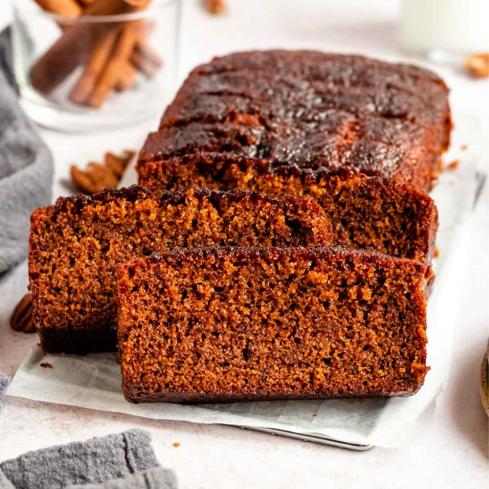

# Honey Cake

*Lekach. The Rosh Hashanah cake. Dark with honey and treacle, spiced with cinnamon and clove, kept moist by coffee and a generous slug of oil. The hopeful gesture on the New Year table: a sweet cake for a sweet year.*

**Serves:** 10-12 (one large loaf or one bundt)

**Prep Time:** 15 minutes

**Cook Time:** 1 hour

## Overview
A simple oil-based cake built around a generous pour of dark honey, brewed coffee for moisture and depth, and a quartet of spices (cinnamon, ginger, clove, allspice). Mixed in one bowl, baked low and slow. The crumb is dark and dense without being heavy; the flavour deepens overnight, which is why most Jewish households bake it a day or two ahead of the meal.

## Ingredients

### Wet
- 250 g dark honey (a strong-flavoured one if you can; chestnut or buckwheat is ideal)
- 60 g treacle (or dark muscovado syrup)
- 150 ml sunflower oil
- 200 ml strong black coffee (cooled to lukewarm)
- 3 eggs
- 80 g soft dark brown sugar
- 1 teaspoon vanilla extract

### Dry
- 300 g plain flour
- 1 ½ teaspoons baking powder
- ½ teaspoon bicarbonate of soda
- 1 teaspoon ground cinnamon
- 1 teaspoon ground ginger
- ½ teaspoon ground cloves
- ½ teaspoon ground allspice
- A small pinch of fine sea salt

### To finish
- 2 tablespoons flaked almonds
- 1 tablespoon honey (for brushing)

## Method

### Stage 1 - Prepare
1. Heat the oven to 150°C fan / 170°C / 340°F. Line a 1 kg loaf tin or grease a 23 cm bundt tin generously. A dark cake on a long bake benefits from a low oven.

### Stage 2 - Mix
1. In a large bowl, whisk together the honey, treacle, oil and lukewarm coffee until smooth and a single colour.
2. Add the eggs one at a time, whisking each in. Whisk in the sugar and vanilla. The mixture will look loose and a little oily; that is right.
3. Sift the flour, baking powder, bicarbonate, spices and salt over the wet mixture. Fold with a spatula until just combined and no streaks of flour remain. Do not over-mix.

### Stage 3 - Bake
1. Pour into the prepared tin and tap once on the counter to settle. Scatter the flaked almonds over the top if using a loaf tin (skip if using a bundt).
2. Bake for 55-65 minutes. A skewer pushed into the centre should come out with a few moist crumbs but no wet batter. The top will have cracked along the length and the colour will be deep mahogany.
3. Cool in the tin for 15 minutes, then turn out onto a rack to finish cooling.

### Stage 4 - Glaze and rest
1. While the cake is still slightly warm, brush the top with the extra tablespoon of honey, warmed briefly until pourable.
2. Wrap the cooled cake in baking paper and rest at room temperature for at least 12 hours, ideally 24, before slicing. The crumb tightens, the spices deepen, the honey takes hold.

## Notes
- A strong dark honey makes the cake; supermarket clover honey will give a paler, less interesting result.
- For a pareve version (no dairy at all), as is traditional for the meat-served Rosh Hashanah dinner, use only oil and ensure the coffee is black. This recipe is already pareve.
- The cake keeps so well that some households bake two: one for Rosh Hashanah, one for Yom Kippur break-fast.

## Serving
Sliced thinly on a plate at the end of the Rosh Hashanah meal, with apples and a small bowl of honey alongside. A cup of strong coffee or sweet tea to drink.

## Storage
Wrapped in baking paper at room temperature for up to a week. Improves for the first 3 days, holds steady for 4 more.
