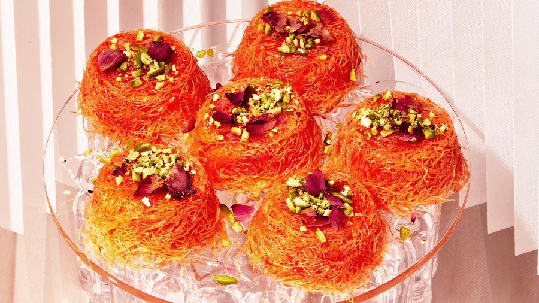

# Knafeh Muffins

*The Levantine dessert in muffin form. A base of buttered kataifi pastry, a generous layer of soft cheese, more kataifi on top, baked until the pastry crisps deep gold. As soon as they leave the oven, a rose-and-cardamom syrup goes over the lot. Scattered with pistachios. Cheese still pulling.*

**Serves:** 12 mini muffins

**Prep Time:** 25 minutes

**Cook Time:** 30 minutes (plus 15 minutes for syrup)

## Overview
Knafeh muffins are the individual portion version of the classical knafeh Nabulsi, the cheese-and-shredded-filo dessert from Nablus translated from a pan-sized layered showpiece into muffin-tin individual servings. Kataifi pastry (shredded filo) tosses with melted butter until every strand is gilded. Half goes into the cups of a buttered muffin tin and presses firm. A mix of ricotta and shredded mozzarella, lightly sweetened and scented with cardamom, fills the middle. The rest of the kataifi caps each muffin. Bake hot until the tops crisp deeply. A lukewarm sugar syrup scented with rose water and a touch of lemon pours over the moment they come out, the syrup hisses and soaks in. Eat warm, with the cheese still pulling.

## Ingredients

### The pastry
- 250 g kataifi pastry (thawed if frozen)
- 200 g unsalted butter (melted)
- ½ teaspoon fine sea salt

### The cheese filling
- 250 g ricotta (drained 30 minutes in a sieve)
- 200 g low-moisture mozzarella (shredded; soaked in cold water for 1 hour and drained if salty)
- 2 tablespoons caster sugar
- ½ teaspoon ground cardamom
- 1 tablespoon orange-blossom water

### The syrup
- 200 g caster sugar
- 100 ml water
- 1 tablespoon lemon juice
- 1 tablespoon rose water
- ½ teaspoon orange-blossom water (optional)

### To finish
- 50 g shelled pistachios (roughly crushed)
- A small pinch of dried rose petals (optional)

## Method

### Stage 1 - Make the syrup
1. In a small pan, combine the sugar, water and lemon juice. Heat gently, stirring until the sugar dissolves, then bring to a steady simmer for 8-10 minutes until the syrup coats the back of a spoon with a faint thread.
2. Take off the heat and stir in the rose water and orange-blossom water if using.
3. Leave to cool to lukewarm - you want it warm but not hot when it meets the hot muffins, for the best soak. The temperature gap is key.

### Stage 2 - Prepare the kataifi
1. Heat the oven to 190°C fan / 210°C / 410°F. Generously butter a 12-cup muffin tin.
2. Tip the kataifi into a wide bowl. Pull the strands apart with your fingertips so they are fluffy rather than packed in clumps. Snip through with kitchen scissors a few times to shorten the longest strands.
3. Pour over the melted butter and salt. Toss thoroughly with your hands until every strand is glossy. Some recipes blitz the buttered kataifi briefly in a food processor for a finer base; texture preference.

### Stage 3 - Mix the cheese
1. In a wide bowl, combine the drained ricotta with the shredded mozzarella, sugar, cardamom and orange-blossom water. Mix with a fork until the cheeses are evenly distributed.
2. The mixture should be soft and spoonable. Taste - if the mozzarella was salty, you may want a touch more sugar.

### Stage 4 - Assemble
1. Press about 1 ½ tablespoons of the buttered kataifi into each muffin cup, pushing down firmly with the back of a measuring spoon to compact the base into a tight nest.
2. Spoon a generous tablespoon of the cheese mixture on top of each, smoothing slightly with the back of the spoon so it sits level.
3. Cover with another 1 ½ tablespoons of the kataifi, pressing the top gently - firm enough to hold, light enough that the surface stays open so it crisps.

### Stage 5 - Bake
1. Bake for 28-30 minutes until the tops are deep golden and the edges are visibly crisp. The cheese should be melted and bubbling at the edges.
2. If the tops have set but are still pale, finish under a hot grill for 1-2 minutes - watch closely, kataifi goes from gold to scorched in seconds.

### Stage 6 - Soak and finish
1. As soon as the muffins come out of the oven, slowly pour or spoon the lukewarm syrup over each. They will hiss and drink it in.
2. Leave to rest in the tin for 5 minutes, then run a small palette knife around the edge of each and lift out.
3. Set the muffins on a serving plate, scatter generously with crushed pistachios and a pinch of dried rose petals if using.

## Notes
- Akkawi is the canonical cheese; a blend of ricotta and low-moisture mozzarella is the most accessible substitute and gives the right pull. If you can find a "knafeh cheese" blend at a Levantine grocer, use it.
- The buttered kataifi is forgiving - a single layer of unpacked strands turns wispy and lacy; a packed layer turns dense and biscuit-like. Both work; muffin-tin baking suits the packed version slightly better.
- For a vivid orange traditional knafeh nablusi look, add a pinch of red food colouring to the melted butter before tossing with the kataifi.

## Serving
Two per person on a plate while warm, with the pistachios scattered fresh on top. Strong unsweetened coffee or mint tea on the side. The temperature contrast is the dish: hot pastry, warm syrup, cool cheese still pulling.

## Storage
Best eaten the day they are made. Keep at room temperature, loosely covered, for 12 hours; reheat briefly in a 160°C oven for 5 minutes to refresh the crisp. Do not refrigerate - the cheese hardens and the kataifi softens.
