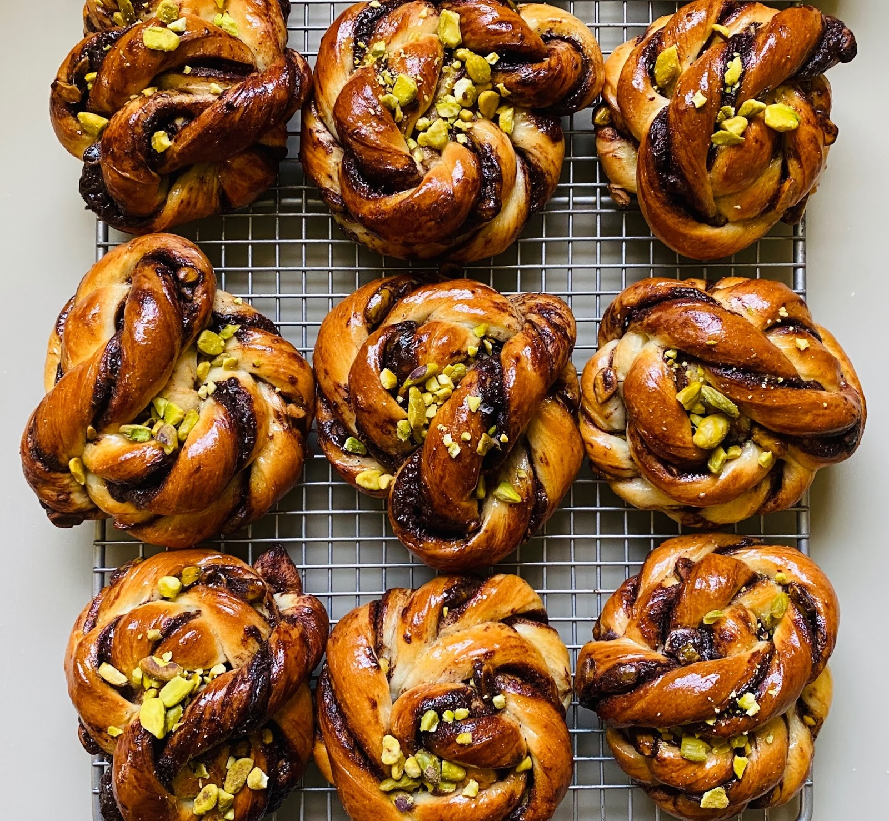

# Pistachio Babka Buns

*Individual babka spirals built from an enriched dough, filled with a sticky date-and-cinnamon paste, scattered with chopped pistachios, baked in a round tin so the buns rise into each other, and finished with a warm honey glaze. The result is the pull-apart babka loaf in single-portion form: soft, fragrant, sweet but not cloying.*

**Serves:** 7 buns

**Prep Time:** 30 minutes (plus 45 minutes first rise, 6 hours cold proof, 1 hour 30 minutes second rise)

**Cook Time:** 20 minutes

## Overview
A rich babka dough — milk, butter, egg, sugar, yeast — kneaded until silky, given a short warm rise, then cold-proofed overnight to deepen the flavour. The filling is a date paste loosened with hot water, spiked with cinnamon, scattered with chopped pistachios. The dough rolls into a long rectangle, gets the filling spread across, rolls back into a log and cuts into seven 5 cm spirals. The spirals go cut-side up in a round cake tin, rise until they touch, and bake hot. A honey-and-sugar syrup brushed over the buns as they leave the oven sets the top tacky-sweet.

## Ingredients

### The dough
- 265-330 g strong white bread flour (start with 265, add up to 330 as needed)
- 50 g golden caster sugar
- ¼ teaspoon fine sea salt
- 1 sachet fast-action dried yeast (7 g)
- 85 ml whole milk (lukewarm)
- 1 large egg (beaten)
- 60 g unsalted butter (softened)
- Sunflower oil (for the proving bowl)

### The filling
- 250 g pitted Medjool dates
- 90 ml just-boiled water (plus a little more if needed)
- 2 teaspoons ground cinnamon
- 100 g shelled pistachios (roughly chopped)

### The glazes
- 1 egg (beaten with a pinch of salt, for the egg wash)
- 50 g caster sugar
- 2 tablespoons honey
- 2 tablespoons water

## Method

### Stage 1 - Wake the yeast
1. Warm the milk in a small pan to barely-warm; it should feel pleasant on your wrist, not hot.
2. Pour a tablespoon or two of the warm milk into a small bowl, sprinkle in the yeast and a large pinch of the sugar. Stir briefly and set aside for 10 minutes. The mixture should foam visibly.

### Stage 2 - Mix the dough
1. In the bowl of a stand mixer fitted with the dough hook, combine 265 g flour, the remaining sugar and salt.
2. Make a well in the centre. Add the foamed yeast mixture (use the rest of the warm milk to rinse the yeast bowl into the flour), the beaten egg and the softened butter.
3. Mix on low until the ingredients come together as a rough ball, then increase to medium and knead for 5-6 minutes. The dough should look elastic and slightly shiny. If it stays sticky on the bowl walls, add more flour a tablespoon at a time, up to the 330 g maximum.

### Stage 3 - Rise then chill
1. Place the dough in a lightly oiled bowl, turn to coat, and cover with a clean tea towel. Leave at room temperature for 45 minutes until visibly puffed.
2. Move the bowl to the fridge and leave to slow-rise for at least 6 hours, ideally overnight. The cold proof deepens the flavour considerably.

### Stage 4 - Make the date paste
1. Chop the dates roughly if whole. Place in a heatproof bowl and pour over the just-boiled water. Cover and leave for 30 minutes; the dates collapse as they steam.
2. Tip into a food processor and blitz to a smooth, spreadable paste, adding more water a tablespoon at a time if too thick. You want the consistency of soft peanut butter, not pourable.
3. Stir in the cinnamon. Taste — it should be sweet and warm, with the cinnamon clearly present.

### Stage 5 - Shape
1. Lightly oil a 23 cm loose-bottom round cake tin and line the base with baking paper.
2. Tip the cold dough onto a lightly floured worktop. Roll out to a rectangle roughly 40 x 30 cm. The dough handles best while still cold; if it softens too much, slide onto a tray and chill for 15 minutes.
3. Spread the date paste evenly across the rectangle, leaving a 1 cm clear strip along one short edge.
4. Scatter the chopped pistachios over the paste.
5. Roll up tightly from the long short edge opposite the clear strip, pinching the seam to seal as you finish.
6. If the log has softened, lift onto a tray and chill for 20 minutes — a firm log slices cleanly; a soft one squashes. If the log is too long for your fridge, halve it.
7. With a sharp serrated knife, slice the log into seven equal pieces about 5 cm thick.
8. Arrange the slices spiral-side up in the prepared tin: one in the centre, six around it. Leave a small gap between each; they will rise to meet.

### Stage 6 - Final rise
1. Cover loosely with a tea towel and leave to rise in a warm spot for 1 to 1 ½ hours, until the buns have visibly puffed and are touching each other.

### Stage 7 - Bake and glaze
1. About 20 minutes before the rise finishes, heat the oven to 200°C fan / 220°C / 425°F.
2. Brush the tops of the buns lightly with the salted beaten egg.
3. Bake for 20 minutes, until deep golden and the tops sound hollow when tapped.
4. While they bake, make the honey syrup: combine the sugar, honey and water in a small pan over a low heat, swirling until the sugar dissolves and the syrup is glossy.
5. As soon as the buns come out of the oven, brush them generously with the warm syrup. Use all of it — the buns will drink it in.
6. Cool in the tin for 15 minutes, then lift out using the baking paper.

## Notes
- Medjool dates have the right sticky-soft texture for the paste; the pre-pitted, drier supermarket dates need an extra splash of water at the soak stage.
- Skipping the cold proof gives noticeably less complex buns; if you must, give the dough 1 hour 30 minutes at room temperature instead and accept a milder flavour.
- For a chocolate-and-pistachio version, replace the date paste with a mix of 100 g dark chocolate melted with 50 g butter and stirred with 1 teaspoon cinnamon.

## Serving
Pull a bun off the cluster, warm or at room temperature. Strong coffee or sweet tea alongside. Sits well on a Shabbat dessert plate or as a sweet entry on the Hanukkah morning table.

## Storage
Covered in an airtight container at room temperature for 3 days. The buns refresh well: 4-5 seconds in the microwave or 5 minutes in a 150°C oven brings back the warm fragrance.
