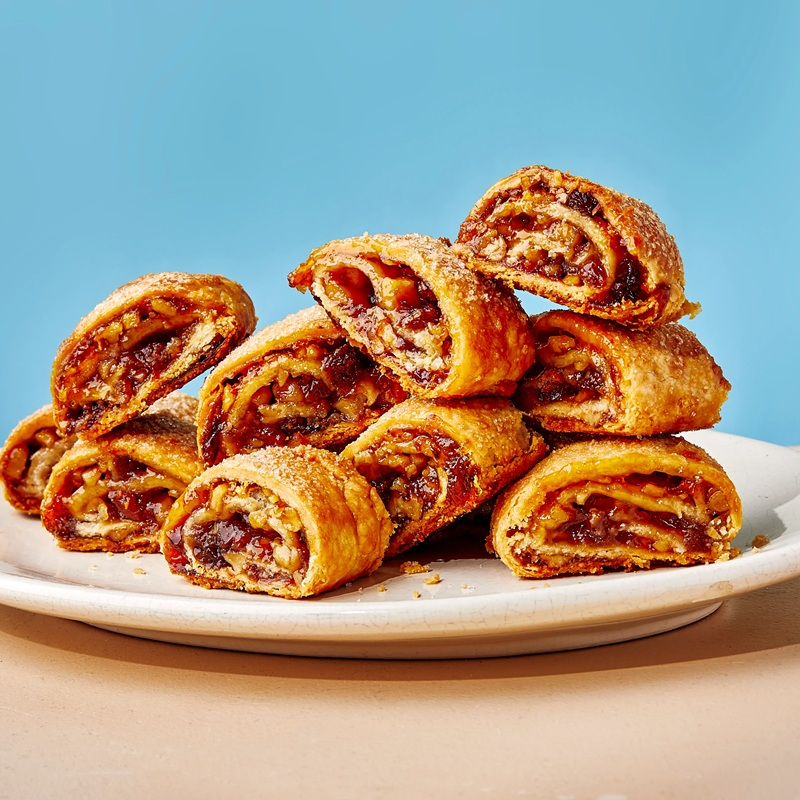

# Rugelach

*The Ashkenazi-Jewish crescent: a cream-cheese dough rolled around chocolate, jam or cinnamon-walnut filling, twisted into small curled pastries. Baked golden.*

**Serves:** Makes 32 rugelach

**Prep Time:** 45 minutes (plus 2 hours chilling)

**Cook Time:** 25 minutes

## Overview
Rugelach dough: equal weights butter and cream cheese, beaten together, with flour and salt, like a cream-cheese shortcrust. Chills for 2 hours. Filling (chocolate version): cocoa, sugar, butter, sometimes chopped chocolate. Dough divides into 4 portions; each rolls into a circle 28 cm across; spreads with filling; cuts into 8 triangular wedges like a pizza. Each wedge rolls up from the wide edge toward the point. Brushes with egg wash; dusts with sugar. Bakes for 22 minutes at 180°C.

## Ingredients

### Dough
- 250 g unsalted butter (cold, cubed)
- 250 g cream cheese (cold, cubed)
- 320 g plain flour
- 50 g caster sugar
- ½ teaspoon salt
- 1 teaspoon vanilla extract

### Filling (chocolate-walnut version)
- 80 g unsalted butter (softened)
- 80 g caster sugar
- 30 g cocoa powder
- 100 g dark chocolate (60-70%, finely chopped)
- 80 g walnuts (chopped fine)
- 1 teaspoon ground cinnamon

### Glaze
- 1 egg (beaten with 1 tablespoon milk)
- 2 tablespoons demerara sugar (for sprinkling)

## Method

### Stage 1 - Dough
1. In a stand mixer or with electric beaters, beat the cold butter and cream cheese until just combined (4-5 minutes on medium).
1. Add the sugar, salt and vanilla; beat briefly.
1. Add the flour all at once; mix on low until a dough comes together (don't overmix - toughens).
1. Tip out; divide into 4 equal portions.
1. Flatten each portion into a 12 cm disc; wrap in cling film.
1. Chill at least 2 hours (overnight is better).

### Stage 2 - Filling
1. In a small bowl, beat the softened butter with sugar, cocoa and cinnamon to a paste.
1. Stir in the chopped chocolate and walnuts.

### Stage 3 - Roll first portion
1. On a lightly floured surface, roll one chilled dough disc into a circle 28 cm across (about 3 mm thick).
1. Spread a quarter of the filling evenly to the edges (leave a tiny 5 mm border at the rim).
1. With a sharp knife or pizza cutter, slice the circle into 8 triangular wedges (like cutting a pizza).

### Stage 4 - Roll wedges
1. Starting at the wide outer edge of a wedge, roll up snugly toward the pointed tip.
1. Place on a parchment-lined baking tray with the point tucked underneath.
1. Repeat for all 8 wedges.

### Stage 5 - Repeat for the other 3 discs

### Stage 6 - Glaze
1. Heat the oven to 180°C (160°C fan).
1. Brush each rugelach with egg wash.
1. Sprinkle demerara sugar over the tops.

### Stage 7 - Bake
1. Bake 22-25 minutes till deep gold.
1. Lift onto a wire rack to cool (the filling is molten straight from the oven).

## Notes
- **Cold dough = flaky rugelach:** the cream cheese provides tang and tenderness, but only if the dough stays cold during shaping. If it warms while you work, return it to the fridge for 15 minutes.
- **Don't roll too thin:** below 3 mm and the dough tears when wrapping the filling.
- **The wide-edge-first roll is the technique:** rolling toward the point means the loose end ends up underneath. Try it the wrong way once to see why it doesn't work.
- **Variation: apricot-jam-and-cinnamon-sugar:** swap the chocolate-walnut filling for 3 tablespoons apricot jam + a sprinkle of cinnamon-sugar + 80 g chopped walnuts per disc.

## Storage
- Keeps 1 week at room temperature in a sealed tin.
- The flavour improves on day 2 as the dough hydrates.
- Freezes baked, 2 months; thaw at room temp 30 minutes.
