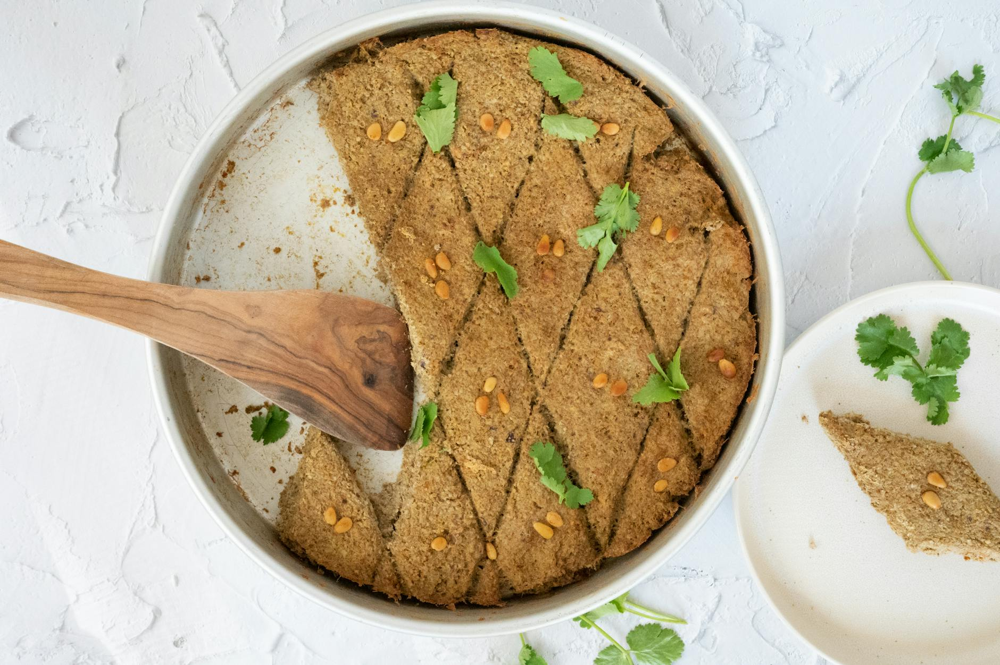

# Tray-Baked Kibbeh

*The lazier cousin of the fried football kibbeh. Bulgur and beef bound in the food processor with baharat and onion, pressed flat in a tin, scored into diamonds, scattered with pine nuts and baked until firm and burnished. The honest one-tray version of the Levantine staple.*

**Serves:** 4

**Prep Time:** 25 minutes

**Cook Time:** 45 minutes

## Overview
Kibbeh is the baked-tray version of the Levantine bulgur-and-meat dish, smooth bulgur and lamb mince pressed into a dish, scored into diamonds and baked until the surface darkens, the everyday Iraqi-Jewish home cook's answer to the elaborate stuffed-and-fried versions. Smooth bulgur softens in hot water, then drains dry. Onion blitzes with baharat, salt and a splash of water to a slurry. Beef mince adds and pulses; bulgur folds through last so its grains stay intact rather than dissolving into the paste. The mixture presses into an oiled tin, smooths flat, then scores into 5 cm diamonds with a sharp knife. Each diamond takes a small handful of pine nuts pressed onto its surface, plus a brush of olive oil. The tin bakes hot until the surface darkens and the inside firms up. Cut along the score lines, lift the diamonds out, serve with tahini sauce and a chopped salad.

## Ingredients

- 1-2 tablespoons olive oil (plus extra for the tin)
- 185 g smooth (fine) bulgur wheat
- 1 medium brown onion (peeled, quartered)
- 1 teaspoon baharat (Middle Eastern spice mix)
- ¾ teaspoon fine sea salt
- A generous grind of black pepper
- 2 tablespoons cold water
- 500 g lean beef mince (5% fat)
- 20 g pine nuts

### To serve
- A small bowl of tahini sauce (tahini whisked with cold water, lemon juice and a small clove of garlic)
- A chopped tomato-cucumber-parsley salad
- Warm pita

## Method

### Stage 1 - Soften the bulgur
1. Lightly oil a 30 x 20 cm square or rectangular baking tin (the shape matters less than the surface area - aim for a 1.5 cm thick finished layer).
2. Tip the bulgur into a heatproof bowl and pour over enough just-boiled water to cover by 1 cm.
3. Leave for 15 minutes to soften and absorb. Drain in a fine sieve and press the back of a spoon against the bulgur to squeeze out any extra moisture. You want it tender but not soggy.

### Stage 2 - Build the mixture
1. In the bowl of a food processor, combine the quartered onion, baharat, salt, pepper and water. Blitz to a smooth, slightly wet paste - 30 seconds or so.
2. Add the beef mince. Pulse 6-8 times until well combined and slightly tackier than the raw mince started.
3. Tip in the drained bulgur. Pulse 4-5 short times, just until the bulgur is distributed and bound into the mixture. Stop while you can still see individual grains.
4. Tip the contents into a wide bowl and knead by hand for 30 seconds to make sure everything is uniformly mixed. The mixture should hold together in a soft, slightly wet mass.

### Stage 3 - Shape in the tin
1. Heat the oven to 180°C fan / 200°C / 400°F.
2. Press the mixture into the oiled tin in an even layer. Use the back of a metal spoon (or a flat-bottomed glass) to flatten and smooth the surface - uniformly level is what gives the diamonds their clean lines.
3. With a sharp knife, score the surface into 5 cm diamond shapes. Start by drawing two long diagonals corner-to-corner, then add parallel lines on either side. Cut about 5 mm deep - you don't need to cut through.
4. Brush the surface generously with olive oil, getting into the score lines.
5. Press 2-3 pine nuts onto the surface of each diamond.

### Stage 4 - Bake
1. Bake for 40-45 minutes, until the surface is deeply browned and the kibbeh feels firm when pressed in the centre.
2. If the tops are colouring too fast, drop the oven 10°C for the last 10 minutes.
3. Let the tray rest for 5 minutes before cutting - the kibbeh firms further as it cools.

### Stage 5 - Serve
1. Cut along the scored diamonds with a thin knife and lift them out with a palette knife.
2. Arrange on a wide warm plate with the tahini sauce drizzled around (or pooled in a small bowl) and the chopped salad piled on the side.

## Notes
- Smooth (fine) bulgur is essential - coarse bulgur gives a gritty bake. If only coarse is available, blitz it briefly in a clean spice grinder first.
- Baharat is the Middle Eastern warm-spice mix (paprika, black pepper, cumin, coriander, cardamom, cinnamon, cloves, nutmeg). If you don't have it, mix 1 teaspoon allspice with ½ teaspoon black pepper and a pinch each of cinnamon and cumin.
- A traditional layered tray-kibbeh (kibbeh bil saneeyeh) layers a meat-and-onion filling between two layers of the bulgur mixture; the single-layer version here is the everyday weeknight version.

## Serving
Two diamonds on a plate with tahini, salad and warm pita. As a starter with a wedge of lemon to squeeze over. On a wide mezze platter alongside hummus, baba ganoush and olives.

## Storage
In a sealed container in the fridge for up to 3 days. The texture sets firmer overnight; reheat in a low (160°C) oven for 10 minutes to warm through, covered loosely with foil to keep the surface from drying.
