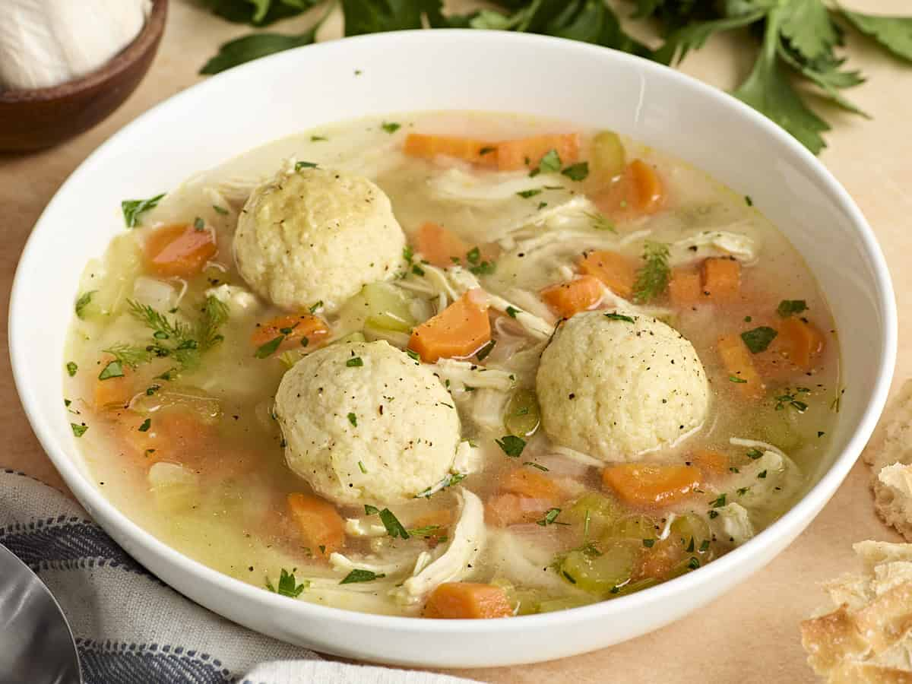

# Matzo Ball Soup

*The Passover soup. Light, fluffy matzo balls floating in a clear, deeply chicken-y broth, with carrots, dill and a slick of golden schmaltz on the surface. The opening of the seder meal, and the recovery food for everything else.*

**Serves:** 6

**Prep Time:** 20 minutes (plus 1 hour chilling)

**Cook Time:** 2 ½ hours

## Overview
Matzo ball soup is the Jewish-American comfort dish, light fluffy matzo dumplings floating in a clear golden chicken broth, the bowl that anchors every Passover seder and every Jewish-grandmother-style remedy for a cold. Two parallel jobs: a long-simmered chicken broth made from a whole bird with onion, carrot and celery, skimmed clean and finished with dill; and the matzo balls themselves, made from matzo meal, eggs, schmaltz and seltzer, rested in the fridge for the gluten to relax. The balls poach in salted water (never the broth, or the broth clouds), then sit in the hot broth at serving time. Light, comforting, traditional. Eat with a wedge of challah on the side.

## Ingredients

### The broth
- 1 whole chicken (about 1.6 kg)
- 2 onions (peeled, halved)
- 3 carrots (peeled, halved lengthways)
- 3 celery sticks (halved)
- 1 small bunch of parsley stalks
- 1 small bunch of dill stalks (save the fronds for the bowls)
- 2 bay leaves
- 1 teaspoon black peppercorns
- 1 ½ teaspoons fine sea salt (plus more to taste)
- 3 litres cold water (enough to cover)

### The matzo balls
- 120 g matzo meal
- 4 large eggs
- 60 g schmaltz (chicken fat) melted (or 60 ml light olive oil)
- 4 tablespoons sparkling water (seltzer)
- 1 teaspoon fine sea salt
- A generous grind of black pepper
- A small pinch of ground ginger (optional)

### To finish
- 2 carrots (peeled, sliced into 5 mm rounds)
- 2 tablespoons chopped fresh dill

## Method

### Stage 1 - Start the broth
1. Place the chicken in a large stockpot with the onions, carrots, celery, parsley and dill stalks, bay leaves, peppercorns and salt. Cover with cold water by 2 cm.
2. Bring slowly to a simmer over a medium heat, about 20 minutes. As the water heats, a grey foam will rise: skim it off with a spoon.
3. Once simmering, drop the heat to low so the surface just trembles. Cook gently for 2 hours, skimming once or twice more. Hard boiling clouds the broth.
4. Lift the chicken out and set on a board to cool. Strain the broth through a fine sieve into a clean pan. Taste and adjust salt: a properly seasoned broth carries the soup.

### Stage 2 - Make the matzo ball mix
1. In a medium bowl, whisk the eggs with the schmaltz, seltzer, salt, pepper and ginger if using.
2. Stir in the matzo meal until just combined. The mixture will look loose and pourable, but it firms up considerably as it rests.
3. Cover and chill for at least 1 hour, up to overnight. The matzo absorbs the liquid and the mixture turns scoopable.

### Stage 3 - Shape and poach
1. Bring a large pan of well-salted water to a gentle simmer.
2. With wet hands, scoop walnut-sized portions of the matzo mix and roll lightly into balls, do not pack tight or they will sink leaden. You should get 12-14 balls.
3. Slide the balls into the simmering water, cover with a tight lid, and cook for 30 minutes without lifting the lid. They will double in size and float to the surface.
4. Lift out with a slotted spoon onto a plate.

### Stage 4 - Bring it together
1. Bring the broth back to a low simmer. Add the sliced carrots and cook for 8-10 minutes, until tender.
2. Pull a little of the cooked chicken meat off the bones, shred it, and add a small handful to the broth (optional, but worth it).
3. Lower the matzo balls into the hot broth to warm through for 2-3 minutes.

### Stage 5 - Serve
1. Ladle the broth into wide bowls with 2 matzo balls per person, a few slices of carrot, a little shredded chicken and a generous scatter of dill fronds.

## Notes
- Light, "floater" matzo balls come from a soft mix and a covered, undisturbed poach. Tight, "sinker" balls come from a stiffer mix and rougher handling, some families prefer them. Both are correct in someone's grandmother's kitchen.
- Schmaltz (rendered chicken fat) is the traditional choice and gives the balls their characteristic flavour. Render it from chicken skin and fat over a low heat, or buy a jar from a kosher grocer. Olive oil works and is what most modern households use.
- The broth can be made a day ahead and the matzo mix overnight; that splits the workload across two evenings.

## Serving
- At the start of the seder meal in shallow bowls. A wedge of lemon on the side is optional but bright.

## Storage
Broth keeps 4 days in the fridge, 3 months in the freezer. Cooked matzo balls keep in a covered container in the fridge for 3 days; warm them gently in fresh broth.
