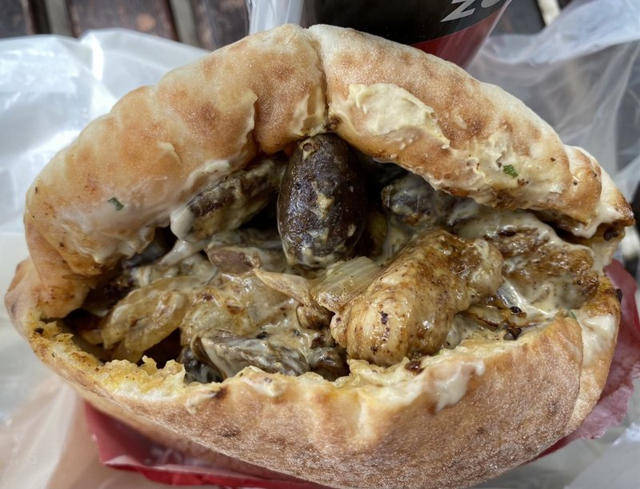

# Me'orav Yerushalmi (Jerusalem Mixed Grill)

*Jerusalem's market mixed grill: chicken hearts, livers, spleen and lamb chunks hit hot on a flat-top with onion, baharat and turmeric. Stuffed into pita.*

**Serves:** 4

**Prep Time:** 20 minutes

**Cook Time:** 20 minutes

## Overview
A mix of chicken livers, hearts, spleen (if you can get it) and small chunks of lamb shoulder, all hit hot on a flat griddle with sliced onion that cooks down sweet. Spice blend: baharat, turmeric, paprika, cumin, black pepper. Olive oil generously. Cooked fast in batches so nothing steams. Stuffed into pita with hummus, pickles, tahina and amba.

## Ingredients

- 400 g chicken livers (cleaned, trimmed of sinews)
- 200 g chicken hearts (halved, fat trimmed)
- 200 g lamb shoulder (cut into 2 cm chunks)
- 200 g chicken thigh (cut into 2 cm chunks)
- 2 large onions (sliced thin)
- 6 tablespoons olive oil (split)
- 4 garlic cloves (crushed)
- 2 tablespoons baharat
- 1 tablespoon ground turmeric
- 1 tablespoon sweet paprika
- 1 teaspoon ground cumin
- 1 teaspoon ground black pepper
- 1 ½ teaspoons salt
- 2 tablespoons fresh parsley (chopped)

### To serve
- 4 large pita breads (warmed)
- Hummus
- Tahina sauce
- Sliced pickles
- Amba (mango pickle)
- Salata (chopped salad)

## Method

### Stage 1 - Prep
1. Pat all the proteins very dry. The drier they are, the better the sear.

### Stage 2 - Onions
1. Heat 3 tablespoons oil in a wide heavy pan over medium-high.
1. Add the sliced onion; cook 12 minutes until deep gold.
1. Sprinkle with a pinch of salt; push to one side.

### Stage 3 - First batch (lamb + chicken thigh)
1. Add 1 tablespoon oil to the cleared half of the pan.
1. Add the lamb and chicken thigh chunks; sear hard 4 minutes, turning, until well-browned.
1. Mix into the onion side; sprinkle in half the spices; cook 1 minute.

### Stage 4 - Second batch (offal)
1. Push everything to the side. Add the remaining 2 tablespoons oil.
1. Add hearts; sear 3 minutes (they stay slightly pink inside).
1. Add livers; sear 2 minutes (still slightly pink at the centre - they go grainy if overcooked).
1. Add garlic and remaining spices; toss everything together.

### Stage 5 - Finish
1. Sprinkle with salt and pepper; scatter parsley.
1. Off heat.

### Stage 6 - Serve
1. Stuff into pita with hummus, pickles, tahina, amba, salata.
1. Or plate over rice.

## Notes
- **Livers slightly pink:** Overcooked liver turns chalky-grainy. Sear hard outside, just-pink inside.
- **Offal sourcing:** Chicken livers and hearts are at any butcher. Spleen is harder; skip if unavailable.
- **Stand back when frying offal:** It spits. A spatter screen helps.

## Storage
- Eat fresh. Refrigerate 2 days; reheat in a hot pan.
