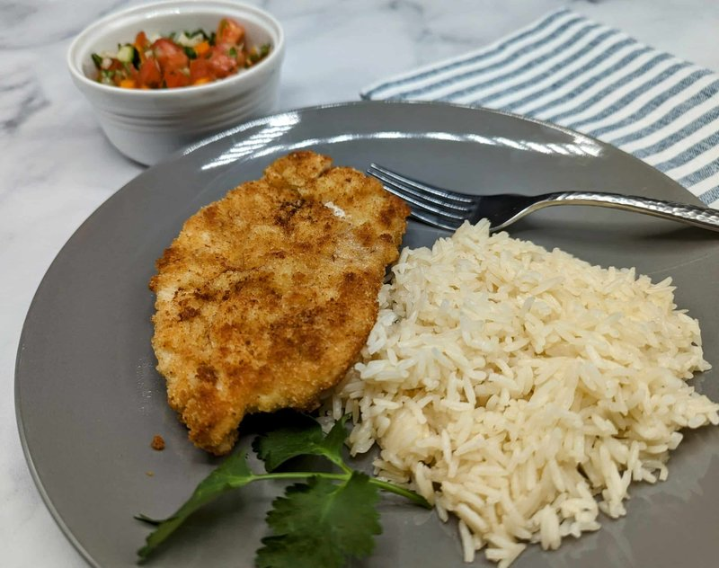

# Israeli Schnitzel

*Israel's national fast lunch: a thin chicken breast pounded flat, breaded with seasoned panko, deep-fried golden. Eaten in pita with hummus and pickles.*

**Serves:** 4

**Prep Time:** 20 minutes

**Cook Time:** 15 minutes

## Overview
Chicken breasts butterfly and pound to 5 mm thick. Dredge through seasoned flour, beaten egg, then panko breadcrumbs mixed with paprika, garlic powder and a pinch of cumin. Shallow-fry in 1 cm of oil at 175°C 2-3 minutes per side until deep gold and crisp. Drain on paper. Lemon wedges.

## Ingredients

- 4 chicken breasts (about 200 g each)
- 100 g plain flour (seasoned with 1 tsp salt, 1 tsp paprika, ½ tsp pepper)
- 3 eggs (large, beaten with 1 tablespoon water)
- 200 g panko breadcrumbs
- 2 teaspoons sweet paprika
- 1 teaspoon garlic powder
- 1 teaspoon ground cumin
- 1 teaspoon salt
- ½ teaspoon ground black pepper
- 300 ml vegetable oil for frying

### To serve
- Lemon wedges
- Israeli salata
- Pita (or rice)

## Method

### Stage 1 - Butterfly and pound
1. Lay each chicken breast flat. Cut in half horizontally to butterfly.
1. Place each piece between two sheets of cling film.
1. Pound with a meat mallet (or rolling pin) to 5 mm thick.

### Stage 2 - Dredge setup
1. Three shallow dishes:
   1. Seasoned flour
   2. Beaten egg + water
   3. Panko mixed with paprika, garlic powder, cumin, salt, pepper

### Stage 3 - Coat
1. Dredge each cutlet: flour → egg → panko. Press the panko firmly to coat.
1. Set on a tray. Refrigerate 10 minutes for the coating to set.

### Stage 4 - Fry
1. Heat 1 cm of oil in a wide heavy pan to 175°C.
1. Fry cutlets 2-3 minutes per side until deep gold and cooked through.
1. Drain on a wire rack.

### Stage 5 - Serve
1. Eat warm with lemon wedges and Israeli salad, or in a pita with hummus and pickles, or with rice.

## Notes
- **Pound thin:** 5 mm is right. Thicker schnitzel takes longer to cook through and the panko burns first.
- **Refrigerate after coating:** Helps the panko adhere during frying.
- **Wide pan:** Cook in batches if your pan can't hold 2 cutlets side-by-side. Crowding drops the oil temperature.

## Storage
- Best fresh, eaten warm. Re-crisp at 200°C 5 minutes.
- Refrigerate 2 days max - the coating softens.
