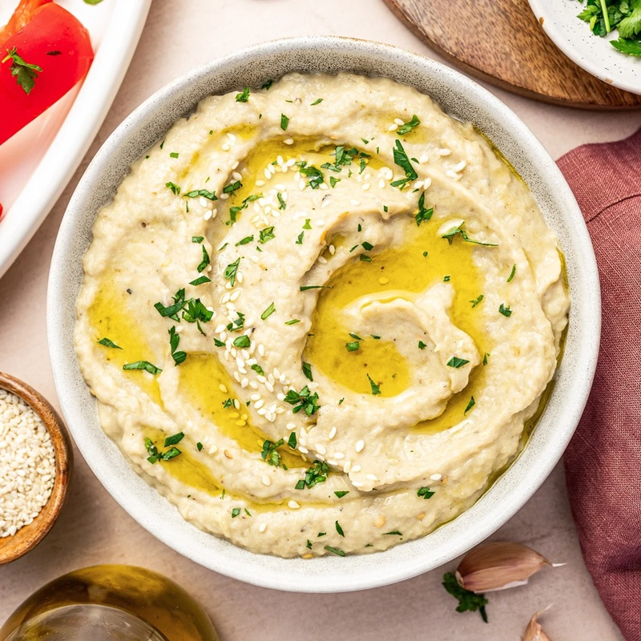

# Baba Ganoush

*The Levantine smoky aubergine dip: flame-charred aubergine mashed with tahini, lemon and garlic, finished with olive oil, pomegranate and parsley.*

**Serves:** 4 as a mezze

**Prep Time:** 10 minutes

**Cook Time:** 25 minutes

## Overview
Baba ganoush is the Levantine smoky aubergine dip, fire-charred whole aubergines mashed with tahini, lemon and garlic, served pooled with olive oil and crowned with pomegranate seeds. Aubergines char directly on a gas flame or under a hot grill until the skin is uniformly black and the flesh is collapsed inside. Steam briefly under foil (this is the trick that loosens the skin); peel. The flesh chops, then mashes with tahini, lemon, garlic and salt (don't blend; the rough texture is the point). Plate in a wide bowl; pool olive oil on top; scatter pomegranate seeds and chopped parsley. Eat warm with pita and crudités.

## Ingredients

- 2 aubergines (large, about 700 g)
- 4 tablespoons tahini (good quality)
- 2 garlic cloves (crushed to a paste with ½ tsp salt)
- 1 lemon (juice)
- ½ teaspoon ground cumin
- ½ teaspoon salt (to taste)
- 2 tablespoons olive oil

### To finish
- 1 tablespoon olive oil (to drizzle)
- 2 tablespoons pomegranate seeds
- 2 tablespoons fresh parsley (chopped)
- ½ teaspoon sumac (optional)

## Method

### Stage 1 - Char
1. Set aubergines directly on a gas flame, or under a very hot grill.
1. Rotate every 5 minutes until the skin is uniformly blackened and the flesh inside is completely collapsed (15-20 minutes total).

### Stage 2 - Steam
1. Tip aubergines into a bowl; cover; rest 10 minutes (the steam loosens the skin and finishes any uncooked spots).

### Stage 3 - Peel and drain
1. Peel off the burnt skin (it slides off); discard.
1. Place the flesh in a colander; let drain 5 minutes (removes excess water that would dilute the dip).

### Stage 4 - Mash
1. Chop the drained flesh roughly.
1. In a wide bowl, combine the aubergine, garlic-salt paste, tahini, lemon, cumin, salt, 2 tablespoons olive oil.
1. Mash thoroughly with a fork to a chunky but cohesive paste. Don't use a processor - the texture should be rustic.

### Stage 5 - Taste
1. Adjust salt, lemon, tahini. The dip should be smoky-forward with the lemon and garlic supporting.

### Stage 6 - Plate
1. Spread on a wide shallow plate, making ridges with the back of a spoon.
1. Drizzle olive oil over the surface.
1. Scatter pomegranate seeds, parsley, sumac (if using).

### Stage 7 - Serve
1. Eat with warm pita, alongside other mezze.

## Notes
- **Open flame is the dish:** Roasting in the oven gives a passable but lesser baba ganoush. Direct flame (gas hob, charcoal grill) gives the proper smoky depth.
- **Don't blend:** A food processor gives smooth, baby-food texture. Mash by hand for rustic chunks.
- **Drain the flesh:** Aubergine releases water as it sits; without draining the dip is loose and bland.

## Storage
- Refrigerate 4 days; bring to room temperature before serving.
