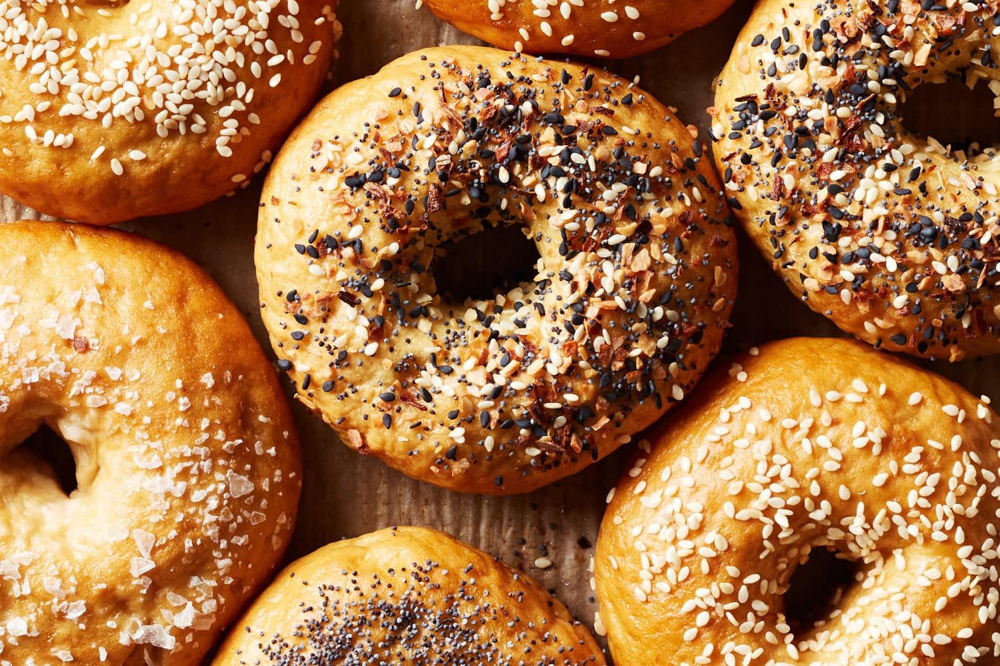

# Bagels

*The Yom Kippur break-fast staple, the Sunday morning ritual, the deli's reason for being. Boiled before they're baked: that's what gives bagels their dense chewy crumb and shiny crust. Plain, sesame or everything-seed; eaten split and toasted with cream cheese and lox.*

**Serves:** 8 (makes 8 bagels)

**Prep Time:** 25 minutes (plus 2 hours rising, overnight cold proof)

**Cook Time:** 25 minutes

## Overview
A stiff bread dough — much firmer than sandwich bread — kneaded long, given a first rise, divided and shaped into rings, cold-proofed overnight in the fridge for flavour development, then boiled briefly in a sweetened water bath before baking. The boil sets the crust and gives the characteristic shiny mahogany surface; the bake finishes the inside. Topped with seeds while wet so they stick.

## Ingredients

### The dough
- 600 g strong white bread flour (plus extra for dusting)
- 12 g fine sea salt
- 4 g instant yeast (½ sachet)
- 30 g malt syrup (or honey)
- 340 ml water (just-boiled, cooled to lukewarm)

### The boil
- 2 litres water
- 2 tablespoons malt syrup (or honey)
- 1 tablespoon bicarbonate of soda

### To finish
- 1 egg (beaten, for the wash)
- Toppings: sesame seeds, poppy seeds, "everything" mix (sesame + poppy + dried garlic + dried onion + flaky salt), or leave plain

## Method

### Stage 1 - Mix the dough
1. In a stand-mixer bowl, combine the flour, salt and yeast. Whisk briefly to distribute the yeast evenly.
2. Pour in the lukewarm water and malt syrup. Mix on low with the dough hook for 2 minutes until the dough comes together as a rough ball.
3. Switch to medium and knead for 8-10 minutes. The dough will look very firm — much firmer than a sandwich bread dough — and slightly tacky but not sticky. If it climbs the hook in a smooth column, you're done.
4. Shape into a ball, place in a lightly oiled bowl, cover, and leave to rise in a warm place for 1 ½ hours, until almost doubled.

### Stage 2 - Shape
1. Knock back gently and divide into 8 equal pieces (about 120 g each). Cover the pieces you're not working with under a damp cloth.
2. Shape each piece: form a smooth tight ball first, then push your thumb through the centre and stretch the hole to about 4 cm across. The dough will spring back — that's fine; the hole grows in the boil. Aim for an even ring, slightly thicker on the sides than the centre.
3. Place shaped bagels on a baking-paper-lined tray, leaving 4 cm between them.
4. Cover loosely with cling film and refrigerate for at least 8 hours, ideally 12-18. The cold proof builds the bagel's deep, slightly sour flavour and tightens the crumb structure.

### Stage 3 - Boil
1. Heat the oven to 230°C fan / 250°C / 480°F.
2. In a wide deep pan, bring the water, malt syrup and bicarbonate to a steady simmer.
3. Take the bagels out of the fridge. They'll be cold and firm; that's right. Test one: it should float when dropped into a bowl of cold water (the "float test"). If it sinks, give the rest another 30 minutes at room temperature.
4. Slide 2-3 bagels into the simmering water using a slotted spoon. Boil for 60 seconds per side, flipping with the slotted spoon. They'll puff and the skin will tighten.
5. Lift onto a wire rack to drain briefly, then transfer to a baking tray lined with fresh baking paper.
6. Brush each boiled bagel with beaten egg. Sprinkle generously with your chosen topping (or leave plain).

### Stage 4 - Bake
1. Bake at 230°C fan for 20-25 minutes, until the tops are deep mahogany and the bottoms are firm to a tap. Rotate the tray halfway through for even colour.
2. Cool on a wire rack for at least 20 minutes before slicing — bagels need to set as they cool, or the crumb is gummy.

## Notes
- Malt syrup (also sold as "barley malt syrup") gives bagels their characteristic flavour and crust colour. Find it in health-food shops or the kosher aisle. Honey works as a substitute but the result is sweeter and slightly paler.
- The overnight cold proof is non-negotiable for proper flavour. If you must speed-run, give the shaped bagels 30 minutes at room temperature and accept a milder, paler bagel.
- For the New York-style "everything" topping, mix equal parts white sesame, black sesame, poppy seeds, dried minced garlic and dried minced onion, with a tablespoon of flaky salt per 6 tablespoons of mix.

## Serving
Split, toasted, spread with cream cheese. The full deli treatment: cream cheese, smoked salmon, capers, paper-thin red onion, a thin slice of tomato, freshly cracked pepper. On the Yom Kippur break-fast table, the bagel is the anchor that everyone else builds around.

## Storage
At room temperature in a paper bag for 24 hours; after that, halve them and freeze. Toast straight from frozen. Never refrigerate whole bagels; the crumb goes stale faster than at room temperature.
