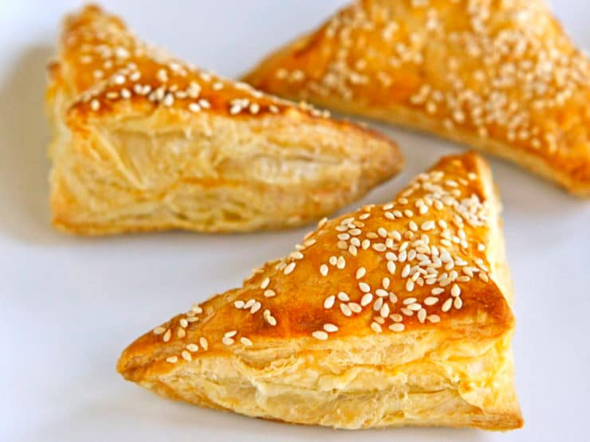

# Three-Cheese Bourekas

*The Israeli bakery staple in pull-from-the-tray form. Puff pastry triangles stuffed with feta, cottage cheese and mature cheddar, sealed with a fork crimp, scattered with sesame, baked golden. Eaten warm on their own or split and packed with hard-boiled egg, harissa and pickle - the proper bakery-window way.*

**Serves:** 4-6 (makes 15 triangles)

**Prep Time:** 20 minutes

**Cook Time:** 25 minutes

## Overview
Bourekas are the Israeli puff-pastry triangles, ready-rolled puff wrapped around a savoury cheese filling and baked until deep golden, the bakery counter staple that turns up in every Israeli supermarket and corner café. Ready-rolled puff pastry cuts into squares; a generous spoon of three-cheese filling on one corner; the opposite corner folds across to form a triangle; edges press and crimp with a fork to lock the filling in. Brush with beaten egg, scatter with sesame seeds, bake hot until puffed and deeply gold. The filling stays soft and salty against the buttery crisp pastry. To eat them properly, split each triangle along the long folded side and stuff with a slice of hard-boiled egg, a smear of harissa and a few pickled cucumber rounds, the classic Tel Aviv bakery breakfast.

## Ingredients

### The filling
- 75 g feta (crumbled)
- 50 g cottage cheese
- 50 g mature cheddar (grated)
- 2 large eggs (separated; one beaten for the filling, one for the wash)
- A generous grind of black pepper
- A pinch of fine sea salt (taste first - the feta is salty)

### The pastry
- 320 g ready-rolled all-butter puff pastry (one standard sheet, about 35 x 23 cm)
- 1-2 tablespoons sesame seeds (white, or a mix of white and black)

### To serve (optional)
- 4 hard-boiled eggs (sliced)
- 2 tablespoons harissa
- A small jar of pickled cucumbers (sliced)

## Method

### Stage 1 - Mix the filling
1. In a wide bowl, combine the feta, cottage cheese and cheddar. Mash and stir with a fork until evenly distributed but still a little chunky.
2. Season with black pepper. Taste before adding any salt - the feta brings most of it.
3. Beat one of the eggs into the cheese mixture until smooth. Set aside.

### Stage 2 - Cut the pastry
1. Heat the oven to 180°C fan / 200°C / 400°F. Line two baking trays with baking paper.
2. Unroll the puff pastry on a board. Trim a 2 cm strip off one short end and discard (the strip is uneven from rolling and won't seal cleanly).
3. Cut the remaining sheet into 15 squares of roughly 7 x 7 cm - three rows of five, or whatever pattern fits cleanest.

### Stage 3 - Fill and fold
1. Spoon a scant tablespoon of cheese filling onto one corner of each square. Flatten the mound slightly so it sits flat against the pastry.
2. Fold the opposite corner over the filling to form a triangle. Press firmly along the two cut edges to seal, pushing any trapped air out as you go.
3. If the pastry won't stick, brush the inner edges with a little of the second beaten egg or a touch of water.
4. Press all the way along the sealed edges with a fork to crimp - this both locks the seal and gives the bourekas their characteristic ridged pattern.
5. Arrange the triangles on the lined trays, spaced 2 cm apart.

### Stage 4 - Wash and bake
1. Brush the tops of each triangle with the second beaten egg.
2. Scatter generously with sesame seeds - they catch as the pastry bakes.
3. Bake for 20-25 minutes, until the bourekas are deeply golden, puffed and crisp. Rotate the trays halfway through if your oven cooks unevenly.
4. Lift onto a wire rack and cool for 5 minutes before serving - the filling is fierce-hot straight from the oven.

### Stage 5 - Stuff (optional)
1. To eat the bakery-window way: take a slightly-cooled boureka and slice halfway through the long folded edge, keeping the two halves joined like a clam. Don't cut all the way through.
2. Slide in a slice or two of hard-boiled egg, smear a quarter teaspoon of harissa across the cheese, and tuck in two or three pickle rounds.

## Notes
- Frozen puff pastry from the supermarket works perfectly - all-butter if you can find it, as it makes a noticeable difference. Block puff rolled out to 35 x 23 cm and 3 mm thick also works.
- For a meatier version (which is no longer kosher with the dairy filling, so pick one): replace the cheddar with 50 g of finely chopped, fried mushroom and a tablespoon of caramelised onion.
- The filling sets sharply as it cools; bourekas keep best at room temperature, then refresh briefly in a hot oven.

## Serving
On a wide platter at brunch, with the eggs/harissa/pickles arranged in small bowls so people can stuff their own. At a buffet alongside bowls of olives, hummus and salad. As a packed-lunch lunchbox item - they travel well.

## Storage
At room temperature for up to 24 hours in a sealed tin. Refresh in a 180°C oven for 5 minutes to bring back the crisp. Freeze unbaked: prepare to the egg-wash stage, freeze on a tray, transfer to a bag; bake from frozen with 5 extra minutes.
