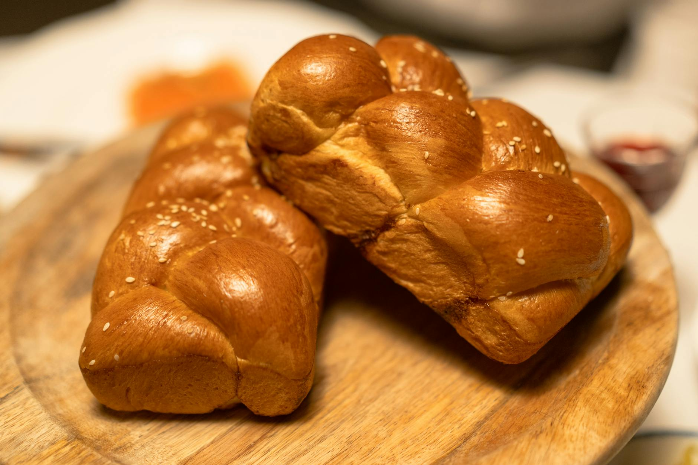

# Challah

*The braided Sabbath bread that doubles as the Hanukkah loaf. Egg-enriched, faintly sweet, with a deep mahogany crust from the egg wash and a tender, slightly stretchy crumb underneath. The braid is theatre but it's also structural, it gives every slice a pulled, ropy texture.*

**Serves:** 10 (makes 1 large loaf)

**Prep Time:** 30 minutes (plus 2.5 hours rising)

**Cook Time:** 30 minutes

## Overview
Strong bread flour worked with eggs, honey, oil, salt and warm water until the dough is smooth and elastic. Two long rises, the first slack and the second tight after braiding. A six-strand braid if you're showing off, three-strand if you want the loaf made before the candles. Brushed with egg yolk for the lacquer-deep crust, scattered with sesame or poppy seeds, baked until the bottom sounds hollow when tapped.

## Ingredients

### The dough
- 500 g strong white bread flour (plus extra for kneading)
- 7 g dried instant yeast (1 sachet)
- 1 teaspoon fine sea salt
- 60 g caster sugar
- 2 tablespoons runny honey
- 250 ml water (lukewarm; finger-warm, not hot)
- 3 medium eggs (lightly beaten)
- 80 ml mild olive oil (or sunflower)

### To finish
- 1 egg yolk
- 1 teaspoon water
- 2 tablespoons sesame seeds or poppy seeds

## Method

### Stage 1 - Mix and first rise
1. In a large bowl, whisk together the flour, yeast, salt and sugar. Make a well in the centre.
1. Whisk the honey into the lukewarm water until dissolved, then pour into the well. Add the beaten eggs and the oil.
1. Stir with a wooden spoon until a shaggy dough forms, then turn out onto a lightly floured surface.
1. Knead for 10 minutes, adding flour a sprinkle at a time if the dough is sticking persistently. You're after a smooth, slightly tacky dough that springs back when pressed.
1. Place in a lightly oiled bowl, cover with a damp cloth, and leave somewhere warm for 90 minutes, until doubled in size.

### Stage 2 - Shape the braid
1. Knock the dough back gently and turn out onto an unfloured surface.
1. Divide into 3 equal pieces (for a three-strand braid) or 6 (for a six-strand). Weigh them if you want them uniform.
1. Roll each piece into a rope about 35 cm long, tapering slightly at the ends. Let them rest for 5 minutes if they spring back too much, gluten needs the pause.
1. Pinch the tops of the three ropes together at one end. Braid as you would hair: left-over-middle, right-over-middle, repeat. Pinch the bottom ends together and tuck both ends under to neaten.
1. Transfer to a baking sheet lined with parchment.

### Stage 3 - Second rise and bake
1. Cover loosely with a damp cloth and leave to rise for 45 minutes, until the loaf has visibly puffed but still springs back slowly when pressed.
1. Heat the oven to 200°C (180°C fan).
1. Whisk the egg yolk with the teaspoon of water and brush over the entire surface of the loaf, getting into every crease of the braid. Scatter sesame or poppy seeds generously.
1. Bake on the middle shelf for 25-30 minutes. The crust should be deep mahogany; the bottom should sound hollow when tapped. If the top is browning too fast at 20 minutes, tent loosely with foil.
1. Cool on a wire rack for at least 30 minutes before slicing, the crumb is gummy if you cut it hot.

## Notes
- The dough enriches with each rise; don't be alarmed if it feels firmer in the second prove than the first.
- For a slightly more golden crumb, swap one of the whole eggs for an extra yolk and reduce the water by 30 ml.
- Sesame seeds are the most traditional finish in Sephardic households; poppy seeds belong to Ashkenazi tradition. A mix of the two is widely accepted.

## Serving
- Torn (never sliced) at the table in pieces, alongside latkes and applesauce on Hanukkah, or with chicken soup for a Friday-night dinner. Day-old slices make outstanding French toast.

## Storage
Wrapped in a clean tea towel at room temperature, 2-3 days. Freezes well sliced; toast straight from frozen.
