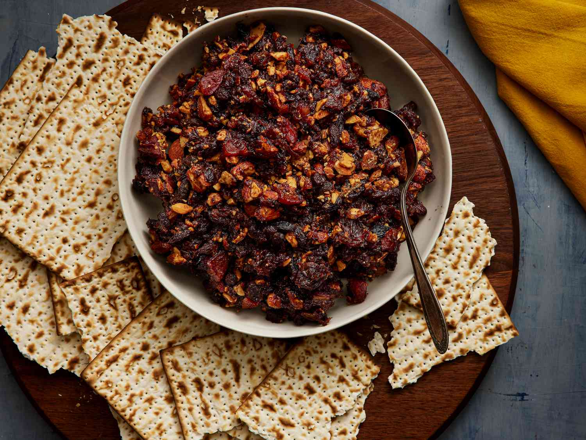

# Charoset

*The seder plate relish. A chunky paste of apples, walnuts and sweet red wine, spiced with cinnamon, eaten on matzo and meant to recall the mortar the Israelites used to build the pyramids. The sweet bite that balances the bitter herbs.*

**Serves:** 8 as part of a seder

**Prep Time:** 15 minutes

**Cook Time:** None

## Overview
The Ashkenazi version, simplest and most common in northern Europe and the United States: tart apples chopped fine, walnuts crushed coarse, cinnamon, a little brown sugar, and sweet kosher red wine to bind. Stirred together and left for the flavours to meld. Some households add a pinch of ground ginger or a squeeze of lemon. There are dozens of regional variants (Sephardi versions use dates and figs); this one is the most familiar at a North American seder.

## Ingredients

- 3 tart apples (about 500 g, peeled, cored and chopped to 5 mm dice)
- 120 g walnuts (roughly chopped)
- 1 teaspoon ground cinnamon
- 2 tablespoons soft dark brown sugar
- 4 tablespoons sweet red wine (kosher for Passover if observed; Manischewitz is traditional)
- 1 tablespoon lemon juice
- A small pinch of fine sea salt
- A small pinch of ground ginger (optional)

## Method

### Stage 1 - Chop
1. Peel and core the apples. Chop them into 5 mm dice; a coarser dice keeps the bite. A food processor pulsed 3-4 times also works, but stop before the apple goes to mush.
2. Chop the walnuts coarsely, leaving some pieces the size of a small pea.

### Stage 2 - Mix
1. In a wide bowl, combine the chopped apples, walnuts, cinnamon, sugar, salt and ginger if using.
2. Add the lemon juice (to keep the apples from browning) and the wine. Stir well. The mixture should be moist but not soupy; add another tablespoon of wine if the apples are particularly dry.

### Stage 3 - Rest
1. Cover and rest at room temperature for at least 1 hour, or in the fridge for up to 24 hours. The apples soften slightly, the wine soaks in, and the spices come forward.
2. Taste before serving and adjust: more wine if dry, a little more sugar if the apples are sharp, a touch more cinnamon if it has gone quiet.

## Notes
- For the Sephardi tradition, replace the apples with 250 g pitted dates and 150 g dried figs, soak in red wine for an hour, then blitz briefly with walnuts and cinnamon to a thick paste. Different texture, same idea.
- Manischewitz is the cultural pick but any sweet red dessert wine works. For an alcohol-free version, use 4 tablespoons of grape juice with a splash of balsamic vinegar to mimic the acidity.
- Some families crush a small piece of matzo into the mix for a coarser, more mortar-like texture.

## Serving
On a small dish as part of the seder plate. At the appropriate point in the seder, spread on a piece of matzo with a smear of bitter herb (horseradish), to remember the mortar with the bricks.

## Storage
In a sealed jar in the fridge for up to a week. Improves on the second day.
