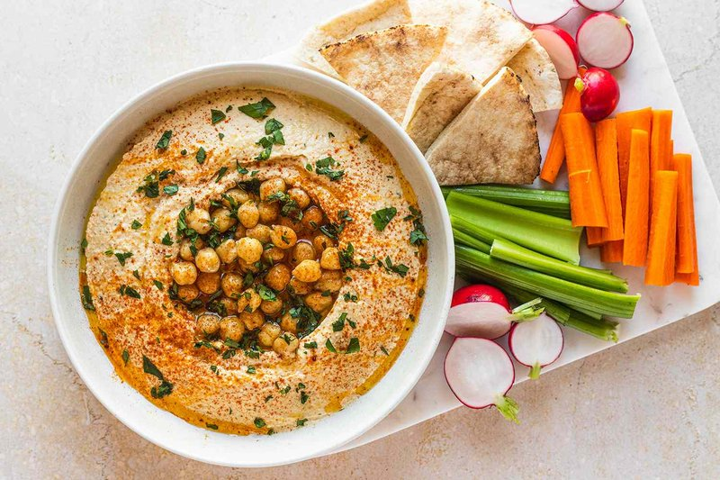

# Hummus

*The Levantine chickpea dip: chickpeas cooked with bicarb till falling apart, blended hot with tahini, lemon and garlic. Plated swirled, eaten with warm pita.*

**Serves:** 6

**Prep Time:** 10 minutes (plus 12 hours soaking)

**Cook Time:** 1 hour 15 minutes

## Overview
Hummus is the great Levantine chickpea-tahini dip, smoothed silky-pale-gold, swirled with the back of a spoon, pooled with olive oil and topped with whole chickpeas, the most-eaten dip in the modern Middle East. Dried chickpeas soak overnight with a teaspoon of baking soda. Cook for sixty to seventy-five minutes with more baking soda until very soft. Reserve a small handful of whole chickpeas as garnish. Blend the hot chickpeas with garlic, lemon, salt, ice cubes (yes, they help the emulsion stay smooth) and a generous quantity of good tahini. The result: smooth, silky, pale-gold. Plate in a wide bowl; swirl with the back of a spoon; top with the reserved chickpeas, paprika, parsley, olive oil and a dust of cumin. Eat warm with pita.

## Ingredients

- 300 g dried chickpeas (soaked overnight in cold water with 1 teaspoon baking soda)
- 1 teaspoon baking soda (for the cook)
- 4 garlic cloves
- 1 ½ lemons (more to taste, juice)
- 200 g good tahini (Lebanese, Palestinian or Israeli brand - light and pourable)
- 1 ½ teaspoons salt (to taste)
- 60-100 ml ice water (added during blending)
- 4 ice cubes (one of the Israeli tricks - silkier emulsion)

### To finish
- 2 tablespoons olive oil (extra-virgin)
- ½ teaspoon ground cumin
- ½ teaspoon paprika (or sumac)
- 2 tablespoons fresh parsley (chopped)
- 1 tablespoon reserved whole chickpeas
- Warm pita

## Method

### Stage 1 - Cook chickpeas
1. Drain soaked chickpeas; rinse; place in a wide pot.
1. Cover with cold water by 5 cm; add 1 teaspoon baking soda.
1. Bring to a boil; skim the heavy scum and the loose skins that rise (skim aggressively - the skins make the hummus grainy).
1. Reduce to a simmer; cover partially; cook 60-75 minutes until chickpeas crush easily between thumb and finger.

### Stage 2 - Drain and reserve
1. Drain chickpeas, reserving 2 tablespoons whole.
1. Use the hot chickpeas immediately (heat helps the silky texture).

### Stage 3 - Blend
1. Place hot chickpeas, garlic, lemon juice, salt, tahini in a food processor.
1. Process for 3-4 minutes (much longer than you'd think). Periodically scrape down.
1. Add ice cubes (one at a time); continue processing.
1. Stream in ice water in small amounts; process another 2 minutes.
1. The hummus should be silky-smooth, pale gold, ribbons from the spatula.

### Stage 4 - Taste
1. Adjust salt, lemon, tahini. Hummus should taste sharper than seems right cold - flavours mellow once cooled.

### Stage 5 - Plate
1. Spread on a wide shallow plate. Use the back of a spoon to create a swirl-well in the centre.
1. Spoon olive oil into the well.
1. Scatter the reserved whole chickpeas in the well.
1. Sprinkle paprika and cumin around the edge.
1. Scatter parsley.

### Stage 6 - Serve
1. Eat warm or at room temperature with warm pita, vegetable crudités, or as part of a mezze.

## Notes
- **Baking soda is the trick:** During soak and cook. Softens the chickpea skins; loose skins float off in the boil; gives silky-smooth hummus.
- **Long blend:** 5+ minutes total in the processor. Most people stop too soon - that's where graininess comes from.
- **Hot chickpeas:** Blending hot gives a silkier result than cooled. The ice water + ice cubes during blending then re-emulsifies.

## Storage
- Refrigerate 5 days; bring to room temperature 30 minutes before serving (cold hummus is dense and flavourless).
