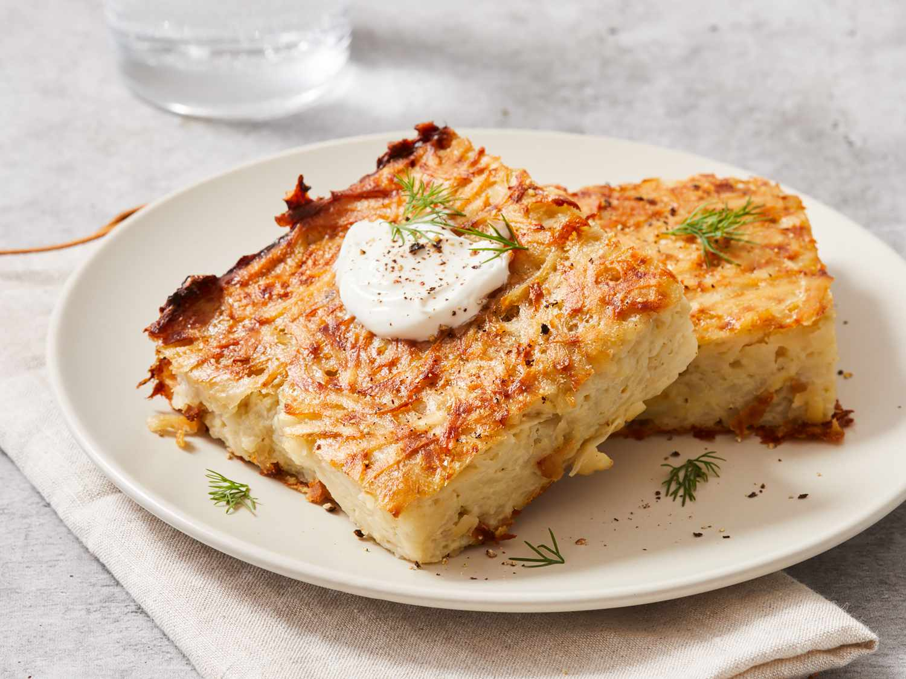

# Potato Kugel

*The Shabbat kugel. Grated potato and slow-fried onion bound with egg and oil, baked in a hot tin until the bottom forms a deep brown crust and the inside stays tender. The Ashkenazi side that crosses every weekly Friday-night table.*

**Serves:** 4-6

**Prep Time:** 15 minutes

**Cook Time:** 1 hour 10 minutes

## Overview
Three ingredients carry this dish: potato, onion, oil. The potatoes are grated coarse and squeezed bone-dry, this is the only step that really matters; wet potato gives a soggy kugel. The onions are sliced fine and fried slow until deep gold, drawing out their sweetness. Both go into a wide bowl with an egg, garlic powder, salt and a generous slug of the still-warm onion oil, mixed quickly so the egg doesn't scramble. The tin gets a thin layer of more hot oil, the heat of the tin is what creates the dark crust on the underside, the signature of a good kugel. Mixture poured in, smoothed flat, baked at high heat until the top is dark brown and the inside is set but still tender.

## Ingredients

- 6 tablespoons sunflower oil (or chicken fat / schmaltz, traditional)
- 2 medium onions (finely sliced)
- 900 g starchy potatoes (Maris Piper, Yukon Gold, or russet, peeled)
- 1 large egg (lightly beaten)
- 1 teaspoon garlic powder
- 1 ¼ teaspoons fine sea salt (plus more to taste)
- A generous grind of black pepper
- A small handful of flat-leaf parsley (finely chopped, optional, for finishing)

## Method

### Stage 1 - Fry the onions
1. Heat 2 tablespoons of the oil in a wide frying pan over a medium-low heat.
2. Add the sliced onions and a pinch of salt. Cook gently for 18-20 minutes, stirring every few minutes, until the onions have collapsed and turned a deep golden brown. This step is the heart of the kugel; rushed pale onions give a thin-tasting bake.
3. Lift the onions onto a plate with a slotted spoon. Reserve the oil from the pan, you'll use it in the kugel mixture.

### Stage 2 - Grate and dry the potatoes
1. While the onions cook, peel and grate the potatoes on the large holes of a box grater (or use a food processor grating disc).
2. Tip the grated potato into a clean tea towel or muslin cloth. Twist the cloth tight over the sink and squeeze hard. You should be able to wring out a surprising amount of cloudy starch-water, wet potato makes a dense, gluey kugel. Keep squeezing until very little liquid comes out.
3. Tip the dried potato into a wide bowl.

### Stage 3 - Mix
1. Add the fried onions, all the oil from the onion pan (still warm but not hot, pour off the excess if there's more than 4 tablespoons), the beaten egg, garlic powder, salt and a generous grind of pepper to the potatoes.
2. Mix thoroughly with a large spoon until uniformly coated. Taste a small pinch and adjust salt, the potato will absorb it surprisingly.

### Stage 4 - Heat the tin
1. Heat the oven to 200°C fan / 220°C / 425°F. Pour the remaining 4 tablespoons of oil into a 23 x 23 cm square baking tin (or equivalent), and place the tin in the oven for 5 minutes, the oil should shimmer and start to ripple.
2. Carefully take the tin out, swirl the oil so it coats the base and sides, then tip the potato mixture in. The mixture should hiss as it meets the hot oil, this is what builds the crust.
3. Smooth the top with the back of a spoon, pressing down evenly.

### Stage 5 - Bake
1. Bake for 50-60 minutes, until the top is deeply browned and the edges have darkened. The undersides should be a deep mahogany, a wider spatula slid in around the edge confirms the crust.
2. Let the kugel rest for 10 minutes before serving, it firms up as it cools.

### Stage 6 - Serve
1. Cut into squares and lift onto warm plates with a spatula, dark crust facing up. Scatter with parsley if using.

## Notes
- For the truly traditional version, use rendered chicken fat (schmaltz) in place of the oil. The flavour is unmistakable, deeper, faintly savoury. Render it from chicken skin and fat over a low heat, or buy a jar from a kosher grocer.
- A wide shallower tin gives more crust per square; a deeper narrower one gives a softer kugel. The 23 x 23 cm tin is the middle ground.
- Reheat leftovers in a hot oven, not a microwave, the microwave goes soft, the oven re-crisps.

## Serving
Beside brisket, roast chicken or schnitzel as the Shabbat side. Slid alongside scrambled eggs at brunch. On the Yom Kippur break-fast table with smoked salmon and bagels.

## Storage
Covered in the fridge for up to 4 days. Reheats well: 15 minutes in a 200°C oven brings back the crust. Freezes for 2 months wrapped tightly; thaw in the fridge overnight and reheat covered to keep it from drying.
