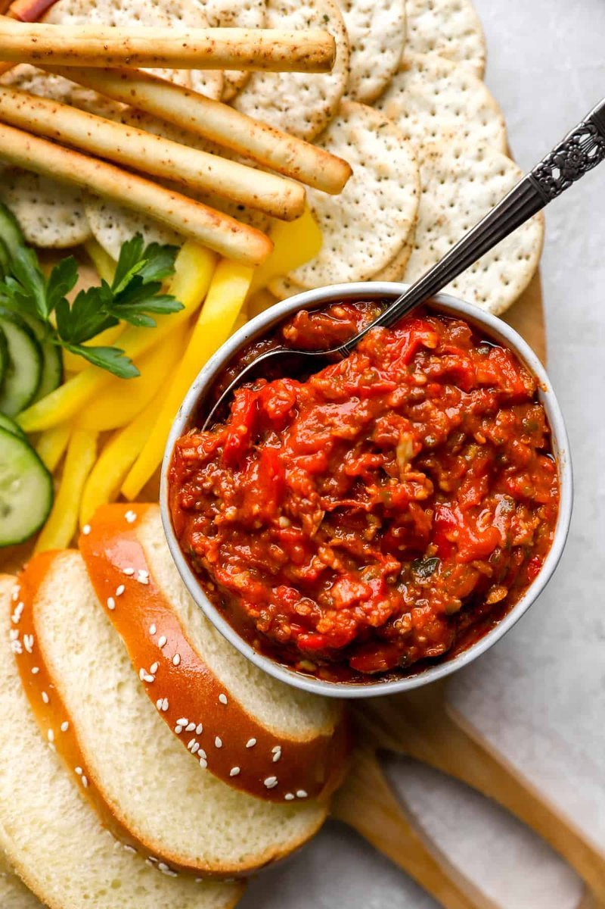

# Matbucha

*A North African-Israeli salad: tomatoes, red peppers, garlic and chillies cooked very slowly down to a thick jammy spreadable paste. Eaten cold with pita.*

**Serves:** 6 as a mezze

**Prep Time:** 15 minutes

**Cook Time:** 1 hour 30 minutes

## Overview
Red bell peppers char briefly under the grill, skin peels off. Tomatoes (fresh or tinned) and the peeled peppers blend coarse. Chopped garlic, hot green chilli and oil heat in a wide pan; the tomato-pepper mix joins. Cooks down slow 75 minutes, stirring occasionally, until very thick and jammy. Paprika, cumin, salt, sugar fold in late.

## Ingredients

- 4 red bell peppers
- 1 kg ripe tomatoes (or 2 × 400 g tins chopped tomatoes if out of season)
- 8 garlic cloves (sliced)
- 2 hot green chillies (finely chopped - adjust to taste)
- 4 tablespoons olive oil
- 2 teaspoons sweet paprika
- 1 teaspoon hot paprika (or smoked paprika)
- 1 teaspoon ground cumin
- 1 teaspoon caster sugar (more if tomatoes are sharp)
- 1 ½ teaspoons salt (to taste)
- ½ teaspoon ground black pepper

### To finish
- 1 tablespoon olive oil (to drizzle)
- 1 tablespoon fresh parsley (chopped, optional)

## Method

### Stage 1 - Peppers
1. Heat grill to high.
1. Place whole peppers on a foil-lined tray; grill 15 minutes, turning, until skins blackened all over.
1. Cover with foil; steam 10 minutes; peel off skins; remove seeds and stems.
1. Chop the flesh coarsely.

### Stage 2 - Tomatoes
1. If using fresh: score the bottom of each tomato with an X; drop into boiling water 30 seconds; lift into cold water; peel.
1. Chop coarsely. (If using tinned, skip.)

### Stage 3 - Cook
1. Heat olive oil in a wide heavy pan over medium-low.
1. Add garlic and green chillies; cook 1 minute (don't brown).
1. Add chopped tomato and chopped peppers.
1. Cook on medium-low, stirring every 10 minutes, for 60-75 minutes until very thick and most of the water has evaporated. The mix should hold a spoon-print.

### Stage 4 - Season
1. Stir in paprika, cumin, sugar, salt, pepper.
1. Cook another 10 minutes.

### Stage 5 - Cool
1. Cool to room temperature. The flavours deepen significantly as it cools.

### Stage 6 - Serve
1. Tip into a shallow bowl; drizzle olive oil; scatter parsley if using.
1. Eat at room temperature with warm pita, or as part of a wider mezze.

## Notes
- **Slow cook is the dish:** Rushing gives a fresh tomato sauce, not matbucha. The character comes from the long slow reduction.
- **Char the peppers properly:** Pale peppers give pale matbucha. The blackened skins are easy to peel and add depth.
- **Better next day:** Make a batch on Friday for Saturday's brunch. It really improves overnight.

## Storage
- Refrigerate 1 week. Bring to room temperature before serving.
- Freezes 3 months.
