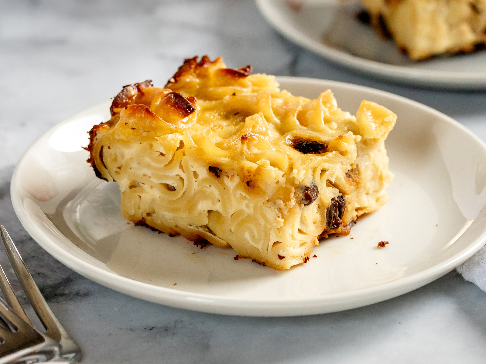

# Noodle Kugel

*The Ashkenazi side that crosses every Jewish holiday table. Sweet, dense, buttery: egg noodles bound with cream cheese and sour cream, dotted with raisins, baked until the top is deeply browned and the underside catches against the dish. Eaten warm with the Yom Kippur break-fast or alongside brisket on Sukkot.*

**Serves:** 8 as a side

**Prep Time:** 20 minutes

**Cook Time:** 1 hour

## Overview
Wide egg noodles cooked just past al dente, drained and tossed in butter so they don't clump. A custard of cream cheese, sour cream, eggs, sugar and cinnamon is whisked smooth and folded through the noodles with golden raisins. The mixture goes into a buttered baking dish, gets a generous topping of crushed cornflakes (or cinnamon-sugar crumbs) and a dot of butter, then bakes low and slow until the custard sets and the top is mahogany-brown. Cut into squares while warm.

## Ingredients

### The kugel
- 350 g wide egg noodles
- 100 g unsalted butter (50 g melted, 50 g cubed)
- 200 g cream cheese (softened)
- 250 g sour cream
- 250 g cottage cheese (or ricotta drained)
- 6 large eggs
- 150 g caster sugar
- 1 ½ teaspoons ground cinnamon
- 1 teaspoon vanilla extract
- The zest of 1 lemon (optional)
- A small pinch of fine sea salt
- 80 g golden raisins (sultanas)
- 2 tablespoons brandy or orange juice (to plump the raisins)

### The topping
- 80 g cornflakes (crushed lightly with a rolling pin)
- 30 g caster sugar
- 1 teaspoon ground cinnamon
- 30 g unsalted butter (melted)

## Method

### Stage 1 - Prepare
1. Heat the oven to 170°C fan / 190°C / 375°F. Butter a 28 x 22 cm baking dish (or equivalent) generously.
2. Plump the raisins in the brandy or orange juice for 10 minutes while you prep the rest.

### Stage 2 - Cook the noodles
1. Bring a large pan of salted water to a hard boil. Add the noodles and cook for the lower end of the packet time — they should be just past al dente, with a touch of bite still. They keep cooking in the oven.
2. Drain and tip back into the pan. Pour over the 50 g melted butter and toss to coat. Set aside.

### Stage 3 - Make the custard
1. In a wide bowl, beat the cream cheese with a wooden spoon or whisk until smooth and lump-free. This step matters: cold cream cheese stays in chunks if you skip it.
2. Whisk in the sour cream and cottage cheese.
3. Add the eggs one at a time, whisking each in fully. Add the sugar, cinnamon, vanilla, lemon zest if using, and salt. Whisk until smooth — the mixture should look like loose pancake batter.

### Stage 4 - Combine
1. Pour the custard over the buttered noodles and fold gently. Drain the raisins (reserve the soaking liquid — it's good in tea) and fold them through.
2. Tip into the prepared baking dish. Smooth the top with a spatula. Dot with the cubed butter.

### Stage 5 - Top and bake
1. In a small bowl, toss the crushed cornflakes with the sugar, cinnamon and melted butter until evenly coated.
2. Scatter the topping evenly over the kugel.
3. Bake at 170°C fan for 50-60 minutes, until the top is deep golden, the edges have darkened, and a knife pushed into the centre comes out with just a little custard cling rather than wet batter. If the top is browning too fast, tent loosely with foil for the last 15 minutes.
4. Cool in the dish for 15 minutes before cutting — the custard sets as it rests. Trying to slice straight from the oven gives a wet mess; rested, it cuts into clean squares.

## Notes
- The texture should be set but soft — somewhere between a bread pudding and a baked custard. If you prefer a firmer kugel, drop an egg and use less sour cream.
- For a savoury kugel (a different beast entirely, often served as a Shabbat side), drop the sugar, cinnamon, raisins and topping; add a pile of softened onions cooked in schmaltz or oil, plenty of salt and pepper, and double the eggs.
- A traditional Sukkot kugel adds chopped apples or a layer of stewed apple under the noodles. Add 2 small Bramley apples, peeled and diced 5mm, sweated in butter for 5 minutes; spread over the buttered dish before the noodle mix.

## Serving
A generous square on a warm plate, with extra sour cream on the side if you like. On the Yom Kippur break-fast table alongside bagels and lox; on the Sukkot table next to brisket. Reheated leftovers eaten standing at the fridge.

## Storage
Covered in the fridge for up to 4 days. Reheats well in a 160°C oven for 20 minutes, covered with foil so the top doesn't burn. Freezes for 2 months wrapped tightly; thaw in the fridge overnight before reheating.
