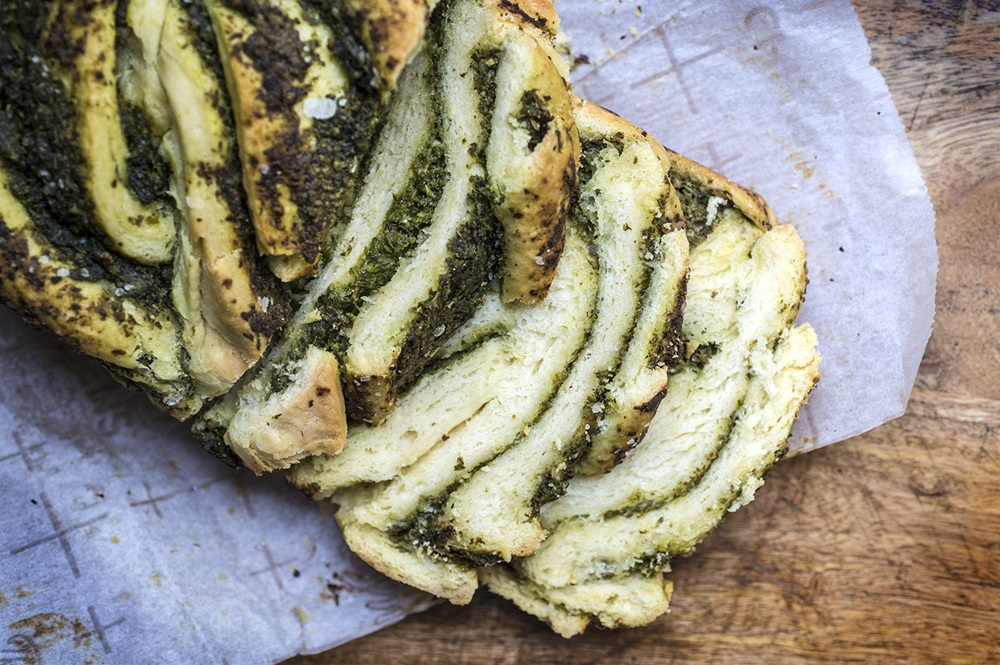

# Pesto Babka

*The savoury cousin of the chocolate babka. Enriched braided dough rolled around a layer of basil pesto and grated cheddar, twisted into a wreath, baked golden. Sliced warm, eaten with soup or pulled apart on a brunch table.*

**Serves:** 8 (one wreath)

**Prep Time:** 30 minutes (plus 1 ½ hours first rise, optional 12-hour cold proof, 1 ½ hours final rise)

**Cook Time:** 45-50 minutes

## Overview
Babka — at its sweet best as the chocolate version — turns out to be a wonderful vehicle for savoury fillings. The dough is the same enriched milk-and-butter base: pillow-soft, gold-yellow, kneaded long until it pulls smooth. The filling here is pesto (basil or, in season, ramp/wild garlic) and a generous grating of sharp cheddar. The dough rolls into a long log, gets sliced lengthways down the middle so the cut sides face up, then twisted into a rope and curled into a wreath on the tray. Risen, egg-washed, baked. The cut faces of the twist open as it bakes, exposing layered green-and-yellow swirls.

## Ingredients

### The dough
- 80 ml water (just-boiled, cooled to lukewarm)
- 7 g instant yeast (1 sachet)
- 80 ml whole milk
- 3 large eggs (plus 1 for the egg wash)
- 2 tablespoons caster sugar
- 1 ¼ teaspoons fine sea salt
- 470 g plain flour
- 85 g unsalted butter (softened, cubed)

### The pesto
- 50 g basil leaves (or wild garlic / ramp leaves in season)
- 50 g toasted walnuts (or pine nuts)
- 50 g grated parmesan
- 1 garlic clove (crushed)
- ¼ teaspoon fine sea salt
- 80 ml extra-virgin olive oil
- 2 tablespoons lemon juice

### The filling
- 100 g mature cheddar (grated)
- A pinch of black pepper

## Method

### Stage 1 - Mix the dough
1. In a small bowl, combine the warm water and yeast. Stir briefly and leave for 5 minutes until foamy.
2. In the bowl of a stand mixer fitted with the dough hook, combine the milk, eggs (reserving one for the wash), sugar, salt and the yeast mixture. Mix briefly to combine.
3. Add the flour. Mix on low for 2 minutes until a shaggy dough forms.
4. Add the softened butter a cube at a time, kneading each in before adding the next. This takes 5-6 minutes. The dough will look broken halfway through; keep going and it pulls back together, smooth and elastic.
5. Knead on medium for another 4 minutes — the dough should clear the bowl walls and feel silky.

### Stage 2 - First rise
1. Shape into a ball, place in a lightly oiled bowl, cover, and leave to rise in a warm place for 1 ½ hours, until visibly puffed. For deeper flavour, refrigerate overnight (8-12 hours) after the initial warm rise.

### Stage 3 - Make the pesto
1. While the dough rises, make the pesto. In a food processor, pulse the basil, walnuts, parmesan, garlic and salt until chunky — leave some texture.
2. With the motor running, drizzle in the olive oil and lemon juice until the pesto is loose enough to spread but not pourable.
3. Taste — adjust salt and lemon. A pesto destined for spreading wants to be slightly sharper than one for pasta.

### Stage 4 - Shape
1. If the dough was refrigerated, let it sit at room temperature for 20 minutes first.
2. Tip onto a lightly floured worktop and roll into a 40 x 50 cm rectangle, with the long side facing you.
3. Spread the pesto evenly over the rectangle, leaving a 2 cm border along the far long edge. Scatter with the grated cheddar and a grind of pepper.
4. Roll up from the long edge nearest you into a tight log, pinching the seam to seal. The log should be about 50 cm long.
5. With a sharp knife, slice the log lengthways down the middle, cut-side up, leaving 2 cm uncut at one end so the two halves stay connected.
6. With cut sides facing up, twist the two halves around each other like a rope, pinching the ends together to seal.
7. Curl the rope into a circle on a baking-paper-lined tray, pinching the ends together to form a wreath. The cut faces should still be visible on top.

### Stage 5 - Final rise
1. Cover loosely with a tea towel and leave to rise in a warm spot for 1 ½ hours, until visibly puffed (not doubled — over-proved babka collapses).

### Stage 6 - Bake
1. Heat the oven to 170°C fan / 190°C / 375°F.
2. Beat the reserved egg with a teaspoon of water and brush over the wreath, getting into the creases.
3. Bake for 45-50 minutes, until deep golden and the internal temperature reaches 90°C at the thickest point. If the top is browning too fast, tent loosely with foil for the last 10 minutes.
4. Cool on the tray for 20 minutes before slicing — the cheese needs to set inside the layers.

## Notes
- Wild garlic (ramps in North America) makes the most spectacular green-flecked version, and is in season in March and April. Use the same weight as basil and skip the garlic clove.
- For a fully Sephardic-leaning filling, swap the pesto for a thin layer of zhoug (green chilli-coriander paste) and the cheddar for feta. Different beast — both work.
- This babka is at its best the day it is baked, warm. Toasted slices the next morning with butter are the dream second-day breakfast.

## Serving
A slice with a bowl of tomato or carrot soup. On a brunch table alongside salads and dips. As a Shabbat side instead of challah.

## Storage
Wrapped in foil at room temperature for 2 days. Re-warm slices in a low oven (150°C) for 5 minutes to refresh. Freezes well sliced; toast straight from frozen.
