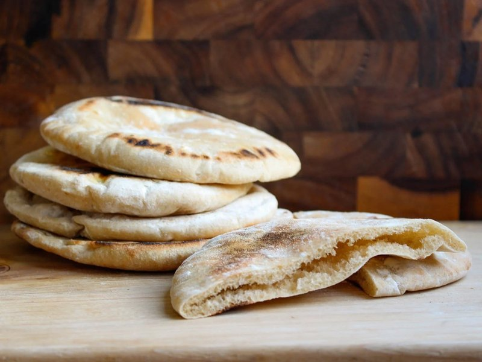

# Pita

*The Middle Eastern pocket bread: a thin round of yeasted dough baked at extreme heat so it puffs into a perfect hollow balloon, then deflates leaving a pocket for stuffing. The everyday bread of Israel, Lebanon, Palestine, Syria, Jordan, Egypt. Stuffed with falafel, shawarma, schnitzel, or torn for scooping hummus.*

**Serves:** 4 (makes 8 pitas)

**Prep Time:** 15 minutes (plus 1 hour 30 minutes rising)

**Cook Time:** 12 minutes (with a hot stone)

## Overview
A simple yeasted dough - flour, yeast, salt, sugar, olive oil, warm water. Rises 1 hour. Divides into 8 portions; rolls into thin discs about 18 cm wide; rests 20 minutes. Baked at maximum heat on a hot baking stone 2-3 minutes - they puff dramatically into balloons and fall flat as they cool, leaving a pocket.

## Ingredients

- 500 g plain flour (or strong bread flour)
- 1 sachet (7 g) fast-action yeast
- 1 ½ teaspoons salt
- 1 tablespoon caster sugar
- 2 tablespoons olive oil
- 320 ml warm water

## Method

### Stage 1 - Dough
1. Whisk flour, yeast, salt, sugar.
1. Add olive oil and warm water; mix to a soft dough.
1. Knead 10 minutes until smooth and elastic.
1. Cover; rise 1 hour until doubled.

### Stage 2 - Heat oven
1. Place a baking stone or upturned heavy tray on the top rack.
1. Heat to maximum (250°C+) for 30 minutes.

### Stage 3 - Shape
1. Knock back; divide into 8 portions.
1. Roll each into a tight ball; cover; rest 10 minutes.
1. Roll each ball into an 18 cm disc, 3-4 mm thick.
1. Place on a lightly floured tea-towel-covered surface; cover; rest 20 minutes.

### Stage 4 - Bake
1. Slide one pita onto the hot stone using a peel or back of a tray (dust with flour or cornmeal first to prevent sticking).
1. Bake 2-3 minutes - the bread puffs dramatically into a balloon.
1. Lift off with tongs.
1. Repeat with the rest.

### Stage 5 - Stack
1. Stack the baked pitas under a clean tea towel - the steam keeps them soft.

### Stage 6 - Serve
1. Eat warm. Tear or split open and stuff with shawarma, falafel, schnitzel, or scoop hummus.

## Notes
- **Maximum heat:** Without enough heat the pita doesn't puff. Pre-heat the stone for at least 30 minutes.
- **Thin enough:** 3-4 mm. Thicker and they don't puff into a pocket; thinner and they crack.
- **Don't peek:** Cool air kills the puff. Watch through the glass.

## Storage
- Best fresh. Keep wrapped 24 hours.
- Freeze 1 month.
