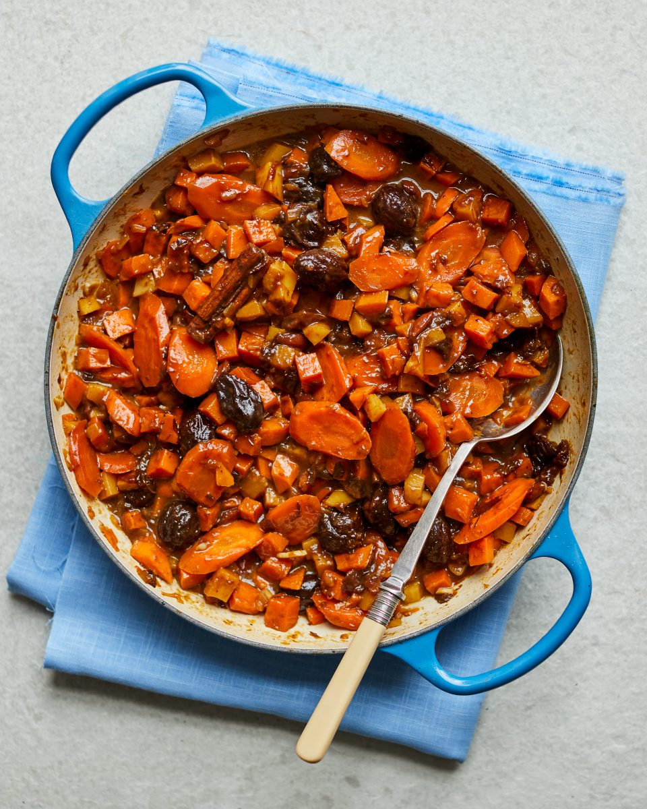

# Tzimmes

*The slow-cooked carrot-and-sweet-potato side that signals Rosh Hashanah as clearly as apples and honey. Sweet, glossy, scented with cinnamon and orange, studded with prunes. Made in a baking dish, cooked until the carrots melt against the spoon.*

**Serves:** 6 as a side

**Prep Time:** 15 minutes

**Cook Time:** 1 hour 15 minutes

## Overview
Carrots, sweet potatoes and prunes are layered in a baking dish with butter or oil, honey, brown sugar, orange juice and a stick of cinnamon. Covered and roasted low until the vegetables soften and absorb the sweet braising liquid, then uncovered for the last fifteen minutes so the top catches and the juices reduce to a syrup. The dish is sweet on purpose: it is the food of a hopeful festival.

## Ingredients

- 500 g carrots (peeled, cut into 3 cm chunks)
- 500 g sweet potatoes (peeled, cut into 3 cm chunks)
- 150 g pitted prunes
- 50 g sultanas (or raisins)
- 4 tablespoons olive oil (or 60 g butter, melted)
- 4 tablespoons honey
- 2 tablespoons soft dark brown sugar
- The juice of 2 oranges (about 200 ml)
- The zest of 1 orange
- 1 cinnamon stick
- ½ teaspoon ground ginger
- A small pinch of fine sea salt
- A generous grind of black pepper

## Method

### Stage 1 - Prepare
1. Heat the oven to 170°C fan / 190°C / 375°F.
2. In a large baking dish, combine the carrots, sweet potatoes, prunes and sultanas. Pour over the oil (or melted butter), honey, sugar and orange juice. Add the orange zest, cinnamon stick, ginger, salt and pepper. Toss with your hands until everything is glossy.

### Stage 2 - Slow cook
1. Cover the dish tightly with foil and bake for 45 minutes. The vegetables should be tender when pierced with the tip of a knife.
2. Uncover and stir gently with a wooden spoon, try not to break up the sweet potatoes, and return to the oven for another 25-30 minutes. The juices should reduce and turn syrupy, and the tops of the vegetables should catch and darken in places.

### Stage 3 - Finish
1. Fish out the cinnamon stick. Taste and add a pinch more salt if needed; the sweetness needs the salt to land properly.
2. Let the dish rest for 5 minutes before serving so the syrup thickens around the vegetables.

## Notes
- Some traditional tzimmes include cubes of brisket cooked alongside, which turns the side into a one-dish main. To do that, brown 600 g of brisket cubes first, layer them under the vegetables, and extend the covered bake to 2 hours.
- For a deeper note, add 2 tablespoons of treacle alongside the honey.
- The dish reheats well; cover with foil and warm in a 160°C oven for 20 minutes with a splash of water.

## Serving
Alongside brisket, roast chicken or roast lamb on the Rosh Hashanah table. The orange-spiced sweetness sits well against a slow-cooked, oniony main.

## Storage
In a covered container in the fridge for up to 4 days. Reheats well; can be made a day ahead.
