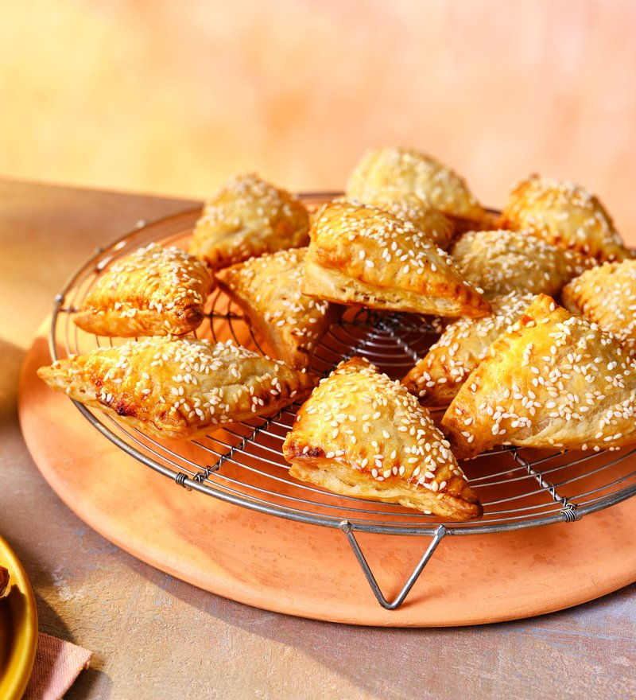

# Bourekas

*Israel's bakery-cabinet pastry: puff-pastry triangles filled with feta-and-ricotta, spinach, potato or mushroom. Sprinkled with sesame and nigella.*

**Serves:** Makes 12 bourekas

**Prep Time:** 30 minutes

**Cook Time:** 25 minutes

## Overview
Ready-rolled all-butter puff pastry cuts into 12 squares (about 12 × 12 cm). Cheese filling: feta + ricotta + egg + parsley + nutmeg + pepper, mashed to a thick paste. Filling spoons onto each square; corners fold across to a triangle; edges crimp with a fork. Brushes with egg wash; sprinkles with sesame and nigella seeds. Bakes for 25 minutes at 200°C till deep gold and puffed.

## Ingredients

### Pastry
- 500 g all-butter puff pastry (2 ready-rolled sheets, or block rolled out)

### Cheese filling
- 250 g feta cheese (crumbled fine)
- 150 g ricotta cheese (drained if very wet)
- 30 g grated kashkaval, parmesan (or kefalotyri, any hard salty cheese)
- 1 egg (large)
- 2 tablespoons fresh flat-leaf parsley (chopped)
- ½ teaspoon ground nutmeg
- ½ teaspoon ground black pepper
- (no extra salt - feta is salty enough)

### Glaze
- 1 egg yolk (beaten with 1 tablespoon milk)
- 2 tablespoons sesame seeds
- 1 tablespoon nigella seeds (kalonji)

## Method

### Stage 1 - Filling
1. In a wide bowl, mash the feta with a fork until uniformly fine.
1. Add ricotta, grated hard cheese, egg, parsley, nutmeg and pepper.
1. Mix to a thick paste. The filling should hold a scoop without sliding.

### Stage 2 - Cut pastry
1. Heat the oven to 200°C (180°C fan).
1. Roll out the puff pastry (or use ready-rolled) on a lightly floured surface.
1. Cut into twelve 12 × 12 cm squares.

### Stage 3 - Fill
1. Place 1 heaped tablespoon of filling in the centre of each square.
1. Brush the edges with egg wash.
1. Lift two opposite corners up over the filling, meeting them at the top.
1. Press to seal - you should have a triangle with the filling enclosed.
1. Crimp the cut edges with a fork or pinch them firmly.

### Stage 4 - Glaze
1. Place the bourekas on parchment-lined baking trays, spaced 3 cm apart.
1. Brush the tops generously with the egg-yolk wash.
1. Sprinkle sesame and nigella seeds.

### Stage 5 - Bake
1. Bake 22-25 minutes till deep golden and puffed.
1. The filling will hint at oozing through the edges - that's correct.

### Stage 6 - Serve
1. Cool 3 minutes (the filling is molten).
1. Eat hot - traditionally with a hard-boiled egg, pickles, and a cup of strong black coffee for the Israeli breakfast.

## Notes
- **Puff pastry, not filo:** Israeli bourekas use puff pastry (the descendants of yufka / Turkish börek doughs). Filo is more typical for Greek tyropita. Both are valid; this is the Israeli version.
- **Drain wet ricotta:** if your ricotta is very wet, sit it in a sieve 30 minutes before mixing. Wet filling makes soggy bourekas.
- **Seal firmly:** loose seams release cheese into the oven. Crimp with a fork.
- **Sesame + nigella:** the iconic Israeli boureka topping. Not optional if you want them to look right.

## Storage
- Best within an hour of baking.
- Keep 1 day at room temp; reheat in a 180°C oven 6 minutes.
- Freeze unbaked, on a tray then bagged, 2 months. Bake from frozen at 200°C 28 minutes.
