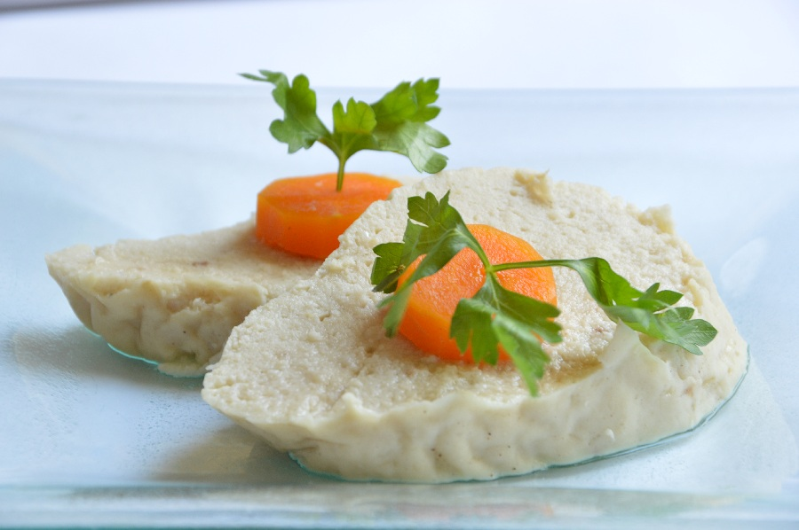

# Gefilte Fish

*The seder starter. Quenelles of ground white fish bound with onion, egg and matzo meal, poached in a fish-and-vegetable broth until set, chilled, and served on lettuce with a sharp horseradish on the side. Old-fashioned, divisive, beloved.*

**Serves:** 8 as a starter (makes about 16 quenelles)

**Prep Time:** 30 minutes (plus 4 hours chilling)

**Cook Time:** 1 hour 15 minutes

## Overview
A mix of white-fleshed fish (carp, pike, whitefish, or a more modern blend of cod and haddock) is ground with grated onion, eggs, matzo meal and a little sugar, then formed into quenelles. The quenelles poach gently in a broth made from the fish skin, heads and bones with onion and carrot. After an hour they are lifted out and chilled overnight in the strained broth; some of the broth jellies as it cools, which is the point. Served cold, on a leaf of lettuce, with a generous spoon of horseradish.

## Ingredients

### The fish mix
- 1 kg skinless white fish fillets (a mix of carp, pike and whitefish if you can find them; otherwise cod and haddock)
- 2 large onions (1 grated, 1 sliced for the broth)
- 2 eggs
- 4 tablespoons matzo meal
- 2 tablespoons cold water
- 1 ½ teaspoons fine sea salt
- 1 teaspoon caster sugar
- A generous grind of white pepper

### The broth
- Fish skins, heads and bones (ask your fishmonger to keep them when filleting; otherwise 500 g white fish bones)
- 1 onion (sliced)
- 2 carrots (peeled, sliced into rounds)
- 1 celery stick (sliced)
- 1 bay leaf
- ½ teaspoon black peppercorns
- 1 teaspoon fine sea salt
- 2 litres cold water

### To serve
- A small bowl of horseradish (jarred is fine, freshly grated is sharper)
- Crisp lettuce leaves
- The poached carrot rounds from the broth (for garnish)

## Method

### Stage 1 - Make the broth
1. In a wide deep pan, place the fish bones, heads and skin, sliced onion, carrots, celery, bay leaf, peppercorns and salt.
2. Cover with cold water. Bring slowly to a low simmer over a medium heat, skimming any grey foam from the surface.
3. Cook gently for 30 minutes. Strain through a fine sieve into a clean pan, reserving the carrot rounds for garnish. Discard the rest of the solids.

### Stage 2 - Make the fish mix
1. Cut the fish fillets into rough chunks and place in a food processor with the grated onion.
2. Pulse 8-10 times to a coarse paste — you want texture, not a smooth purée.
3. Tip into a bowl. Add the eggs, matzo meal, water, salt, sugar and white pepper. Mix with a wooden spoon for 2 minutes until cohesive and slightly sticky.
4. Test the seasoning by frying a teaspoon-sized piece in a little oil; taste and adjust salt or pepper before shaping the rest.

### Stage 3 - Shape and poach
1. Bring the strained broth back to a low simmer.
2. With wet hands, shape the fish mix into oval quenelles about the size of a small egg. Slide them gently into the broth as you go.
3. Cover, drop the heat low, and poach gently for 45 minutes. The quenelles should be just firm to the touch and cooked through.

### Stage 4 - Cool and rest
1. Lift the quenelles carefully into a wide shallow dish with a slotted spoon.
2. Strain the broth over the top so they are just submerged. Cool to room temperature, then chill for at least 4 hours, ideally overnight. The broth jellies slightly as it cools and clings to the quenelles.

### Stage 5 - Serve
1. Set each quenelle on a leaf of crisp lettuce. Top with a slice of the poached carrot. Spoon a little of the jellied broth alongside.
2. Pass the horseradish at the table; a generous teaspoon per portion is the traditional measure.

## Notes
- Most modern households buy gefilte fish from a jar at the kosher grocer; the homemade version is a labour of love that travels far better when shared with a grandmother who has done it before. The flavour reward is real.
- White fish blends vary by tradition: Ashkenazi households of Eastern European origin favour carp and pike; American households often default to whitefish and cod. Any blend of mild, firm-fleshed white fish works.
- Sweet versus savoury is a regional divide: Polish-style is sweeter (the sugar in the mix); Lithuanian-style is peppery. The recipe above is mid-sweet; lean either way to taste.

## Serving
At the start of the seder meal, on individual plates with lettuce, carrot and horseradish. A glass of sweet white wine alongside.

## Storage
In a covered container with the broth in the fridge for up to 4 days. Do not freeze cooked: the texture goes powdery.
