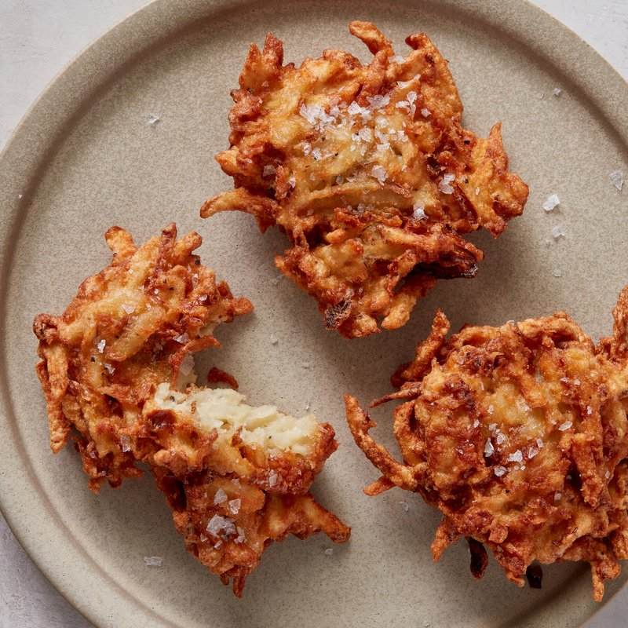

# Latkes (Potato Pancakes)

*The Hanukkah pancake: shredded potato and onion bound with egg, fried lacy-crisp in hot oil. Served with sour cream and apple sauce.*

**Serves:** 4 (makes 12 latkes)

**Prep Time:** 20 minutes

**Cook Time:** 25 minutes (in batches)

## Overview
Latkes are the Ashkenazi Jewish potato pancakes of Hanukkah, fried in oil to commemorate the miracle of the lamp that burned for eight days, eaten by the dozen during the festival with sour cream and applesauce. Floury potatoes grate fine; onion grates fine; both squeeze in a tea towel to remove water (this water-squeeze is what gives crisp latkes). Mix with egg, matzo meal (or flour), salt and pepper. Drop by spoonfuls into hot oil; flatten with a spatula; fry for three to four minutes per side until deep gold. Drain on a rack. Serve hot with cold sour cream and applesauce.

## Ingredients

### Latkes
- 1 kg floury potatoes (Maris Piper, Russet, Idaho)
- 1 onion (large)
- 2 eggs (large, beaten)
- 4 tablespoons matzo meal (or fine breadcrumbs / plain flour)
- 1 ½ teaspoons salt
- 1 teaspoon ground black pepper
- 200 ml neutral oil (generous for shallow frying)

### To serve
- 200 g sour cream
- 200 g applesauce (unsweetened or lightly sweetened)
- Snipped chives (or chopped parsley)

## Method

### Stage 1 - Grate
1. Peel the potatoes.
1. Grate on the LARGE side of a box grater (or use a food processor with a coarse grating disc).
1. Grate the onion the same way.

### Stage 2 - Squeeze
1. Tip the grated potato and onion into a clean tea towel.
1. Gather the corners; squeeze HARD over the sink to extract as much water as possible.
1. You should be amazed how much liquid comes out.
1. Tip the squeezed mixture into a wide bowl.

### Stage 3 - Mix
1. Add the beaten eggs, matzo meal, salt and pepper.
1. Mix with a fork until uniform.

### Stage 4 - Fry
1. Heat the oil in a wide heavy pan (cast-iron is ideal) over medium-high heat - the oil should be 1 cm deep.
1. Test with a small bit of mixture; it should sizzle vigorously.
1. Scoop a heaped tablespoon of the potato mixture; drop into the oil; flatten gently with the back of the spoon or a spatula to a 1 cm thick disc, about 8 cm across.
1. Fry 3-4 latkes at a time (don't crowd).
1. Cook 3-4 minutes; flip; cook another 2-3 minutes.
1. The exterior should be deep gold and lacy-crisp; the interior just-tender.
1. Lift onto a wire rack lined with kitchen paper.
1. Salt lightly while hot.

### Stage 5 - Keep warm
1. Hold latkes warm in a 90°C oven on the wire rack while you cook the rest.

### Stage 6 - Serve
1. Pile on a warm platter.
1. Serve with bowls of sour cream and applesauce on the side.
1. Garnish with chives or parsley.

## Notes
- **Squeeze the potato HARD:** this is the entire secret. Undrained potato latkes are soggy and steam in the oil instead of frying. The drier the mixture going into the pan, the crisper the latkes.
- **Floury potatoes, not waxy:** waxy varieties (Charlotte, Anya, baby new) have too much moisture and not enough starch. Maris Piper or Russet give the right texture.
- **Don't make the latkes too thick:** 1 cm thick max. Thicker and the inside steams while the outside burns.
- **Fresh oil is best:** clean oil gives clean latkes. The first few latkes will dirty the oil with potato bits; you can skim or change the oil halfway through.
- **Hold warm in the oven, not on the stove:** stacking latkes on a plate steams them and they lose their crisp. A wire rack in a low oven keeps them crisp until service.

## Storage
- Best within 15 minutes of frying.
- Reheats well in a 200°C oven on a wire rack 6 minutes; never microwave.
- Cooked latkes freeze 2 months on a tray then bagged; reheat from frozen in a 200°C oven 12 minutes.
