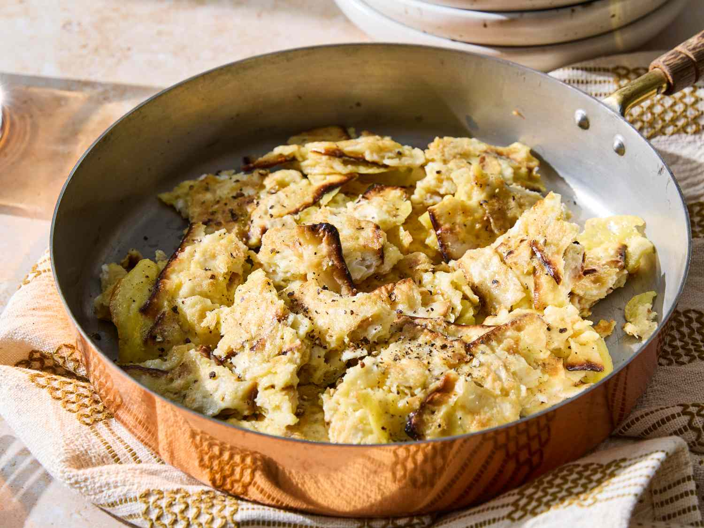

# Matzo Brei

*The Passover breakfast. Matzo broken into pieces, briefly soaked to soften, beaten with eggs, then cooked in butter to a chunky scramble or a single golden pancake. Sweet with cinnamon sugar and sour cream, or savoury with smoked salmon and chives.*

**Serves:** 2

**Prep Time:** 5 minutes

**Cook Time:** 7 minutes

## Overview
The eight-day Passover diet rests on matzo, and matzo brei is the dish that turns yesterday's plain matzo crackers into a proper hot breakfast. Pieces of matzo go briefly under warm water until they soften (but don't disintegrate), then drain. They get folded into beaten salted eggs, sit a minute so the matzo drinks in the egg, and then go into hot foaming butter. Two finishes: cook flat as a thick pancake and flip, or break up and scramble. Eat immediately with whichever topping the household votes for.

## Ingredients

### The brei
- 4 sheets plain matzo
- 4 large eggs
- 2 generous pinches kosher salt
- A generous grind of black pepper
- 2 teaspoons unsalted butter (or schmaltz for the savoury version)

### Sweet finish (pick one)
- 2 tablespoons strawberry jam (or apricot)
- 4 tablespoons sour cream
- 1 tablespoon caster sugar mixed with ½ teaspoon ground cinnamon

### Savoury finish (or pick one of these instead)
- 80 g smoked salmon (sliced thin)
- 2 tablespoons soft cream cheese
- 1 tablespoon chopped chives
- A squeeze of lemon

## Method

### Stage 1 - Soak the matzo
1. Break the matzo into roughly 4 cm pieces and pile in a colander or wide bowl.
2. Run warm (not hot) water over the pieces for 10-15 seconds, turning with your hands so every piece gets wet. The matzo softens fast - over-soak and it turns to porridge; under-soak and it stays sharp at the edges.
3. Drain in the colander and press gently to release excess water. The pieces should feel pliable but still have some texture, like a wet sponge.

### Stage 2 - Mix with egg
1. Crack the eggs into a wide bowl. Add the salt and pepper. Beat with a fork until uniform.
2. Tip the drained matzo into the eggs. Fold gently with a spatula until every piece is coated.
3. Let the mixture sit for 2 minutes. The matzo continues to absorb the egg and the mix tightens. This rest matters - a quick cook from a wet mix gives mushy brei.

### Stage 3 - Cook
1. Heat the butter in a medium non-stick frying pan over a medium heat until it bubbles vigorously but is not browning.
2. Pour the egg-matzo mixture into the pan in an even layer.
3. **For the pancake style**: cook undisturbed for 3 minutes until the underside is set and golden. Flip in one piece (slide onto a plate, invert the pan over the plate, flip back) and cook another 2 minutes. Slide onto a warm plate and cut in half.
4. **For the scrambled style**: after 1 minute, start breaking the matzo brei into large rough chunks with a spatula and stirring gently. Continue for 2-3 minutes until the eggs are set but still soft, the matzo pieces holding shape but warmed through.

### Stage 4 - Finish
1. **Sweet**: top with sour cream, a spoon of jam, and a generous shake of cinnamon sugar. The classic combination is half-sweet-half-savoury - sour cream on one half, jam on the other.
2. **Savoury**: top with cream cheese, a few slices of smoked salmon, chopped chives, a squeeze of lemon.

## Notes
- Matzo brei is a fast breakfast and only takes 7 minutes once you have the matzo broken. Worth using slightly stale matzo if it's available; fresher matzo can disintegrate at the soak stage.
- The sweet-vs-savoury debate runs through every Ashkenazi household. The pancake style suits sweet finishes (clean slices, even base for the toppings); the scrambled style suits savoury (the smoked salmon weaves through the chunks).
- Some cooks add a splash of milk to the eggs for a softer brei; others insist water only, which keeps the brei kosher with both meat and dairy meals. Pick your tradition.

## Serving
On warm plates straight from the pan, with strong coffee. Beside a bowl of fresh berries or a half-grapefruit if you want to dress it up.

## Storage
Best fresh - the texture suffers on reheating. Leftovers keep in a covered container in the fridge for 1 day; refresh in a hot non-stick pan for 2 minutes if you must.
