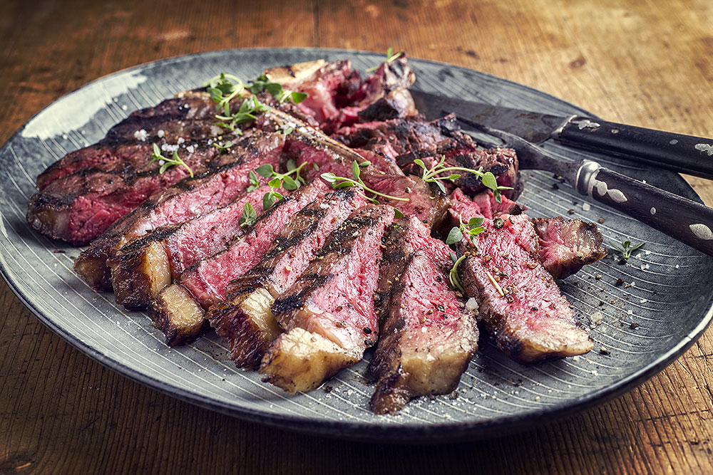

# Bistecca alla Fiorentina

*Tuscany's giant grilled T-bone: a thick (4 cm minimum) T-bone or porterhouse steak from Chianina cattle, grilled rare over wood coals till the outside chars and the inside stays bright red. Seasoned only with sea salt, olive oil, fresh rosemary and lemon. The Florentine restaurant centerpiece, minimalism in service of a perfect piece of meat.*

**Serves:** 4 (sharing one giant steak)

**Prep Time:** 10 minutes (plus 30 minutes resting steak to room temperature)

**Cook Time:** 15 minutes

## Overview
Bistecca alla Fiorentina is the iconic giant T-bone of Florence and Tuscany: properly a 1.2 to 1.5 kg T-bone (or porterhouse) from Chianina cattle (the giant white Tuscan breed), at least 4 cm thick, grilled rare to medium-rare over wood coals till the outside chars and the inside stays bright red. Stood up briefly on the bone, rested, then sliced thickly off the bone and served with just sea salt, fresh rosemary, extra virgin olive oil and a wedge of lemon. The dish is a study in Italian minimalism: one perfect ingredient, treated with respect, eaten with reverence. Florentine restaurants serve a bistecca to a table of three or four; ordering it well-done is considered a culinary sin in Tuscany. The steak must be a minimum of 4 cm thick (thinner cuts cook through before the outside chars), the heat must be ferocious (wood coals traditional; a cast-iron pan or screaming-hot grill the substitute), and the doneness must stay rare to medium-rare.

## Ingredients

### The steak
- 1 large T-bone or porterhouse steak (1.2-1.5 kg; minimum 4 cm thick; preferably Chianina or aged-prime steak)

### Seasoning (minimalist Tuscan)
- 2 teaspoons flaky sea salt (Maldon or fleur de sel)
- 1 teaspoon coarsely ground black pepper
- 4 sprigs fresh rosemary
- 4 tablespoons extra virgin olive oil (best quality Tuscan)
- 2 lemons (cut into wedges)

### Optional garnishes
- Fresh thyme
- 2 garlic cloves (lightly crushed; rubbed on the steak)

### To serve
- Tuscan white beans (cannellini) with sage and olive oil
- OR Tuscan-style sautéed cavolo nero
- OR roasted potatoes
- Tuscan red wine (Chianti Classico, Brunello di Montalcino, Vino Nobile di Montepulciano)
- Crusty Tuscan bread

## Method

### Stage 1 - Bring to room temperature
1. Take the steak out of the fridge 1-2 hours before cooking.
2. Pat dry thoroughly.

### Stage 2 - Heat the grill or pan
1. Light a charcoal grill; let burn down to glowing embers covered with a thin layer of grey ash (no flames).
2. OR heat a heavy cast-iron pan (or ridged grill pan) over very high heat till smoking.

### Stage 3 - Season briefly
1. Rub the steak with the crushed garlic cloves (optional).
2. Don't season with salt before cooking (the salt would draw out moisture); season after.

### Stage 4 - Sear on the first side
1. Place the steak on the grill or pan.
2. Don't move it for 5-7 minutes; the outside needs to develop a deep char.
3. The grill should be screaming hot.

### Stage 5 - Flip and sear the other side
1. Carefully flip the steak with tongs.
2. Sear 5-7 more minutes on the second side.

### Stage 6 - Stand on the bone
1. Stand the steak upright on its bone for 1-2 minutes.
2. This cooks the spine area and ensures even doneness.

### Stage 7 - Rest
1. Lift onto a wooden board.
2. Don't slice yet; rest for 5 minutes covered loosely with foil.
3. The internal temperature should be 50-52°C / 122-126°F for proper rare; 54-57°C / 130-135°F for medium-rare.

### Stage 8 - Season and serve
1. Sprinkle with flaky sea salt and coarsely ground black pepper.
2. Scatter fresh rosemary sprigs.
3. Drizzle generously with extra virgin olive oil.
4. Slice thickly (1.5 cm) off the bone, against the grain.
5. Squeeze lemon over.
6. Serve immediately on the wooden board.

## Notes
- **Steak must be thick:** 4 cm minimum.
- **Very high heat:** wood coals or screaming-hot grill.
- **Rare to medium-rare only:** ordering well-done is sacrilege in Florence.
- **Salt AFTER cooking:** salt before draws out moisture.
- **Rest before slicing:** essential.

## Variations
- **Beef ribeye instead of T-bone:** if you can't get a T-bone, a thick ribeye works.
- **Tagliata version:** slice the steak more thinly; serve over rocket with Parmesan shavings.
- **With balsamic reduction:** drizzle aged balsamic vinegar over; gives sweet-tart depth.
- **With herb butter:** top with a slice of compound butter; less traditional but excellent.

## Serving
- On a wooden board for sharing. Tuscan beans, cavolo nero, roasted potatoes alongside. Tuscan red wine. Crusty bread. The Florentine experience: one giant steak shared among 4 people, eaten with reverence.

## Storage
- Best eaten immediately.
- Leftover sliced steak keeps refrigerated 2 days; use cold in salads.
- Don't reheat; the texture suffers.
