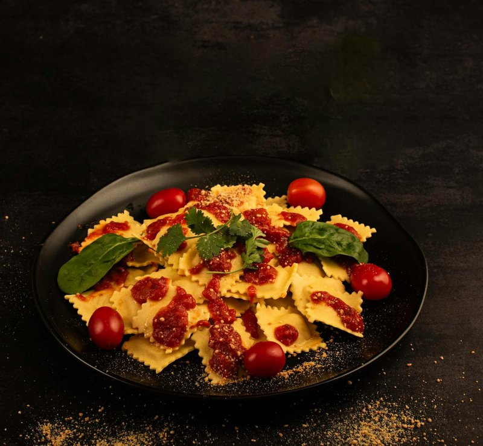

# Chilli Ravioli with Crab

*Chilli pasta that looks and tastes sensational. The vibrant red dough encases a creamy mascarpone and crab filling, creating a dish that excels at dinner parties and impresses all who taste it.*

**Serves:** 4

**Prep Time:** 15 minutes

**Cook Time:** 10 minutes

## Overview
Crab ravioli is the elegant fresh-pasta dish of coastal Italy, white crab meat folded with mascarpone, lemon and parsley, wrapped in chilli-tinted pasta and finished with a simple lemon butter. The chilli-flecked dough is the traditional visual signature; dried chilli flakes worked through the fresh pasta give the deep red colour and a faint background heat that pairs with the sweetness of crab. White crab meat is the right cut; brown meat is too rich for this delicate filling and overpowers the mascarpone, where white meat gives the traditional sweet seafood note Italian coastal cooking calls for. The lemon-butter sauce is the right finish (no cream, no tomato); the simple emulsion of melted butter with lemon zest lets the crab speak rather than burying it. Pasta rolled thin enough to see your hand through is the proper sheet thickness, and thicker pasta gives ravioli that taste of dough rather than filling. Boiled briefly in salted water so the pasta stays al dente. Served on warm plates with a glass of cold white.

## Ingredients

### Chilli Pasta Dough
- 300 grams strong white flour
- 1 teaspoon salt
- 2 teaspoons crushed dried red chillies
- 3 eggs

### Crab Filling
- 175 grams mascarpone cheese
- 175 grams freshly picked crab meat
- 2 tablespoons fresh flat-leaf parsley (finely chopped)
- Rind of 1 lemon (finely grated)
- Pinch of crushed dried chillies
- salt
- pepper

### Finishing
- 75 grams butter
- 1 lemon (juice)
- Fresh basil leaves (chopped)

## Method

### Stage 1 - Make Pasta Dough
1. Make a well in the center of the flour and crack eggs into it.
2. Add dried chillies and salt to the eggs.
3. Gradually bring in the sides of flour, mixing into the egg until a dough forms.
4. Roll the dough into a ball and knead for 10 minutes until smooth and elastic.
5. Place in a bowl, cover with cling film, and refrigerate for 30 minutes.
6. After chilling, knead again for 10 minutes and set aside.

### Stage 2 - Prepare Filling
1. Mash mascarpone in a bowl with a fork until smooth.
2. Add crab meat, parsley, lemon rind, and dried chillies.
3. Season to taste with salt and freshly ground black pepper.
4. Stir gently until combined but not overworked. Set aside.

### Stage 3 - Roll & Cut Ravioli
1. Using a pasta machine, roll out one-quarter of the dough to a 90 cm strip.
2. Cut into two lengths.
3. Using a 6 cm fluted cutter, cut out 8 squares from each strip.
4. Using a teaspoon, place a mound of filling in the center of half the squares.
5. Brush a little water around the edge of filled squares.
6. Top with plain squares and press edges to seal.
7. For decorative finish, press edges with fork tines.
8. Place ravioli on floured tea towels, sprinkle lightly with flour, and allow to dry.
9. Repeat with remaining dough and filling to create 32 ravioli total.

### Stage 4 - Cook & Serve
1. Bring a large pan of salted water to the boil.
2. Cook ravioli in batches for 4-5 minutes until they rise to the surface.
3. Meanwhile, melt butter and lemon juice in a small pan until sizzling.
4. Drain ravioli and divide among 4 warmed bowls.
5. Drizzle lemon butter over ravioli.
6. Sprinkle with crushed chillies and chopped basil.
7. Serve at once.

## Notes
- **Fresh Crab:** Use hand-picked white and brown meat for best flavor; avoid frozen crab if possible.
- **Pasta Rest:** The 30-minute chill is essential for the dough to relax and become workable.
- **Filling Proportion:** Don't overfill; too much filling causes bursting during cooking.
- **Drying Time:** Allowing ravioli to dry slightly before cooking helps them hold together.

## Variations
- **With Lemon Zest:** Add extra lemon zest to the lemon butter for brighter flavor.
- **Seafood Mix:** Combine crab with finely chopped scallops or prawns for variety.

## Serving
- Serve with: A crisp white wine and simple green salad
- Garnish with: Fresh basil, red chilli flakes, and lemon wedges

## Storage
- Best eaten immediately after cooking
- Uncooked ravioli freeze well up to 1 month on a parchment-lined tray
- Cooked ravioli does not reheat well; prepare fresh for best results
