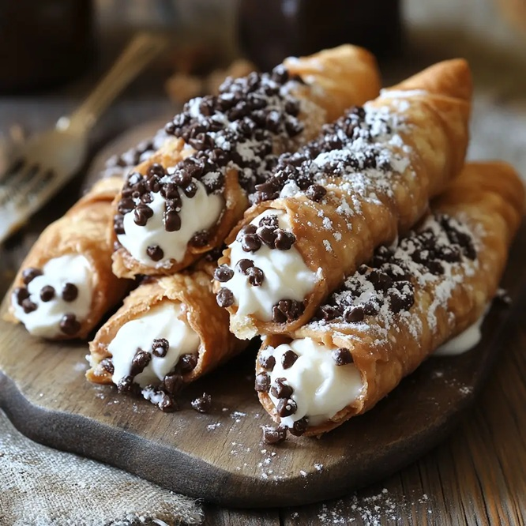

# Cannoli Siciliani

*Sicily's signature pastry: deep-fried Marsala-spiked dough tubes filled to order with sweetened ricotta, candied peel and pistachio.*

**Serves:** 8 (makes 12 cannoli)

**Prep Time:** 1 hour (plus 30 min dough rest, 4 hours ricotta drain)

**Cook Time:** 15 minutes

## Overview
Sicily's most famous sweet, and the one you'll find on every pasticceria counter from Palermo to Catania. The shells fry the day before, the ricotta drains overnight, and you only fill them when the order goes in, that's the rule, because a cannolo sitting on a tray for an hour goes soft and loses everything that makes it worth eating. You roll the dough thin enough to read through, wrap it around oiled metal tubes, brush egg wash on the seam, and drop them into 180°C oil where they blister and crackle in about a minute and a half. The drained ricotta gets whipped with icing sugar, vanilla and orange zest, chocolate chips and candied peel folded through; piped in from both ends so the shell stays whole. Pistachio crumb or chopped chocolate at the ends, icing sugar on top, eaten standing up at the counter with espresso.

## Ingredients

### Pastry dough
- 250 g plain flour
- 2 tablespoons caster sugar
- 1 tablespoon unsweetened cocoa powder
- ½ teaspoon ground cinnamon
- ¼ teaspoon salt
- 30 g unsalted butter (cold, cubed)
- 1 egg yolk (large)
- 80 ml sweet Marsala (or sweet sherry, or dry white wine + 1 tablespoon sugar)
- 1 tablespoon white wine vinegar

### To fry
- 1 litre sunflower oil (or vegetable oil)
- 1 egg white (for sealing the dough around the forms)
- 12 metal cannoli forms (cylinders 13 cm long; widely sold at Italian shops and online)

### Ricotta filling
- 600 g whole-ricotta (drain overnight in muslin in the fridge, see Stage 1)
- 120 g icing sugar (sifted)
- 1 teaspoon vanilla extract
- 1 orange (zest)
- 60 g dark chocolate chips (or finely chopped dark chocolate)
- 30 g candied orange peel (finely chopped)
- 30 g candied citron (optional, sold at Italian / cake-decorating shops)

### To finish
- 50 g shelled unsalted pistachios (finely chopped)
- 50 g dark chocolate (grated or finely chopped, optional)
- 30 g icing sugar (for dusting)
- 12 maraschino cherries (optional)

## Method

### Stage 1 - Drain the ricotta
1. Line a sieve with muslin or a clean tea towel; set over a bowl.
1. Tip the ricotta in; tie up the corners of the cloth; weight with a small plate.
1. Refrigerate at least 4 hours, ideally overnight. The ricotta should be firm and almost pasta-thick.

### Stage 2 - Dough
1. In a wide bowl, whisk flour, sugar, cocoa, cinnamon and salt.
1. Rub in the cold cubed butter with fingertips until the mixture resembles fine breadcrumbs.
1. Make a well; add egg yolk, Marsala and vinegar.
1. Mix with a fork, then by hand, to a stiff but pliable dough.
1. Knead on a floured surface for 6-8 minutes, the dough should be smooth and elastic.
1. Wrap in cling film; rest 30 minutes at room temperature.

### Stage 3 - Roll and cut
1. Roll the dough on a lightly floured surface to a thin sheet, ideally pasta-thin, around 2 mm thick. Use a pasta machine if you have one, taking it down to setting 5 or 6.
1. Cut out 12 cm discs (or 12 x 8 cm oval shapes, the traditional shape).
1. Re-roll scraps once.

### Stage 4 - Form
1. Brush each metal cannoli form lightly with oil.
1. Wrap a disc of dough around each form (lengthwise), overlapping the edges by 2 cm.
1. Brush the overlap with egg white; press firmly to seal.

### Stage 5 - Fry
1. Heat oil to 180°C in a deep pot.
1. Lower 3-4 cannoli (still on their forms) into the oil with tongs.
1. Fry 90 seconds to 2 minutes, turning, until deep amber and blistered.
1. Lift onto kitchen paper.
1. Once cool enough to handle (about 5 minutes), gently slide each shell off its form. The metal will be hot, use a tea towel.
1. Re-oil the forms between batches.

### Stage 6 - Make the filling
1. In a bowl, mix the drained ricotta, icing sugar, vanilla extract and orange zest until smooth.
1. Fold in chocolate chips and candied peel.
1. Taste; the filling should be sweet but not cloying.
1. If you want a smoother texture, press the ricotta through a fine sieve before mixing.

### Stage 7 - Prep finishing components
1. Spread chopped pistachios on a small plate.
1. Spread grated chocolate on another plate (if using).

### Stage 8 - Fill (at the moment of serving)
1. Transfer the filling to a piping bag fitted with a 1 ½ cm plain or star nozzle (or use a freezer bag with the corner snipped).
1. Pipe the filling into each shell from both ends, working from the centre outward, until the shell is generously full and the filling protrudes slightly from each end.
1. Press one end into chopped pistachios; the other end into chopped chocolate (or both ends in pistachios).
1. Optional: press a maraschino cherry into one end.

### Stage 9 - Serve
1. Dust with icing sugar at the table.
1. Eat within 30 minutes of filling, beyond that, the shell softens.

## Notes
- **Drain the ricotta, really drain it:** Wet ricotta makes the cannoli filling sloppy and the shell soft within minutes. Overnight in muslin is ideal. The drained whey can be discarded or used in bread / smoothies.
- **Fill at the last second:** This is the cardinal rule of cannoli. Pre-filled cannoli in a bakery window are sad; the shells go soft from the wet filling. Real Sicilian pasticcerie fill them as you order. At home: fry the shells in advance, store airtight, fill when serving.
- **No cannoli forms?**: Cut foil into rectangles, fold and roll around cylindrical objects (like a thick pen wrapped in foil) for a homemade form. Or skip the tubes entirely and make "cannoli scoops", break shells into shards, pile filling on a plate, scatter chocolate chips and pistachios.

## Storage
- **Fried shells, unfilled**: keep airtight at room temperature 1 week.
- **Filling**: refrigerate 2 days (eat sooner; ricotta is perishable).
- **Filled cannoli**: don't store. Eat within 30 minutes.
