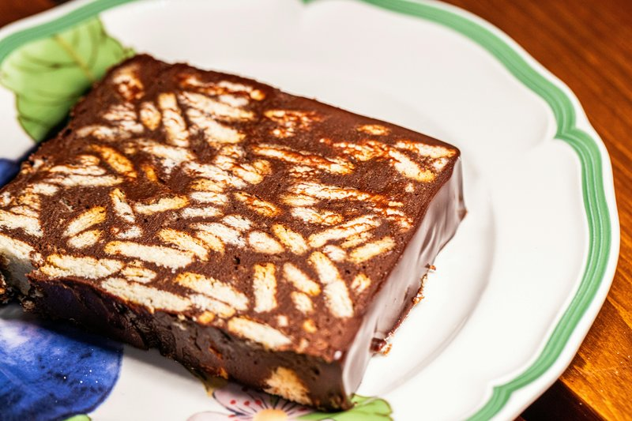

# Chocolate Biscotti Cake

*An Italian dessert: a layered cake of chocolate sponge and crushed almond biscotti, set with whipped cream and cocoa. Sliced like a parfait.*

**Prep Time:** 10 minutes

**Yield:** 8

## Ingredients
- 250 grams dark chocolate
- 3 eggs (medium)
- 50 grams candied fruit peel
- 200 grams ground almonds
- 150 grams biscotti
- 200 grams icing sugar
- 4 table spoons amaretto

### For the topping
- 100 grams dark chocolate
- 70 grams icing sugar

## Overview
A no-bake chocolate cake that comes together in the time it takes the kettle to boil, and tastes like something a Roman pastry shop spent all day on. You crush biscotti to coarse rubble, fold in ground almonds and melted dark chocolate, press the lot into a lined tin and let it set in the fridge for a few hours. A glossy chocolate syrup goes over the top once it's firm, pooling at the edges where it meets the tin. The texture is the trick: the biscotti hold their crunch, the almonds keep it from going claggy, and the chocolate binds the whole thing without turning it into fudge. Cut thin slices, you don't need a fat wedge, and serve with strong coffee or a small glass of Vin Santo.

## Method
1. Melt the chocolate in a large heatproof bowl over a pan of simmering water, ensuring that the base of the bowl does not touch the water.
1. Using a fork, beat the egg whites in a large bowl for two minutes. 
1. Add in the peel, ground almonds, the biscotti, icing sugar and Amaretto. 
1. Mix well then very gently fold in the melted chocolate.
1. Line a circular flan dish measuring about 18 cm across and 3 cm deep with cling film. 
1. Pour in the mixture and set aside for two hours.
1. To make the topping, melt the chocolate in a heatproof bowl over a pan of simmering water, ensuring that the base of the bowl does not touch the water.
1. Melt the icing sugar and two tablespoons of water in a small saucepan over a low heat.
1. Stir to check the sugar has melted, then add the chocolate to make a syrup.
1. Turn the cake out onto a plate and peel off the cling film. 
1. Use a spatula to cover the surface with the chocolate syrup. 
1. Set aside for one hour or until the chocolate has hardened.

## Notes
- The biscotti should be crushed to various sizes (not a fine powder) for interesting texture contrasts; the hardness of biscotti means it won't turn to dust when mixed
- Melted dark chocolate folding gently into the almond mixture creates the binding without requiring eggs; ensure chocolate is not too hot or it will break down the mixture
- The two-hour setting time allows flavors to develop and the structure to set without using heat; extended chilling improves flavor integration
- The chocolate syrup glaze must be slightly warm (not hot, which would be too runny) to flow evenly and set to a shiny finish

## Serving
- Slice the chilled cake with a sharp knife dipped in hot water (wipe between cuts) to reveal the attractive interior. Serve at room temperature or lightly chilled. The rich chocolate flavor and interesting texture make this elegant enough for formal dinner parties.

## Storage
The assembled cake can be refrigerated for up to 3 days in an airtight container; the flavors mature and integrate beautifully over this time. Do not freeze as the biscotti absorbs moisture and the texture changes. Remove from refrigerator 20-30 minutes before serving to allow chocolate to soften slightly.
