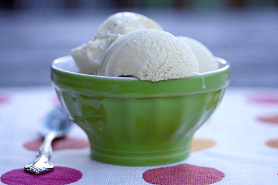

<!-- TODO: hero image undersized, refresh from Pexels or hand-curate -->
# Lavender Ice Cream

*Adding double cream makes this classic ice cream extra rich and creamy.*

**Serves:** 

**Prep Time:** 20 minutes

**Cook Time:** 20 minutes

## Ingredients
- 750 ml [crème anglaise](../../../baking/cremes/creme-anglaise.md) (warm, infused with 10 sprigs of lavender)
- 100 ml double cream

## Overview
A pale violet ice cream that smells like an Italian garden in July: dried culinary lavender steeped in cream until the buds release their oils, then churned to a smooth custard. The trick is restraint, you want the lavender to whisper rather than perfume the room, so the buds come out before the cream tips into "soap". You'll know you've got it right when the first spoonful reads as creamy and floral, and the lavender only registers as you swallow. Serve it on its own in a small glass, alongside a few fresh strawberries, or next to a thin slice of lemon polenta cake; it wants company that doesn't shout.

## Method
1. Pour the crème anglaise into a bowl, set over ice to hasten the cooling, stirring from time to time to prevent a skin from forming.
1. Once cold, remove the lavender and discard.
1. Stir the cream into the crème anglaise.
1. Pour the mixture into an ice-cream maker and churn for about 20 minutes, until the ice cream is firm but still creamy.
1. Transfer the ice cream to a chilled freezer-proof container for ½ hour before serving.

## Notes
- Only use culinary lavender from suppliers catering to food preparation; ornamental lavender can be treated with pesticides and is not for consumption
- The lavender should infuse the warm crème anglaise for 3-5 minutes only; prolonged infusion can create a soapy flavor rather than delicate floral notes
- Remove the lavender before churning by straining through a fine sieve; any remaining flower pieces will damage the ice cream machine or create an unpleasant texture
- If the lavender flavor seems too subtle after churning, a few drops of lavender essential oil for culinary use can be whisked in to adjust intensity

## Serving
Serve as an elegant standalone dessert in a chilled glass or coup, garnished with a single fresh lavender sprig if available. This ice cream pairs beautifully with light meringues, shortbread cookies, and delicate fruit compotes, particularly strawberry or raspberry. Avoid serving with other heavily-flavored desserts.

## Storage
Keep the ice cream in an airtight freezer container for up to two weeks, though best texture and flavor are achieved within the first week. Cover the surface with plastic wrap before sealing the container to prevent ice crystals. If rock-hard from freezing, soften for 10-15 minutes at room temperature before scooping.
