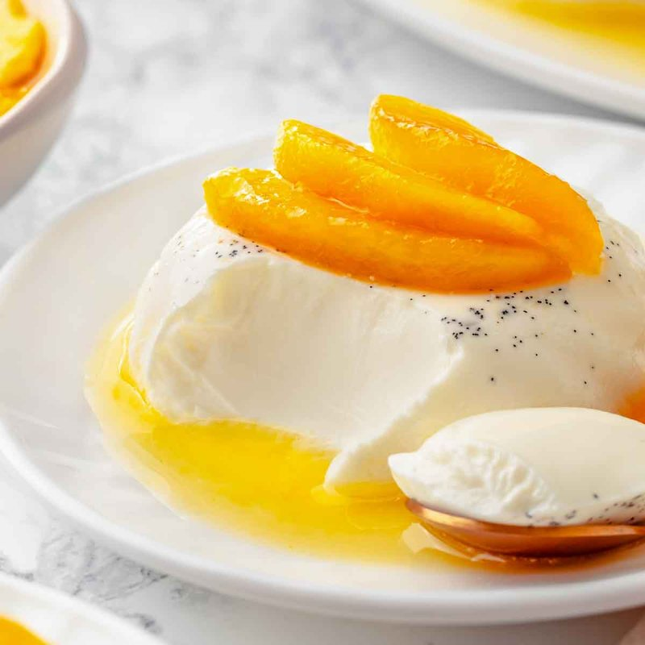

# Panna Cotta

*Piedmont's cooked cream: cream, sugar and vanilla set with a touch of gelatin, turned out on a plate and crowned with berry compote.*

**Serves:** 6

**Prep Time:** 10 minutes (plus 4-6 hours setting)

**Cook Time:** 8 minutes

## Overview
Powdered gelatin blooms in cold milk 5 minutes. Double cream, the remaining milk, sugar and a vanilla pod (split and scraped) heat gently to just under a simmer, never to a boil. Off heat, the bloomed gelatin stirs in until dissolved. The mixture strains through a sieve into 6 small ramekins or dariole moulds. Refrigerated for 4-6 hours (ideally overnight) until set. To serve: briefly dip each mould in hot water; invert onto a plate; spoon over the berry compote.

## Ingredients

### Panna cotta
- 8 g powdered gelatin (about 1 ½ teaspoons, or 4 leaves)
- 100 ml whole milk (cold, for blooming)
- 500 ml double cream
- 150 ml whole milk (additional, for the mixture)
- 80 g caster sugar
- 1 vanilla pod (split lengthwise, seeds scraped, or 2 teaspoons vanilla bean paste)
- A pinch of salt

### Berry compote
- 300 g mixed berries (raspberries, strawberries, blueberries, blackberries - fresh or frozen)
- 60 g caster sugar
- 1 tablespoon lemon juice
- 1 tablespoon water
- 1 teaspoon vanilla extract (optional)

### To serve
- Fresh mint sprigs
- Optional: a small drizzle of cream

## Method

### Stage 1 - Bloom the gelatin
1. **Powdered**: sprinkle 8 g gelatin over 100 ml cold milk in a small bowl; let stand 5 minutes - the powder absorbs the liquid and swells into a soft, slightly bouncy mass.
1. **Leaf**: soak 4 leaves in plenty of cold water 5 minutes; squeeze out excess water before using.

### Stage 2 - Heat the cream
1. In a saucepan, combine double cream, 150 ml additional milk, caster sugar, the split vanilla pod (and its scraped seeds), and a pinch of salt.
1. Heat over medium-low, stirring occasionally to dissolve the sugar.
1. Bring to JUST under a simmer (about 80°C - small bubbles at the edges, no rolling boil).
1. Off heat.

### Stage 3 - Combine with gelatin
1. Pour about half the hot cream into the bowl with the bloomed gelatin.
1. Whisk to dissolve the gelatin completely - no specks left.
1. Pour back into the saucepan; whisk thoroughly to combine.

### Stage 4 - Strain and pour
1. Strain the mixture through a fine sieve into a measuring jug (catches the vanilla pod and any specks).
1. Pour into 6 dariole moulds, ramekins, or small glasses (about 120-130 ml each).
1. Let cool 15 minutes at room temperature (gelatin sets better with a gradual chill).

### Stage 5 - Set
1. Cover each ramekin loosely with cling film (don't let it touch the surface).
1. Refrigerate at least 4 hours, ideally overnight.
1. The panna cotta is set when it wobbles uniformly but doesn't slosh.

### Stage 6 - Compote
1. In a saucepan, combine berries, sugar, lemon juice and water.
1. Bring to a simmer over medium heat; cook 5-8 minutes, stirring gently, until the berries break down and the juice thickens to a loose syrup.
1. Off heat; stir in vanilla extract if using.
1. Cool; chill in the fridge.

### Stage 7 - Unmould and serve
1. To unmould: run a thin knife around the inside edge of each ramekin.
1. Dip the bottom of the ramekin in a bowl of hot tap water for 5-8 seconds - feel it loosen.
1. Place a serving plate over the top; invert; lift the ramekin away. The panna cotta should slide out as a domed disc.
1. Spoon the berry compote around the base.
1. Garnish with a mint sprig.

### Stage 8 - Serve
1. Eat slightly cold, but not fridge-fresh. The flavours open at slightly-cool temperature.

## Notes
- **Gelatin proportion is precise:** 8 g powdered (or 4 leaves) for 750 ml of liquid gives the right wobble. Less and it won't hold its shape; more and it's gummy. If using a different brand of gelatin, check the packet - some are stronger than others.
- **Don't boil the cream:** Boiling denatures the gelatin and the panna cotta won't set properly. Just below a simmer is right.
- **Vanilla pod is worth it:** The pod is what gives panna cotta its delicate fragrance. Bean paste works as a substitute; vanilla extract added at the end works in a pinch but lacks the depth.
- **Mould vs glass:** Traditional Italian panna cotta is unmoulded onto a plate. Modern presentations often serve it in glass jars or coupes (no unmoulding needed). Both work; the dramatic flat-top dome is the classic visual.

## Storage
- Refrigerate (in moulds, covered) 3 days.
- Once unmoulded, eat the same day - it's fragile.
- The berry compote keeps 1 week in the fridge.
