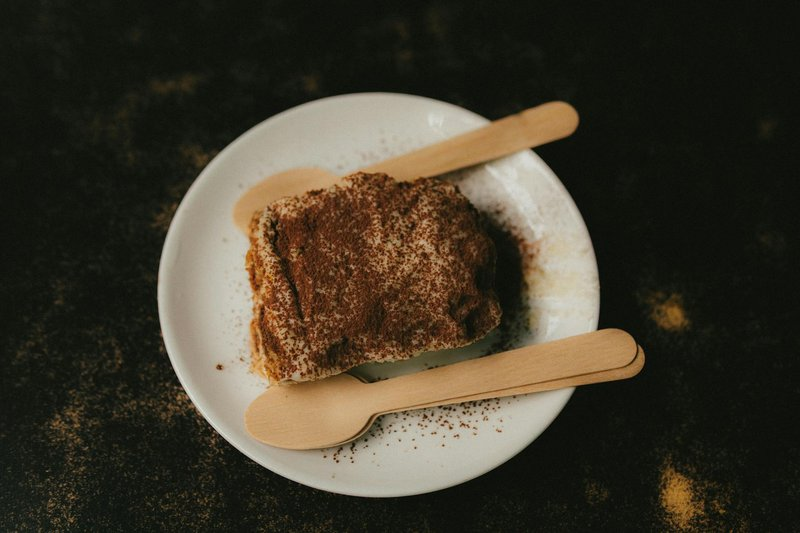

# Tiramisù

*Italy's most-exported dessert: espresso-soaked savoiardi layered with mascarpone-and-egg cream, dusted thickly with cocoa, set overnight.*

**Serves:** 8

**Prep Time:** 30 minutes (plus overnight chilling)

**Cook Time:** 0 minutes (eggs are raw - see Notes)

## Overview
Egg yolks whisk with sugar over hot water (zabaglione method, gentle heat) until pale and thick. Off heat, mascarpone whisks in to a smooth thick cream. Whipped egg whites fold through to lighten. Strong espresso is brewed and cooled; Marsala (or rum) stirs in. Savoiardi (lady fingers) get dipped briefly in the coffee, 2 seconds maximum per side, and lined up in the dish. Half the mascarpone cream goes on; cocoa-dust between layers. A second layer of dipped savoiardi; remaining cream on top. Heavy cocoa dusting. Refrigerated overnight; the savoiardi soften and the layers set.

## Ingredients

### The cream
- 4 eggs (large, separated - yolks for the cream, whites for lightening)
- 100 g caster sugar (for the yolks)
- 50 g caster sugar (for the whites)
- 500 g mascarpone (cold, from the fridge)
- A pinch of salt

### The dipping coffee
- 300 ml strong fresh espresso (or very strong filter coffee)
- 3 tablespoons Marsala (sweet, or use dark rum, brandy, or amaretto)
- 1 tablespoon caster sugar

### Assembly
- 300 g savoiardi (lady fingers / Italian sponge biscuits - about 32-36 biscuits)
- 30 g good cocoa powder (Valrhona or other 100% cocoa, NOT sweetened drinking chocolate)
- 50 g dark chocolate (70% - for grating, optional)

### To serve
- Mascarpone-style spoon for serving
- Optional: extra cocoa at the table

## Method

### Stage 1 - Prep the dish
1. Get a 22 x 28 cm rectangular dish (or a 22 cm round dish, deep). No greasing needed - the dessert sets and lifts naturally.

### Stage 2 - Egg yolks and sugar (zabaglione step)
1. Set up a bain-marie: place a heatproof bowl over a small pan of barely simmering water (the water mustn't touch the bowl).
1. In the bowl, whisk egg yolks with 100 g caster sugar continuously for 5-6 minutes - the mixture should pale and thicken to a ribbon consistency (a trail held briefly on the surface when the whisk is lifted).
1. The bowl should be warm but never hot to the touch. Don't let the eggs scramble.
1. Off heat; whisk 1 more minute to cool slightly.

### Stage 3 - Add mascarpone
1. Add the cold mascarpone in 3 additions, whisking smoothly between each, until you have a thick smooth cream.
1. Don't overwork - mascarpone can split if whisked too long.

### Stage 4 - Whip the egg whites
1. In a separate clean bowl with clean beaters, whip egg whites and a pinch of salt to soft peaks.
1. Add 50 g caster sugar gradually; continue whipping to stiff glossy peaks.

### Stage 5 - Fold
1. Fold a third of the meringue into the mascarpone mixture to lighten.
1. Fold in the rest in 2 additions, using a large spatula and lifting / cutting motion - don't stir flat.
1. The cream should be light, voluminous, but still thick enough to hold its shape.

### Stage 6 - Prepare the coffee
1. Stir Marsala and 1 tablespoon sugar into the cooled espresso in a wide shallow bowl.
1. Coffee must be at room temperature - hot coffee makes the savoiardi go to mush instantly.

### Stage 7 - First layer
1. Working quickly: take a savoiardo, dip one flat side in the coffee for 1 second, then the other for 1 second.
1. Place in the dish, dipped-side up.
1. Continue until the base is covered in a single tight layer (don't overlap).
1. Spoon half the mascarpone cream over; smooth with a spatula to a flat layer.
1. Sift a thin layer of cocoa across.

### Stage 8 - Second layer
1. Repeat with another layer of dipped savoiardi.
1. Cover with the remaining cream; smooth flat.

### Stage 9 - Finish
1. Sift cocoa generously across the top in an even layer - about 2 tablespoons.
1. Grate dark chocolate over the cocoa if using.

### Stage 10 - Chill
1. Cover the dish with cling film (don't let the film touch the cocoa or it'll leave marks).
1. Refrigerate at least 6 hours, ideally overnight.
1. The savoiardi continue softening and the layers set.

### Stage 11 - Serve
1. Slice with a large spoon (a knife drags the cocoa).
1. Best slightly cold but not fridge-cold - let it sit out for 15 minutes before serving.

## Notes
- **Raw eggs:** Traditional Italian tiramisù uses raw eggs (in both the yolk-zabaglione and the whipped whites). The zabaglione step DOES cook the yolks lightly. If you're concerned about food safety (pregnant, immunocompromised), use pasteurised eggs (sold in cartons) OR whisk the yolks at the bain-marie for an extra 3 minutes to reach 71°C, OR skip the egg whites and substitute 200 ml whipped double cream folded in instead.
- **Quick dip the savoiardi:** 1-2 seconds per side, no more. Long-soaked savoiardi disintegrate into the cream and the dessert becomes wet sponge. Italian savoiardi are designed to be dipped quickly - the dryness is the point.
- **Marsala, rum or alcohol-free:** Sweet Marsala is the classic. Dark rum is the next best. Amaretto is great but pushes the dessert into a different flavour profile (almond-forward). Alcohol-free tiramisù just leaves out the booze - still good, slightly less complex.
- **Mascarpone, not cream cheese:** Mascarpone is much higher fat (~45%) and almost sweet-tasting. Cream cheese is sour, lower fat, and makes a tiramisù that tastes like New York cheesecake. They are not interchangeable.

## Storage
- Refrigerate 4 days; arguably best on day 2-3 when the layers fully set and flavours marry.
- The cocoa dusting can darken / dampen over time - re-sift fresh cocoa just before serving if it's been more than a day.
- Doesn't freeze well - the mascarpone separates on thaw.
