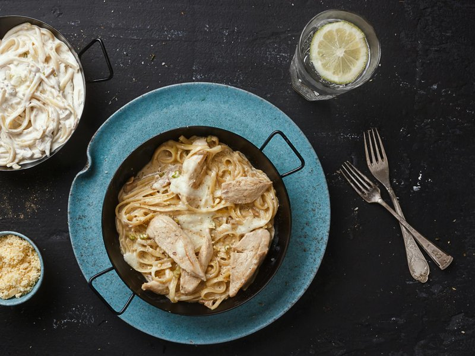

# Fettuccine with Chicken and Dolcelatte

*Fettuccine con pollo e Dolcelatte, a wonderful marriage of tender chicken, creamy blue cheese, and wine-enriched sauce. The Dolcelatte's sweetness and creaminess provide surprising depth, complemented by fresh chives and white wine.*

**Serves:** 4

**Prep Time:** 10 minutes

**Cook Time:** 4 minutes

## Overview
Fettuccine with chicken and Dolcelatte is the Italian-bistro classic that turns golden-fried chicken into a creamy blue-cheese pasta dish, a dinner that lands between rich and elegant. Chicken breast strips fry golden in butter; Dolcelatte (creamy Italian blue) and a splash of white wine join the pan along with double cream to make the sauce. The cheese melts into a velvety sauce that clings to fresh fettuccine. Fresh chives bridge all the flavours with their subtle onion notes. (Gorgonzola substitutes if Dolcelatte is unavailable.) Eat with a green salad and a glass of Pinot Grigio.

## Ingredients

### Chicken & Base
- 2 tablespoons olive oil
- 350 grams boneless, skinless chicken breast (cut into strips)
- 200 grams Dolcelatte cheese (cut into chunks)

### Sauce
- 150 ml double cream
- 50 ml dry white wine
- 3 tablespoons fresh chives (finely chopped)
- salt
- pepper

### Pasta
- 400 grams fresh fettuccine (or tagliatelle)

## Method

### Stage 1 - Cook Chicken
1. Heat oil in a medium saucepan over medium heat.
2. Add chicken strips and fry for about 6 minutes until golden all over.
3. Stir occasionally with a wooden spatula for even cooking.

### Stage 2 - Add Cheese
1. Add Dolcelatte chunks to the pan.
2. Lower the heat and cook for 2 minutes, stirring until melted.

### Stage 3 - Finish Sauce
1. Pour in cream and white wine.
2. Continue cooking for a further minute, stirring constantly.
3. Stir in fresh chives.
4. Season with salt and pepper to taste.
5. Set sauce aside, keeping warm.

### Stage 4 - Cook & Combine
1. Cook fettuccine in a large saucepan of boiling salted water until al dente.
2. Drain thoroughly and return to the same pan.
3. Pour the chicken sauce into the pan with the pasta.
4. Stir everything together for 30 seconds, allowing sauce to coat pasta evenly.
5. Serve immediately in warmed bowls.

## Notes
- **Dolcelatte:** A creamy, mild blue cheese, less intense than Gorgonzola. Both work but produce different flavor profiles.
- **Chicken Thickness:** Cut chicken into uniform strips so they cook evenly without drying out.
- **Cheese Temperature:** Low heat prevents the cheese from becoming grainy or separating.
- **Fresh Chives:** Essential for their delicate onion flavor; dried chives lack this brightness.

## Variations
- **With Walnuts:** Add 50g toasted walnuts for textural contrast and nutty depth.
- **Mushroom Version:** Add 150g sliced mushrooms cooked with the chicken.

## Serving
- Serve with: A crisp Pinot Grigio or similar white wine
- Garnish with: Fresh chives, cracked black pepper, and Parmesan shavings if desired

## Storage
- Best eaten freshly made
- Can refrigerate up to 2 days (sauce may thicken; thin with a little cream when reheating gently)
- Not suitable for freezing due to cream separation
