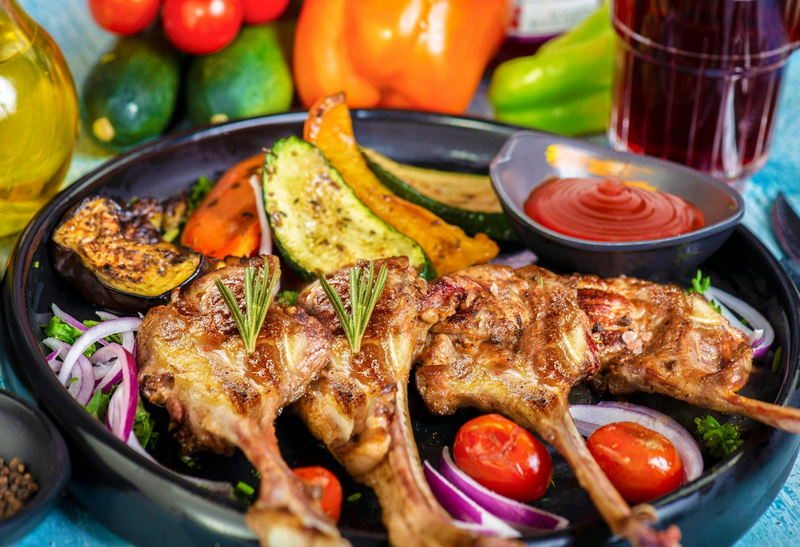

# Fettuccine with Sweet Onion, Rosemary, and Lamb

*Fettuccine alle cipolle, combining the rich, distinctive flavors of quality lamb with the sweetness of slowly caramelized onions and the herbaceous notes of fresh rosemary. This dish brings the essence of roast lamb to a plate of pasta, satisfying and deeply flavored.*

**Serves:** 4

**Prep Time:** 15 minutes

**Cook Time:** 3 minutes

## Overview
Fettuccine with rosemary lamb is the Italian-spring pasta, a fragrant minced-lamb ragù scented with fresh rosemary, served over fresh egg fettuccine. Onions and grated carrot soften slowly in olive oil until pale gold; minced lamb browns hard; fresh rosemary, garlic and a splash of white wine join the pan. Stock simmers everything together for thirty minutes into a light savoury sauce that clings to the pasta. The key is patience with the soffritto (don't rush the onions) and quality lamb. Toss with fresh egg fettuccine and a generous grating of Pecorino. Eat with a glass of red and crusty bread.

## Ingredients

### Lamb Sauce Base
- 6 tablespoons olive oil
- 3 onions (large, peeled and finely sliced)
- 1 carrot (peeled and finely grated)
- 1 tablespoon fresh rosemary (chopped)
- 200 grams top-quality minced lamb

### Liquid Components
- 200 ml dry white wine
- 300 ml vegetable stock
- salt
- pepper

### Pasta & Finishing
- 400 grams fettuccine
- 100 grams Parmesan cheese (freshly grated)

## Method

### Stage 1 - Cook Aromatics
1. Heat olive oil in a large saucepan over medium heat.
2. Add the sliced onions, carrot, and rosemary.
3. Fry for 5 minutes over medium heat until softened and golden.
4. Stir occasionally with a wooden spatula.

### Stage 2 - Brown Lamb
1. Add lamb mince and mix well into the onion mixture.
2. Continue cooking for 5 minutes, stirring frequently so meat browns all over.

### Stage 3 - Deglaze & Simmer
1. Pour in white wine and cook for a further 3 minutes to allow alcohol to evaporate.
2. Season with salt and pepper.
3. Pour in vegetable stock.
4. Bring to a boil over medium heat, then lower heat.
5. Leave to simmer uncovered for 30 minutes, stirring every 10 minutes.

### Stage 4 - Cook Pasta & Combine
1. About 10 minutes before sauce finishes, cook pasta in a large saucepan of boiling salted water until al dente.
2. Drain pasta thoroughly and immediately add to the meat sauce.
3. Increase heat to high and gently mix sauce and pasta together for 30 seconds, stirring constantly.
4. Ensure sauce coats pasta evenly.
5. Lower heat if needed to avoid breaking apart pasta.

### Stage 5 - Serve
1. Divide among warmed bowls.
2. Serve immediately, topped with freshly grated Parmesan cheese.

## Notes
- **Lamb Quality:** Good quality minced lamb makes all the difference; ask butcher to mince fresh lamb shoulder for you.
- **Onion Caramelization:** The slow cooking of onions concentrates their natural sweetness, providing depth.
- **Rosemary:** Fresh is essential; dried lacks the bright, herbal character this dish requires.
- **Stock Choice:** Vegetable stock works best, as it doesn't overpower the delicate lamb flavor.

## Variations
**With Red Wine:** Substitute red wine for white for deeper, earthier flavor.
**Cream Finish:** Add 100ml double cream in the final minute for richness.

## Serving
Serve with: A bold red wine such as Chianti or Barbera
Garnish with: Fresh rosemary sprigs and additional Parmesan shavings

## Storage
- Keeps 4-5 days refrigerated
- Freezes well up to 2 months (thaw completely before reheating gently)
- Best eaten within 24 hours when flavors are brightest
