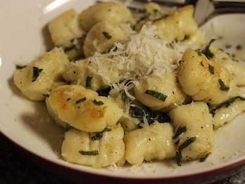

# Gnocchetti with Courgettes in Butter and Sage Sauce

*Gnocchetti burro e salvia, though a bit fiddly to prepare, this delicate gnocchi dish is absolutely worth the effort. The earthy sage and sweet courgettes create perfect harmony, enriched by melting butter and Parmesan. Always use fresh sage, never dried.*

**Serves:** 2

**Prep Time:** 15 minutes

**Cook Time:** 4 minutes

## Overview
Gnocchetti are the small handmade Italian potato dumplings, tender pillows of potato dough tossed with sweet courgettes, fresh sage and golden butter, the rustic dish that anchors every Italian Sunday lunch. Whole unpeeled potatoes bake until fluffy; while still hot, they pass through a ricer and build into a delicate dough with just flour and an egg yolk. Roll into thin ropes and cut into 2 cm pieces; press each piece with a fork or board for the textural grooves. The key is gentle handling: don't overwork the dough or the gnocchetti become tough. Boil briefly until they float (under a minute); toss with melted butter, sliced sautéed courgettes, fresh sage and grated Parmesan. Serve immediately.

## Ingredients

### Gnocchetti Dough
- 300 grams floury potatoes (unpeeled)
- 1 egg (small, lightly beaten)
- 100 grams plain flour (plus extra for dusting)
- Salt to taste

### Butter Sage Sauce
- 100 grams salted butter
- 2 courgettes (medium, cut into 1 cm cubes)
- 1 tablespoon fresh sage (finely sliced)
- 300 grams Parmesan cheese (freshly grated)
- salt
- pepper

## Method

### Stage 1 - Cook & Press Potatoes
1. Cook unpeeled potatoes in a large saucepan of boiling water for 25-30 minutes until tender.
2. Drain well and allow to cool slightly.
3. Peel the warm potatoes and press the flesh through a potato ricer into a large bowl.

### Stage 2 - Make Dough
1. While potatoes are still warm, add 2 pinches of salt, the beaten egg, and flour.
2. Lightly mix; do not overwork.
3. Turn out onto a floured surface and knead very lightly until a soft, slightly sticky dough forms.
4. Handle minimally, overworking makes gnocchetti tough.

### Stage 3 - Shape
1. Cut the dough in half.
2. Roll each piece into a long sausage shape, approximately 1 ½ cm in diameter.
3. Cut into 2 cm pieces.
4. Lay gnocchetti on a lightly floured clean tea towel.

### Stage 4 - Cook Gnocchetti
1. Bring a large saucepan of salted water to the boil.
2. Drop in gnocchetti and cook for about 2 minutes (ready when they rise to the surface).
3. Remove with a slotted spoon and drain.

### Stage 5 - Sauce & Serve
1. Melt butter in a large frying pan over medium heat.
2. Once hot, add courgettes and cook for 3 minutes until just tender.
3. Stir in fresh sage.
4. Season with salt and pepper.
5. Remove from heat.
6. Place drained gnocchetti in the pan and toss gently to coat.
7. Serve immediately, sprinkled generously with freshly grated Parmesan.

## Notes
- **Gentle Handling:** Overworked dough produces tough, dense gnocchetti. Handle only until the dough just comes together.
- **Floury Potatoes:** Essential for light, fluffy gnocchetti. Waxy potatoes make them dense.
- **Fresh Sage:** Provides essential peppery, herbaceous notes; dried sage is a poor substitute.
- **Courgette Timing:** Add late to cooking process so they stay firm and don't become mushy.

## Variations
- **With Truffle:** Drizzle a few drops of truffle oil over the finished dish for luxury.
- **Garlic Variation:** Add 2 sliced garlic cloves to the butter at the beginning of sauce preparation.

## Serving
- **Serve with:** A crisp white wine, perhaps Pinot Grigio
- **Garnish with:** Fresh sage leaves and abundant Parmesan shavings

## Storage
- Best eaten fresh immediately after cooking
- Uncooked gnocchetti can be frozen on a tray, then stored in freezer bags for up to 1 month
- Not suitable for refrigeration or reheating; texture suffers significantly
