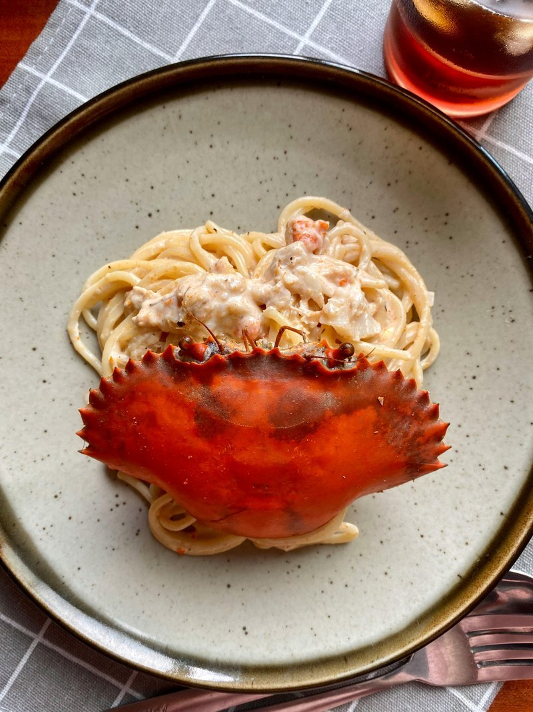

# Linguine with Crab, Fresh Chilli, and Lemon Zest

*Linguine con granchio e limone, a classic from Amalfi that requires exactly three things: absolute freshness, proper al dente pasta, and restraint. The beauty lies in simplicity. Never, ever add cheese to this dish; it would be an insult.*

**Serves:** 4

**Prep Time:** 10 minutes

## Overview
Linguine with crab is the elegant pasta of the Amalfi coast, white crab meat briefly warmed in fruity olive oil with garlic, chilli and lemon, the kind of dish that captures the essence of seaside Italy in fifteen minutes. Linguine cooks in salted water. Meanwhile, garlic and dried chilli infuse fruity extra-virgin olive oil; white crab meat warms briefly through with lemon juice and zest. The sauce is delicate and elegant, allowing the sweet briny crab to shine without smothering it. The pasta is the vehicle for the liquid gold underneath. Eat with a glass of cold Falanghina and a wedge of lemon on the side.

## Ingredients

### Crab Sauce
- 450 grams dressed crab (including shells, for presentation)
- 5 tablespoons extra virgin olive oil
- 2 garlic cloves (peeled and finely chopped)
- 1 medium-hot red chilli (de-seeded and finely chopped)
- 3 tablespoons fresh flat-leaf parsley (finely chopped)
- 1 lemon (zest)
- 3 tablespoons fresh lemon juice (squeezed)
- Salt to taste

### Pasta
- 500 grams linguine

## Method

### Stage 1 - Prepare Crab
1. Using a tablespoon, scoop crab meat from the shell and claws into a bowl.
2. Mix together the white and brown meat gently to combine.

### Stage 2 - Cook Pasta
1. Bring a large saucepan of boiling salted water to the boil.
2. Cook pasta until al dente.
3. Note the exact timing as you'll use this to coordinate the sauce.

### Stage 3 - Make Sauce
1. While pasta cooks, heat oil in a large frying pan over low heat.
2. Add chopped garlic and chilli and fry gently for 30 seconds only (not longer, or it becomes bitter).
3. Add crab meat with parsley, lemon zest, and lemon juice.
4. Cook for 1 minute until crab is just heated through.
5. Season with salt and set aside off the heat.

### Stage 4 - Combine & Serve
1. Drain pasta thoroughly and tip into the pan with the crab sauce.
2. Off the heat, stir everything together gently for 30 seconds to allow flavors to combine.
3. Divide among warmed bowls.
4. Serve immediately at the table.

## Notes
- **Crab Freshness:** This dish lives or dies by crab quality. Use handpicked, fresh crab; avoid frozen.
- **Gentle Heating:** The crab needs only warming through; over-cooking makes it tough and dry.
- **Garlic Timing:** 30 seconds is the sweet spot; longer cooking develops bitterness.
- **No Cheese:** Parmesan would mask the delicate crab flavor. This is sacred in Amalfi.

## Variations
**With White Wine:** Add 50ml dry white wine when the crab heats for added complexity.
**Fresh Scallops:** Substitute or combine fresh scallops with the crab for variety.

## Serving
Serve with: A crisp Sauvignon Blanc or Vermentino
Garnish with: Lemon wedges and fresh crab shell if available for presentation

## Storage
- Best eaten immediately after cooking
- Not suitable for leftovers or freezing; the crab becomes tough and the sauce separates
- This is a dish made to order, in the moment
