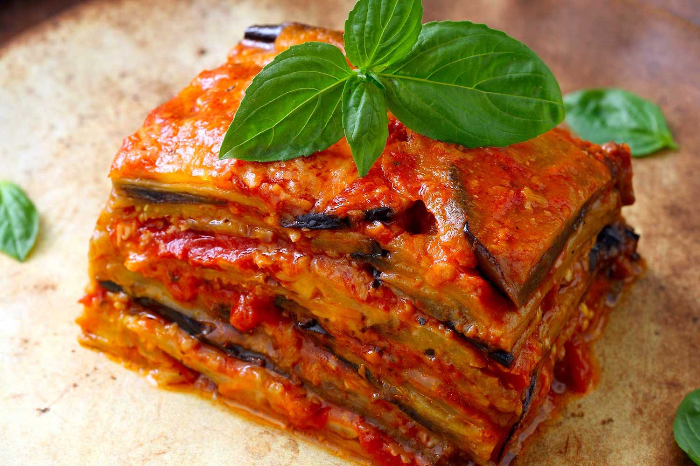

# Melanzane alla Parmigiana

*Italy's eggplant parmigiana: layers of fried eggplant slices, tomato sauce, mozzarella, basil and Parmesan, baked till the top crusts golden and the layers meld into a deeply savoury Italian comfort casserole. The Campania-Sicilia signature dish, vegetarian, extravagant, beloved across Italy.*

**Serves:** 6

**Prep Time:** 30 minutes (plus 45 minutes eggplant salting)

**Cook Time:** 1 hour 15 minutes

## Overview
Melanzane alla Parmigiana is Italy's most iconic eggplant dish (and despite the name suggesting Parma, the dish actually comes from southern Italy - Campania and Sicily - with "parmigiana" referring to the use of Parmesan cheese, not the city): thick slices of aubergine first salted to remove bitterness, then dredged in flour and fried in olive oil till deep golden, layered in a baking dish with thick tomato sauce, fresh mozzarella, fresh basil and grated Parmesan, repeated for 3-4 layers, topped with extra Parmesan and baked till the cheese melts and the top crusts golden. Served warm or at room temperature with crusty Italian bread and salad. Three details define proper melanzane parmigiana. First, salt and drain the eggplant. Removes bitterness and prevents excess oil absorption. Second, fry the eggplant. Don't bake the slices first; the proper texture requires shallow-frying. Third, fresh mozzarella, not pre-shredded. The fresh ball mozzarella (fior di latte; or buffalo) gives the proper melt; pre-shredded mozzarella from a bag has anti-caking agents that prevent proper melting.

## Ingredients

### Eggplants
- 3 large aubergines (about 1.2 kg total; sliced lengthwise into 8 mm slices)
- 3 teaspoons fine sea salt (for salting)
- 200 g plain flour (for dusting)
- 250 ml olive oil (for frying)

### Tomato sauce
- 4 tablespoons olive oil
- 8 garlic cloves (crushed)
- 2 tins (each 400 g) chopped tomatoes; or 800 g tomato passata
- 1 teaspoon caster sugar
- 1 ½ teaspoons fine sea salt
- 1 teaspoon ground black pepper
- 1 large bunch fresh basil (half for sauce, half for layers)
- 1 teaspoon dried oregano

### Cheese layers
- 400 g fresh mozzarella (fior di latte or buffalo; torn into pieces; not pre-shredded)
- 200 g grated Parmesan (or Pecorino Romano)
- 50 g grated Parmesan (for the topping)

### To finish
- Extra fresh basil leaves
- Extra virgin olive oil

## Method

### Stage 1 - Salt and drain
1. Lay eggplant slices on a tray; sprinkle with salt.
2. Let stand 45 minutes; water beads on the surface.
3. Rinse briefly; pat thoroughly dry.

### Stage 2 - Make the tomato sauce
1. Heat 4 tablespoons olive oil in a saucepan over medium heat.
2. Add crushed garlic; cook 30 seconds.
3. Add chopped tomatoes (or passata); cook 20 minutes till thickened.
4. Add sugar, salt, pepper, oregano and half the basil (torn).
5. Take off the heat.

### Stage 3 - Fry the eggplant
1. Dust eggplant slices lightly in flour.
2. Heat 200 ml olive oil in a wide pan over medium-high heat.
3. Fry slices in batches 2 minutes per side till deep golden.
4. Drain on kitchen paper.

### Stage 4 - Layer
1. Preheat oven to 200°C (400°F).
2. Spread a thin layer of tomato sauce in a wide baking dish.
3. Layer 1: aubergine slices (overlapping slightly).
4. Layer 2: tomato sauce.
5. Layer 3: torn mozzarella + grated Parmesan + basil leaves.
6. Repeat layers 3-4 times.
7. End with a top layer of tomato sauce, the remaining grated Parmesan (50 g extra), and torn mozzarella.

### Stage 5 - Bake
1. Bake at 200°C for 30-35 minutes till the top is bubbly, golden and crisp.

### Stage 6 - Rest and serve
1. Take out; rest 15 minutes (the layers firm up).
2. Scatter fresh basil leaves over.
3. Drizzle with extra virgin olive oil.
4. Serve warm.

## Notes
- **Salt and dry the eggplant:** essential.
- **Fry, don't bake:** texture requires frying.
- **Fresh mozzarella, not pre-shredded:** melts properly.
- **Rest 15 minutes before serving:** layers firm up.
- **Better at room temperature next day:** flavours improve.

## Variations
**Lighter (baked eggplant):** instead of frying, brush eggplant with oil and bake at 220°C for 15 minutes per side; less rich.
**With meat (parmigiana di carne):** add a layer of ground beef cooked in the tomato sauce; gives a meat-and-vegetable version.
**With anchovy in sauce:** add 4 anchovy fillets to the tomato sauce; gives umami.
**Smaller individual portions:** make in individual ramekins; gives a fancier dinner-party presentation.

## Serving
In warm wedges with crusty Italian bread and a green salad. Italian red wine. As a vegetarian main or a side to grilled meats.

## Storage
- Keeps refrigerated 4 days; flavour deepens.
- Reheat in covered oven dish at 180°C for 20 minutes.
- Freezes 3 months.
- Day-after is excellent at room temperature.
