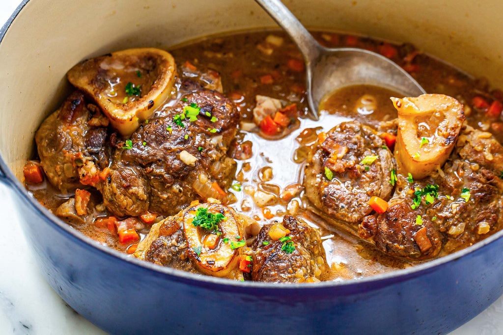

# Osso Buco

*Milan's slow-braised veal shanks: thick cross-cuts of bone-in veal shank slowly braised in white wine, tomato, onion, carrot and stock till the meat falls from the bone and the marrow softens in its bone cavity. Finished with gremolata (lemon-garlic-parsley). The Lombard winter centerpiece, served over saffron risotto Milanese.*

**Serves:** 4

**Prep Time:** 25 minutes

**Cook Time:** 2 hours 30 minutes

## Overview
Osso buco (literally "bone with hole") is Milan's most iconic dish and one of Italy's most beloved slow-braised meat preparations: thick cross-cuts of bone-in veal shank seared, then slowly braised in a base of soffritto (onion, carrot, celery), white wine, tomato, beef stock and aromatics till the veal is meltingly tender and the marrow softens in its bone cavity. Finished with the traditional Milanese gremolata, a vivid mixture of grated lemon zest, finely chopped garlic and fresh parsley scattered over the top just before serving. Traditionally served on a bed of saffron risotto Milanese (the traditional pairing). The bone-in cut is essential for both flavour and the prized marrow. The gremolata is not optional; the bright lemon-garlic-parsley finish is what makes the dish Milanese.

## Ingredients

### Veal shanks
- 4 thick veal shank cross-cuts (about 3-4 cm thick; 350-400 g each, bone-in)
- 1 ½ teaspoons fine sea salt
- 1 teaspoon ground black pepper
- 4 tablespoons plain flour (for dusting)
- 4 tablespoons olive oil
- 2 tablespoons butter

### Soffritto and braise
- 2 large onions (finely chopped)
- 2 large carrots (peeled, finely chopped)
- 2 celery stalks (finely chopped)
- 8 garlic cloves (crushed)
- 4 tablespoons tomato paste
- 300 ml dry white wine
- 400 g chopped tomatoes (tinned)
- 600 ml hot beef stock (or chicken stock)
- 4 bay leaves
- 4 sprigs fresh thyme
- 4 sprigs fresh rosemary
- 1 ½ teaspoons fine sea salt
- 1 teaspoon ground black pepper

### Gremolata
- Zest of 2 lemons (finely grated)
- 4 garlic cloves (very finely chopped)
- 1 large bunch fresh flat-leaf parsley (about 30 g; finely chopped)

### To serve
- Saffron risotto Milanese (the traditional pairing)
- Crusty Italian bread
- Italian red wine (Barbera, Nebbiolo, or Chianti)

## Method

### Stage 1 - Tie and season the shanks
1. Tie kitchen twine around each shank to keep them intact during braising.
2. Pat dry; season with salt and pepper.
3. Dust lightly with flour.

### Stage 2 - Sear the shanks
1. Heat 2 tablespoons olive oil and 1 tablespoon butter in a wide heavy Dutch oven over medium-high heat.
2. Sear the shanks 4-5 minutes per side till deeply golden.
3. Lift out.

### Stage 3 - Soffritto
1. Reduce heat to medium.
2. Add the remaining 2 tablespoons olive oil and 1 tablespoon butter.
3. Add chopped onions, carrots and celery; cook 10 minutes till deeply soft.
4. Add crushed garlic; cook 30 seconds.
5. Add tomato paste; cook 2 minutes till deepened.

### Stage 4 - Add liquid
1. Pour in the white wine; let bubble 3 minutes till mostly reduced.
2. Add chopped tomatoes; cook 3 minutes.
3. Pour in the hot stock.
4. Add bay leaves, thyme, rosemary, salt and pepper.

### Stage 5 - Return shanks and braise
1. Return the shanks to the pot, nestling into the sauce.
2. The liquid should come halfway up the shanks.
3. Bring to a low simmer.
4. Cover with the lid; transfer to a 160°C / 320°F oven.
5. Braise 2-2.5 hours; turn the shanks halfway through.
6. The veal should be fork-tender.

### Stage 6 - Reduce the sauce
1. Lift out the shanks; place on a warm platter.
2. Strain the sauce through a sieve (or leave chunky).
3. Skim excess fat.
4. Return to the pot; reduce 5 minutes till slightly thickened.

### Stage 7 - Make the gremolata
1. Combine the lemon zest, finely chopped garlic and chopped parsley in a small bowl.
2. Mix together.

### Stage 8 - Serve
1. Place a shank on each plate over a portion of saffron risotto Milanese.
2. Spoon reduced sauce over.
3. Scatter generous gremolata over the top.
4. Eat with a small spoon to scoop out the marrow from the bone (the prized part).

## Notes
- **Bone-in veal:** essential for flavour and marrow.
- **Tie the shanks:** keeps them intact.
- **Low-and-slow:** 2-2.5 hours minimum.
- **Gremolata is non-negotiable:** it makes the dish.
- **Eat the marrow:** the centre of the bone has soft marrow, scoop it out.

## Variations
- **Without tomato (alla milanese pura):** the purist Milanese version skips tomato entirely; cooks in white wine and stock only; gives a paler sauce.
- **Beef osso buco:** swap veal for beef shank; cook 30-40 minutes longer for tenderness.
- **Pork osso buco:** swap for pork shank; reduce cooking by 30 minutes.
- **With anchovy in gremolata:** add 1 finely chopped anchovy to the gremolata; gives umami depth.

## Serving
- With saffron risotto Milanese, the traditional pairing. Crusty bread for the sauce. Italian red wine.

## Storage
- Keeps refrigerated 5 days; flavour deepens.
- Reheat in covered oven dish at 160°C for 25 minutes.
- Freezes 3 months.
- Day-after is even better.
