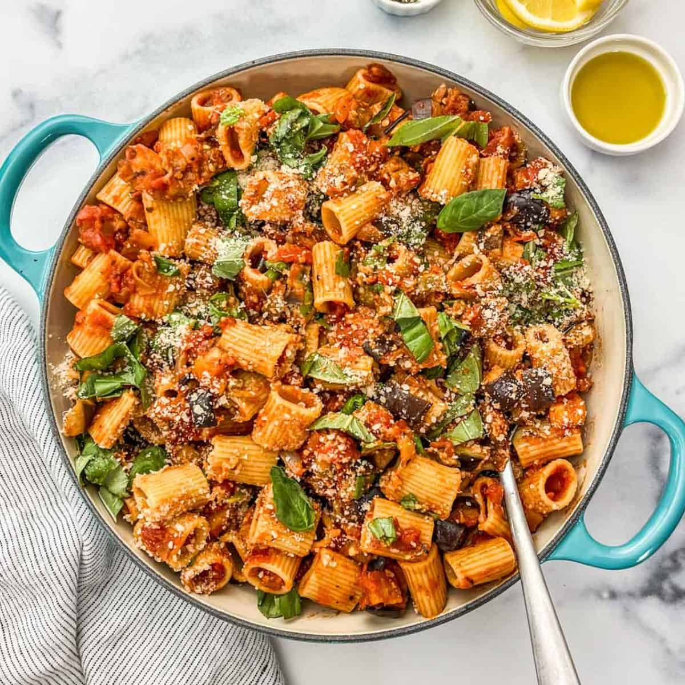

# Pasta alla Norma

*Sicily's eggplant-tomato pasta: short pasta (rigatoni or penne) tossed with a sauce of fried eggplant cubes, garlic-tomato passata, fresh basil and ricotta salata. The Sicilian classic from Catania, named after Bellini's opera - fried eggplant, sweet tomato, salty cheese, a beautiful trio.*

**Serves:** 4

**Prep Time:** 20 minutes (plus 30 minutes eggplant salting)

**Cook Time:** 30 minutes

## Overview
Pasta alla Norma is the iconic pasta of Catania, Sicily, and one of Italy's most beloved vegetarian dishes: short pasta (rigatoni canonical; penne, fusilli or maccheroni all work) tossed with a sauce of cubed aubergine first fried separately in olive oil till deep golden and creamy, combined with a simple garlic-tomato passata and generous fresh basil leaves, topped with grated ricotta salata (the salty crumbly aged ricotta of Sicily; Pecorino Romano substitutes). The dish was supposedly named in the 1920s after Vincenzo Bellini's opera Norma by a Sicilian chef who declared the pasta "a Norma": a Sicilian masterpiece. The aubergine must be fried separately till deeply caramelised; raw aubergine in the sauce gives the wrong texture. The tomato base is just garlic and tomato (no onion, no carrot).

## Ingredients

### Eggplants
- 2 large aubergines (about 800 g; cubed into 2 cm pieces)
- 2 teaspoons fine sea salt (for salting)
- 200 ml olive oil (for frying)

### Tomato sauce
- 4 tablespoons olive oil
- 8 garlic cloves (crushed)
- 1 tin (400 g) chopped tomatoes (or 2 cups tomato passata)
- 1 teaspoon caster sugar (balances acidity)
- 1 ½ teaspoons fine sea salt
- 1 teaspoon ground black pepper
- 1 teaspoon dried oregano
- 1 large bunch fresh basil (chopped, half for sauce, half for finishing)
- 1 teaspoon red pepper flakes (optional)

### Pasta
- 500 g rigatoni or penne pasta
- 4 tablespoons fine sea salt (for pasta water)

### To finish
- 100 g ricotta salata (grated; or Pecorino Romano if unavailable)
- Extra fresh basil leaves
- Extra virgin olive oil for drizzling

## Method

### Stage 1 - Salt and drain the eggplant
1. Cube the aubergines; place in a colander.
2. Sprinkle with the 2 teaspoons of salt; toss.
3. Let drain 30 minutes to draw out moisture.
4. Pat dry thoroughly with paper towels.

### Stage 2 - Fry the eggplant
1. Heat the 200 ml of olive oil in a wide deep frying pan over medium-high heat.
2. Add the eggplant cubes in batches; fry 5-6 minutes till deep golden-brown.
3. Lift out with a slotted spoon; drain on kitchen paper.

### Stage 3 - Make the tomato sauce
1. Heat 4 tablespoons fresh olive oil in a wide saucepan over medium heat.
2. Add the crushed garlic; cook 30 seconds till just fragrant (don't brown).
3. Add the chopped tomatoes (or passata); cook 12-15 minutes till the sauce thickens.
4. Add the sugar, salt, pepper, oregano and red pepper flakes (if using).
5. Stir in half the chopped basil.

### Stage 4 - Cook the pasta
1. Bring a large pot of water to a rolling boil; add the 4 tablespoons of salt.
2. Cook the pasta to al dente (1-2 minutes less than packet instruction).
3. Reserve 200 ml pasta water; drain.

### Stage 5 - Combine
1. Add the fried eggplant to the tomato sauce; stir to combine.
2. Add the drained pasta and 100 ml of the reserved pasta water.
3. Toss for 1 minute till the pasta is fully coated.
4. Stir in most of the remaining basil.

### Stage 6 - Serve
1. Tip into warm pasta bowls.
2. Top generously with grated ricotta salata.
3. Scatter remaining basil leaves.
4. Drizzle with extra olive oil.
5. Serve immediately.

## Notes
- **Fry the eggplant separately:** essential for proper texture.
- **Salt and dry the eggplant:** removes bitterness and prevents oil absorption.
- **Simple tomato sauce:** no onion, no carrot.
- **Ricotta salata canonical:** salty aged ricotta; Pecorino Romano substitutes.
- **Don't overcook the pasta:** al dente.

## Variations
**Baked version (pasta al forno):** assemble and bake at 200°C with extra cheese on top for 15 minutes; gives a baked-pasta version.
**With mozzarella:** add 200 g of cubed mozzarella in the last minute; gives a stringier richer version.
**With anchovy:** add 4 anchovy fillets to the tomato sauce; gives umami (less canonical but valid).
**Spicy version (arrabbiata-style):** double the red pepper flakes; gives a fiery Sicilian version.

## Serving
In warm pasta bowls with the ricotta salata grated generously over. Italian red wine (Sicilian Nero d'Avola, or Chianti). Crusty bread, simple salad.

## Storage
- Best eaten fresh; pasta texture suffers on reheating.
- Sauce alone keeps refrigerated 5 days and freezes 3 months.
- Cook fresh pasta and combine with the reheated sauce.
