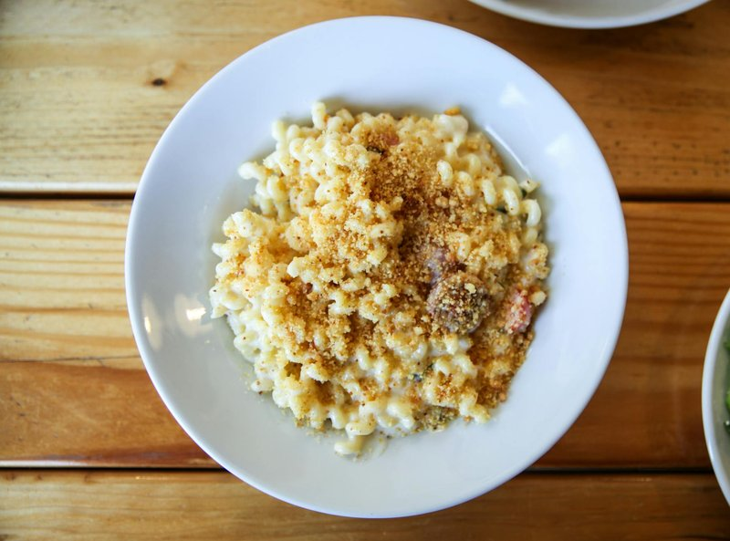

# Crispy Topped Pasta with Courgettes and Salami

*An Italian baked pasta: penne in a silky béchamel with courgettes and salami, buried under a golden Parmesan crust. Comfort with a sharp savoury punch.*

**Serves:** 6

**Prep Time:** 15 minutes

**Cook Time:** 11 minutes

## Overview
This is the baked-pasta dish where salami goes into the sauce instead of on a sandwich, fresh courgettes seared quickly, salami crisped in butter, all bound with a silky bechamel and baked under a golden Parmesan crust. Fresh courgettes slice and sear in olive oil to keep texture; salami chops fine and crisps separately, providing salty richness. A silky homemade bechamel unites everything in a baking dish. The lot bakes under a deep Parmesan crust until crispy and bubbling. The dish works as a first course, main course, or even at room temperature as a cold dish. The textural contrast between creamy sauce and crispy top is the dish's whole point.

## Ingredients

### Courgettes & Salami
- 6 tablespoons extra virgin olive oil
- 2 courgettes (large, cut into 5 mm cubes)
- 250 grams salami Milano (cut into small strips)
- 3 tablespoons fresh flat leaf parsley (chopped)
- salt
- pepper

### Pasta
- 350 grams penne rigate

### Béchamel Sauce
- 50 grams salted butter
- 50 grams plain flour
- 500 ml full-fat milk (cold)
- ½ teaspoon paprika
- Pinch of freshly grated nutmeg
- salt
- pepper

### Topping & Assembly
- 100 grams Parmesan cheese (freshly grated)
- Butter for greasing (2 tablespoons)

## Method

### Stage 1 - Blanch Courgettes
1. Heat the olive oil in a large frying pan over medium heat.
2. Add the courgette cubes and fry for 5 minutes, stirring occasionally.
3. The courgettes should soften but retain their shape and slight firmness.
4. Season with salt and pepper.
5. Set aside to cool slightly.

### Stage 2 - Make Béchamel Sauce
1. Melt the butter in a large saucepan over medium heat.
2. Stir in the flour with a wooden spoon and cook for 1 minute until it turns a light brown color.
3. This "roux" creates the sauce's body.
4. Gradually whisk in the cold milk, pouring slowly whilst whisking to avoid lumps.
5. Reduce the heat to low and cook for 10 minutes, whisking continuously, until the sauce thickens enough to coat the back of a spoon.
6. Stir in the paprika and nutmeg.
7. Season with salt and pepper to taste.
8. Set aside to cool slightly.

### Stage 3 - Cook Pasta
1. Bring a large saucepan of salted water to a boil.
2. Add the penne and cook until al dente.
3. Drain thoroughly and tip into a large mixing bowl.

### Stage 4 - Assemble
1. To the cooked penne, add the courgettes, salami strips, parsley, and half of the Parmesan.
2. Pour in half of the béchamel sauce.
3. Gently mix everything together until well combined and coated with sauce.
4. Preheat the grill to medium-high.
5. Butter a 22 cm round, ovenproof dish with sides at least 4 cm deep.
6. Pour the pasta mixture into the prepared dish.
7. Cover with the remaining béchamel sauce, spreading it evenly.
8. Sprinkle the remaining Parmesan over the top.

### Stage 5 - Grill & Rest
1. Place the dish under the preheated grill.
2. Cook for 12-15 minutes until golden, crispy, and bubbling at the edges.
3. Watch carefully towards the end to prevent burning.
4. Once ready, remove from heat and allow to rest for 5 minutes.
5. The layers will hold together better when rested; it will be easier to cut and serve.

## Notes
- **Béchamel Smoothness:** Whisking the cold milk in gradually prevents lumps. If lumps form, pass through a fine sieve before proceeding.
- **Courgette Texture:** Don't overcook courgettes in Stage 1; they soften more during baking and need to retain some firmness.
- **Grill Watch:** Different grills vary in intensity. Watch the topping carefully; the Parmesan can burn quickly once golden.
- **Rest Time:** The 5-minute rest is crucial; it allows the layers to set, making serving much cleaner.

## Variations
- **Add Garlic:** Include 2 crushed garlic cloves in the oil with the courgettes.
- **Different Salami:** Substitute with pepperoni or soppressata for different flavor profiles.
- **Mushroom Version:** Add 150 grams sliced button mushrooms (séparé from courgettes) to the mix.
- **Spicy Heat:** Add ½ teaspoon chilli flakes to the béchamel.

## Serving
- Serve as: Hot as a main course (serve directly from the dish), warm as a side, or cold as a pasta salad
- Garnish with: Fresh parsley, cracked black pepper
- Pair with: Light red wine (Chianti) or white wine (Pinot Grigio)

## Storage
- Refrigerate leftover baked pasta in an airtight container for up to 3 days
- Reheats well: warm in a 160°C oven until heated through
- Brings to room temperature naturally for a cold pasta salad; holds its shape beautifully
- Do not freeze; the béchamel texture suffers when thawed
