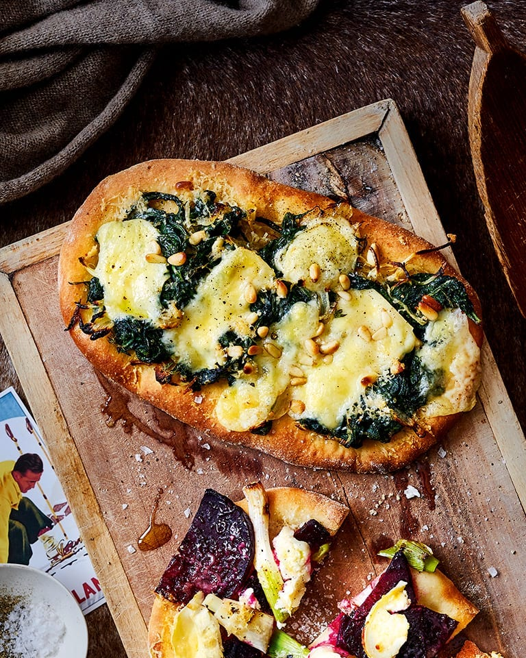

# Spinach and Pine Nut Pinsa Romana

*Pinsa romana is the older, lighter cousin of Roman pizza, made with a mixed-flour dough hydrated to around 80 percent and shaped into an elongated oval. The high water content gives an airy crumb and a beautifully crisp base.*

**Serves:** 2 pinsa bases

**Prep Time:** 15 minutes

**Cook Time:** 18 minutes

## Overview
Pinsa is Rome's lighter, longer-fermented cousin of pizza, and pre-made pinsa bases are one of the better shortcuts in the supermarket. The base is wilted spinach with slowly fried onion, garlic and thyme, the kind of mixture you'd be happy to eat on toast. Spread that over the pinsa, lay torn fontina or mozzarella on top, scatter toasted pine nuts and grated parmesan, and bake briefly at high heat until the cheese is bubbling and the edges of the pinsa go gold. The fontina melts into pools rather than even cover; the pine nuts darken slightly and turn buttery. A vegetarian pizza that doesn't need meat to feel substantial.

## Ingredients

### Spinach Topping
- 2 tablespoons olive oil
- 1 onion (small, thinly sliced)
- 1 garlic clove (thinly sliced)
- 2 teaspoons fresh thyme (chopped)
- 250 grams spinach leaves (washed)
- salt
- pepper

### Pizza
- 2 pinsa romana bases
- 125 grams fontina cheese (or mozzarella, thinly sliced)
- 2 tablespoons pine nuts
- 2 tablespoons grated parmesan cheese

## Method

### Stage 1 - Cook the Spinach Mixture
1. Heat the olive oil in a frying pan over low to medium heat.
2. Add the onion, garlic and thyme with a generous pinch of salt and pepper.
3. Fry gently for 10 minutes, until well softened.
4. Add the spinach and stir until just wilted, about 1 to 2 minutes.
5. Remove from the heat and leave to cool slightly.

### Stage 2 - Heat the Oven
1. Heat the oven to 230°C (210°C fan, gas 8).

### Stage 3 - Top & Bake
1. Divide the spinach mixture between the two pinsa bases.
2. Top each with sliced fontina (or mozzarella).
3. Scatter with pine nuts.
4. Sprinkle with grated parmesan.
5. Bake for 6 to 8 minutes, until the cheese is melted and golden.

## Notes
- **Pinsa romana:** A higher hydration than standard pizza dough, made with a blend of wheat, rice and soy flours, giving an airy, crisp base. Look for it at Italian delis or larger supermarkets.
- **Wilt the spinach first:** Adding raw spinach to the pizza floods the base with water as it cooks. Pre-wilting and squeezing dry is essential.
- **Pine nuts toast in the oven:** They go from raw to golden to burnt in the same minute. Watch the bake closely toward the end.
- **Fontina vs mozzarella:** Fontina has a stronger, nuttier flavour that pairs beautifully with the pine nuts. Mozzarella is fine but milder.

## Variations
**With prosciutto:** Drape thin slices of prosciutto over the hot pizza after baking.
**Mushroom and spinach:** Add 100 grams of sliced sautéed chestnut mushrooms with the spinach for a heartier base.

## Serving
Serve with: A glass of soave or pinot grigio and a peppery leaf salad
Garnish with: A drizzle of truffle oil (a few drops only) for special occasions

## Storage
- Best eaten fresh from the oven; pine nuts and bases lose their crispness on standing
- Spinach mixture keeps 2 days refrigerated and reheats well
- Pinsa bases freeze well; bake from frozen with a few extra minutes
