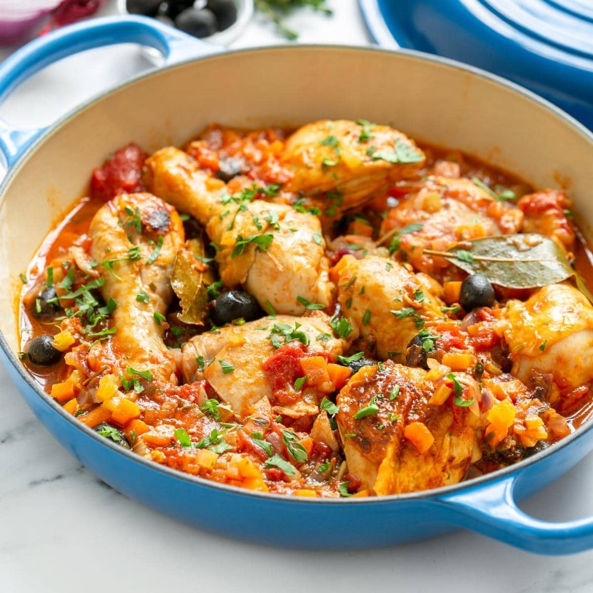

# Pollo alla Cacciatora

*Italy's "hunter's chicken": bone-in chicken pieces slow-cooked in a sauce of onion, garlic, mushrooms, tomato, white or red wine, rosemary, bay leaves and olives. The rustic Italian one-pot - Northern (with red wine and mushrooms) or Tuscan (with white wine and olives) - eaten with bread or polenta.*

**Serves:** 4-6

**Prep Time:** 20 minutes

**Cook Time:** 1 hour

## Overview
Pollo alla cacciatora (literally "hunter-style chicken") is one of Italy's most beloved rustic chicken dishes and a staple of Italian home cooking; the name refers to the way hunters traditionally prepared chicken with simple pantry-and-foraged ingredients. The dish has regional variations: the Northern Italian version (Tuscan, Emilian) uses white wine, olives, capers and herbs; the Central-Northern version (Marche, Umbria) uses red wine, mushrooms and fewer herbs; the Southern version uses tomato more heavily, plus chillies. This recipe gives the Tuscan white-wine version with olives and a touch of tomato - generally considered the canonical northern Italian rendition. Bone-in skin-on chicken pieces give the proper flavour; boneless skinless cuts won't work. Fresh rosemary and sage are the canonical herbs. The cook needs 45 minutes minimum till the chicken is tender and the sauce has reduced.

## Ingredients

### Chicken
- 8 bone-in skin-on chicken pieces (mix of thighs and drumsticks; about 1.2 kg total)
- 1 ½ teaspoons fine sea salt
- 1 teaspoon ground black pepper
- 2 tablespoons plain flour (for dusting)

### Cooking
- 4 tablespoons olive oil
- 2 tablespoons butter
- 1 large onion (sliced)
- 6 garlic cloves (crushed)
- 200 g mushrooms (sliced; cremini or button)
- 2 medium carrots (sliced)
- 1 celery stalk (sliced)
- 3 tablespoons tomato paste
- 1 tin (400 g) chopped tomatoes
- 300 ml dry white wine (Tuscan; Vernaccia, Trebbiano)
- 300 ml chicken stock
- 4 bay leaves
- 4 sprigs fresh rosemary
- 4 sprigs fresh sage
- 1 tablespoon dried oregano
- 1 teaspoon red pepper flakes (optional)
- 1 ½ teaspoons fine sea salt
- 1 teaspoon ground black pepper

### Additions
- 100 g pitted black olives (Taggiasca or Kalamata; sliced)
- 2 tablespoons capers (drained)

### To finish
- 1 large bunch fresh parsley (chopped)
- Fresh rosemary (chopped)

### To serve
- Soft polenta (creamy)
- OR crusty Italian bread
- OR boiled potatoes
- Italian red or white wine

## Method

### Stage 1 - Brown the chicken
1. Pat chicken dry; toss with salt, pepper and flour.
2. Heat olive oil and butter in a heavy casserole over medium-high heat.
3. Brown chicken 4 minutes per side till deep golden.
4. Lift out.

### Stage 2 - Sauté vegetables
1. Reduce heat to medium.
2. Add sliced onion, carrots, celery; cook 8 minutes till soft.
3. Add garlic; cook 30 seconds.
4. Add mushrooms; cook 5 minutes till they release water and the water evaporates.

### Stage 3 - Build sauce
1. Add tomato paste; cook 2 minutes till deepened.
2. Pour in white wine; let bubble 2 minutes.
3. Add chopped tomatoes; cook 3 minutes.
4. Pour in chicken stock.
5. Add bay leaves, rosemary, sage, oregano, red pepper flakes, salt and pepper.

### Stage 4 - Return chicken
1. Return browned chicken to the pot; nestle into sauce.
2. Bring to a simmer; reduce heat to low.
3. Cover with the lid slightly ajar.
4. Cook 35-40 minutes till the chicken is tender.

### Stage 5 - Add olives and capers
1. Add the olives and capers.
2. Continue simmering uncovered for 10 minutes; the sauce should reduce slightly to a thick coating.

### Stage 6 - Finish
1. Lift out bay leaves and woody herb stems.
2. Stir in most of the chopped parsley.
3. Taste; adjust salt.

### Stage 7 - Serve
1. Spoon soft polenta (or other accompaniment) onto plates.
2. Place 2 chicken pieces on top with plenty of sauce.
3. Scatter remaining parsley and fresh rosemary.
4. Serve with crusty bread on the side.

## Notes
- **Bone-in skin-on chicken:** essential.
- **Brown before braising:** fond is key.
- **White wine for Tuscan version; red for northern:** both valid.
- **Slow-cook 45+ minutes:** for tenderness.
- **Olives and capers at the end:** preserve their texture and brightness.

## Variations
**Northern with red wine and mushrooms:** swap white wine for red; double the mushrooms; skip olives.
**Southern with chillies:** add 2 chopped fresh chillies; use red wine; gives Calabrian-leaning version.
**With pancetta:** add 100 g of diced pancetta browned at the start.
**Pheasant or rabbit:** the canonical "hunter's" version uses game; same technique.

## Serving
With soft polenta, crusty bread, or boiled potatoes. Italian wine. Simple salad.

## Storage
- Keeps refrigerated 4 days.
- Reheat covered with a splash of stock.
- Freezes 3 months.
- Day-after is even better.
