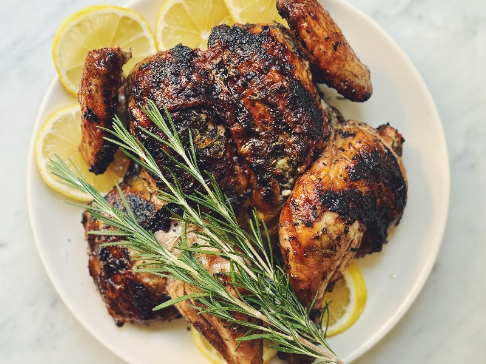

# Pollo Alla Diavola

*Italy's devil's chicken: spatchcocked and marinated in lemon, garlic, pepper and chilli, pressed under a brick on a screaming-hot grill.*

**Serves:** 4

**Prep Time:** 20 minutes (plus 2 hours marinating, ideally overnight)

**Cook Time:** 40 minutes

## Overview
Two things define the dish: ferocious black pepper and dried chilli (the "diavola" is both flavour and theatre), and the crackling-glassy skin that only comes from pressing the bird flat onto screaming-hot cast iron. The marinade is olive oil, lemon zest, smashed garlic, coarsely cracked peppercorns, peperoncino and rosemary, aromatic, sharp, properly spiced but never one-note. When the chicken hits the pan you get a wave of rosemary-and-pepper smoke; the lemon comes through later, brighter, especially when the cut halves are charred alongside. The technique looks intimidating (spatchcock, brick, smoking pan) but it's one of the more forgiving things you can do with a whole chicken: the weight forces consistent contact, the marinade tenderises, and the temperature is high enough that timing has real tolerance. A standard of Roman trattorie and the Tuscan summer grill, where both regions claim it; one origin story says the name comes from the devilish pepper, another says it's the way the bird is "tortured" flat under weight. Either way, it's a centuries-old solution to cooking a whole bird quickly over an open fire.

## Ingredients

### Chicken
- 1 whole chicken, 1 ½-1.8 kg (free-range or organic if you can - the flavour matters here)

### Marinade
- 6 tablespoons extra-virgin olive oil
- 2 lemons (zest)
- 1 lemon (save the second for serving, juice)
- 6 garlic cloves (smashed flat with the side of a knife)
- 2 tablespoons whole black peppercorns (cracked coarsely in a mortar - not ground to dust)
- 2 tablespoons dried chilli flakes (peperoncino; Calabrian if you can find it, otherwise standard crushed red pepper)
- 1 tablespoon sweet smoked paprika
- 4 sprigs fresh rosemary (leaves stripped and roughly chopped)
- 2 teaspoons sea salt flakes
- 1 teaspoon dried oregano (optional, Sicilian-leaning)

### To serve
- 1 lemon, halved (for grilling/charring alongside)
- Extra peperoncino, for the table
- Maldon salt for finishing
- Crusty Italian bread (or grilled ciabatta)
- A green salad dressed with olive oil and lemon

### Equipment
- A cast-iron pan large enough to hold the spatchcocked bird, or a grill with a lid
- A brick wrapped in two layers of foil (or a second heavy pan to press)
- Kitchen shears or a sharp knife (for spatchcocking)

## Method

### Stage 1 - Spatchcock the chicken
1. Place the chicken breast-down on a board.
1. With kitchen shears, cut down each side of the backbone and remove it (save for stock).
1. Turn the bird over and press down firmly on the breastbone with the heel of your hand to crack it and flatten the bird. A clear cracking sound is what you're after.
1. Pat dry with kitchen paper. The drier the skin, the better the char.

### Stage 2 - Marinate
1. In a wide dish or large zip-bag, combine the olive oil, lemon zest, lemon juice, smashed garlic, cracked black peppercorns, peperoncino, smoked paprika, rosemary, salt and oregano.
1. Add the spatchcocked chicken. Massage the marinade into both sides and into the skin folds.
1. Cover (or seal the bag); refrigerate at least 2 hours. Overnight is much better; 24 hours is best.
1. Bring to room temperature **30 minutes before cooking**. Cold meat won't take the char properly.

### Stage 3 - Heat the cooking surface
1. **Indoor (cast iron):** heat a large cast-iron pan over high heat for 5-7 minutes until it's smoking lightly. Set the oven to 220°C (200°C fan / 425°F).
1. **Outdoor (grill):** light the grill for a medium-high direct fire (you should only be able to hold your hand over for 3 seconds at grate height). For charcoal, build a 2-zone fire.

### Stage 4 - Press and char
1. Lift the chicken from the marinade (let the excess drip off; don't wipe).
1. Place it **skin-side down** on the hot pan or grill.
1. Press the foil-wrapped brick (or second pan) directly onto the bird. Use it as a weight, not a hammer. The skin must be in full contact with the surface.
1. Cook 12-15 minutes **without disturbing**, until the skin is deeply browned and crispy. A glance under one corner is fine; lifting the whole bird is not.

### Stage 5 - Flip and finish
1. Lift away the weight. Flip the chicken **skin-side up**.
1. **Indoor:** transfer the whole pan to the hot oven. Roast 18-22 minutes until a thermometer in the thickest part of the thigh reads 75°C / 165°F.
1. **Outdoor:** move the bird to the cooler zone of the grill, close the lid, and cook 20-25 minutes to the same internal temperature.
1. Add the halved lemons cut-side-down to the pan or grill for the last 3-4 minutes so the cut faces char.

### Stage 6 - Rest and serve
1. Lift the bird onto a board. Rest 8-10 minutes, loosely tented with foil.
1. Carve into legs, thighs, wings, and breast halves.
1. Arrange on a warm platter with the charred lemon halves.
1. Scatter extra peperoncino and Maldon salt over the top.
1. Squeeze the second fresh lemon over just before serving.
1. Eat with crusty bread to mop up the spiced oil, and a green salad alongside.

## Notes
- **The brick is the point:** without weight, the skin won't crackle. A brick wrapped in foil is traditional; two heavy cast-iron pans work fine. Improvise; the principle is pressure.
- **Peperoncino quantity:** 2 tablespoons sounds like a lot. It is. But the dish is named after the devil. For mild palates, halve to 1 tablespoon; the flavour is still distinctly diavola.
- **Cracked, not ground:** black peppercorns must be cracked coarse, not pulverised. The bite of half-broken peppercorns is half the dish.
- **Don't add herbs that burn:** rosemary handles the heat. Basil and parsley have no place here - they scorch and turn bitter on the grill.
- **Free-range chicken matters:** the marinade is intense, but the chicken still has to carry it. A factory broiler reads as "chilli on poultry"; a free-range bird tastes of chicken with chilli on top.

## Storage
- Best eaten straight off the bird; the cracked skin softens overnight.
- Leftover meat is excellent stripped from the bone and tossed into a salad with cannellini beans, olive oil and lemon the next day.
- The marinade can be made 3 days ahead and refrigerated; the chicken can sit in it up to 24 hours.
