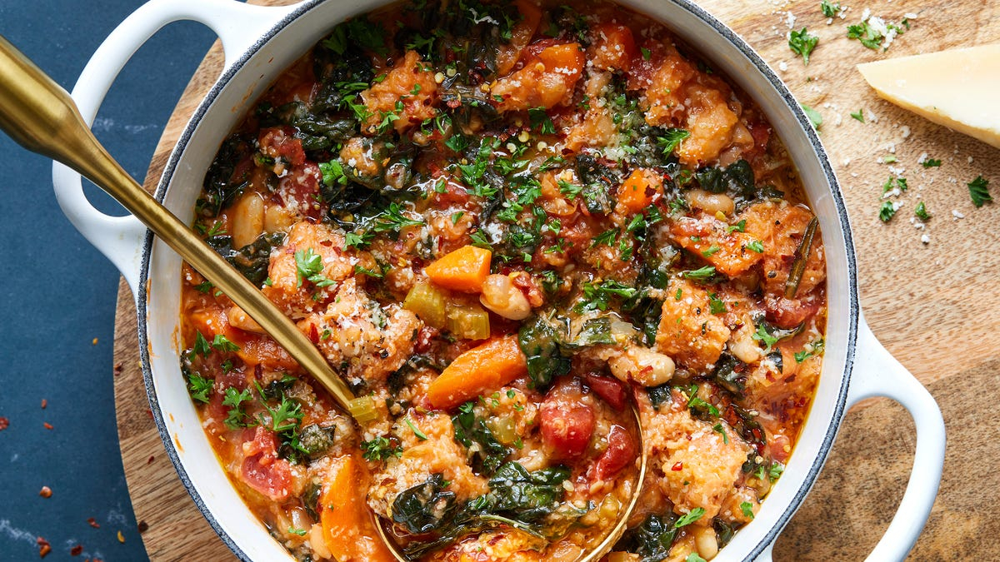

# Ribollita

*Tuscany's bread-and-bean soup: a thick "reboiled" Tuscan vegetable soup of cannellini beans, cavolo nero (Tuscan kale), Savoy cabbage, carrots, celery, onion, garlic and tomato, slow-cooked then layered with stale Tuscan bread and reheated till the bread breaks down into the soup. The rural-tradition Tuscan winter classic; turning yesterday's leftovers into something even better.*

**Serves:** 6-8

**Prep Time:** 25 minutes (plus overnight bean soaking)

**Cook Time:** 2 hours

## Overview
Ribollita (literally "reboiled", referring to the way leftover Tuscan vegetable soup is reheated with stale bread to create a new dish) is one of Italy's most iconic rural soups and the traditional Tuscan winter centrepiece: dried cannellini beans soaked overnight, slow-cooked into a thick vegetable soup with cavolo nero (Tuscan kale), Savoy cabbage, carrots, celery, onion, garlic, tomato and rosemary. The next day the soup is layered in a baking dish with thick slices of stale Tuscan bread (the unsalted pane sciocco) and reheated together till the bread breaks down into the soup, creating a thick, almost spoonable mass. Served with a generous drizzle of olive oil, a grating of Parmesan and fresh black pepper. A cornerstone of cucina povera; the reboiling with bread is the traditional step, not a garnish. Cannellini from dried gives the deepest result; cavolo nero is essential (curly kale or Savoy cabbage substitute).

## Ingredients

### Beans
- 400 g dried cannellini beans (soaked overnight, drained)
- 2 litres cold water
- 1 small onion (whole, peeled)
- 4 garlic cloves (whole, crushed)
- 2 bay leaves
- 1 teaspoon fine sea salt

### Soffritto
- 6 tablespoons olive oil
- 1 large onion (chopped)
- 3 large carrots (chopped)
- 2 celery stalks (chopped)
- 8 garlic cloves (crushed)
- 4 tablespoons tomato paste
- 1 tin (400 g) chopped tomatoes

### Vegetables
- 400 g cavolo nero (Tuscan kale; or curly kale; ribs removed, leaves chopped)
- 400 g Savoy cabbage (cored, shredded)
- 2 medium potatoes (cubed)
- 100 g chard (chopped, optional)

### Liquid
- 2 litres hot vegetable stock (or use the bean cooking liquid as base + extra)
- 4 bay leaves
- 3 sprigs fresh rosemary
- 2 sprigs fresh thyme
- 2 sprigs fresh sage
- 1 ½ teaspoons fine sea salt
- 1 teaspoon ground black pepper
- 1 teaspoon red pepper flakes (optional)

### Bread (for the second-day "reboiling")
- 8 thick slices stale Tuscan bread (unsalted "pane sciocco"; or any sturdy stale country bread)

### To finish
- 100 ml extra virgin olive oil (for drizzling)
- 100 g grated Parmesan
- Freshly ground black pepper
- Fresh herbs

## Method (two-day approach)

### Day 1 - Make the soup

### Stage 1 - Cook the beans
1. Place soaked drained beans in a pot with the water, whole onion, garlic, bay leaves and salt.
2. Bring to a boil; reduce to a simmer.
3. Cook 60-90 minutes till tender.
4. Drain (reserve cooking liquid); set aside half the beans whole; mash the other half with a fork.

### Stage 2 - Soffritto
1. Heat the olive oil in a large heavy pot over medium heat.
2. Add chopped onion, carrots and celery; cook 12 minutes till soft.
3. Add crushed garlic; cook 30 seconds.
4. Add tomato paste; cook 2 minutes.
5. Add chopped tomatoes; cook 5 minutes.

### Stage 3 - Build the soup
1. Add all the cavolo nero, Savoy cabbage, potatoes and chard (if using).
2. Cook 5 minutes till the greens wilt.
3. Add the whole-and-mashed beans.
4. Pour in 1.5 litres of vegetable stock (or bean cooking liquid).
5. Add bay leaves, rosemary, thyme, sage, salt, pepper, red pepper flakes.

### Stage 4 - Simmer
1. Bring to a simmer; partially cover.
2. Cook 45-60 minutes till the vegetables are tender and the soup has thickened.
3. Stir occasionally.

### Stage 5 - Rest overnight
1. Take off the heat; cool slightly.
2. Refrigerate overnight (or at least 4 hours).

### Day 2 - The "ribollita"

### Stage 6 - Reheat with bread
1. Bring the soup back to a simmer in the same pot (or transfer to a deep oven-proof dish).
2. Tear the stale bread into chunks (or thick slices).
3. Layer the bread chunks into the soup (or in alternating layers in a dish).
4. Reheat for 20-30 minutes; the bread soaks up the liquid and breaks down into the soup.
5. The texture should be thick and porridge-like; almost spoonable.

### Stage 7 - Serve
1. Ladle into wide deep bowls.
2. Drizzle generously with extra virgin olive oil.
3. Top with grated Parmesan and freshly ground black pepper.
4. Serve hot.

## Notes
- **Dried cannellini beans:** the Tuscan traditional.
- **Cavolo nero:** essential Tuscan kale; substitute with curly kale.
- **Stale bread:** essential.
- **Two-day approach:** the "reboiling" is the point.
- **Generous olive oil at the end:** Tuscan signature.

## Variations
**With pancetta:** add 100 g of diced pancetta to the soffritto; less traditional but common.
**Quicker single-day version:** make the soup; add bread in the last 30 minutes; eat the same day. Less traditional.
**With Parmesan rind:** add a Parmesan rind to the simmering soup; gives deep umami.
**Without potatoes:** purist Tuscan version skips potatoes; the bread is the carb.

## Serving
In wide deep bowls with generous olive oil, Parmesan and pepper. Crusty bread on the side. Tuscan red wine (Chianti, Brunello).

## Storage
- Keeps refrigerated 5 days; the dish improves over the first 2 days.
- Reheat in a covered pan with a splash of stock if needed.
- Freezes 3 months; defrost and reheat with fresh bread.
