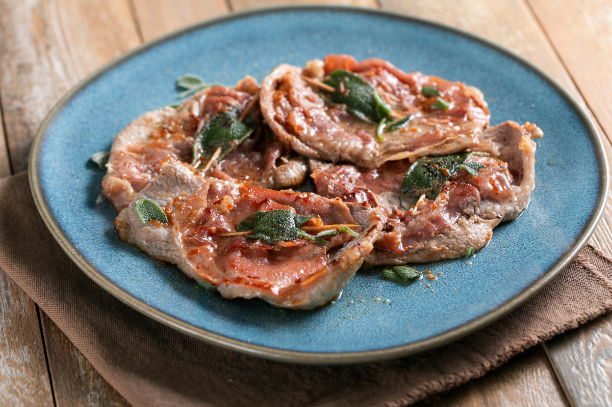

# Saltimbocca alla Romana

*Rome's veal-prosciutto-and-sage classic: thin veal escalopes topped with prosciutto and fresh sage leaves, pan-fried briefly in butter and white wine till the prosciutto crisps and the veal is just cooked. The Roman trattoria classic - saltimbocca means "jumps in the mouth", named for the dish's vibrant flavours.*

**Serves:** 4

**Prep Time:** 15 minutes

**Cook Time:** 12 minutes

## Overview
Saltimbocca alla Romana (literally "jumps in the mouth, Roman-style") is one of Rome's most beloved trattoria classics and a study in Italian simplicity: thin veal escalopes pounded flat, topped with a slice of prosciutto crudo (Italian dry-cured ham; Parma or San Daniele preferred) and a single fresh sage leaf, fastened together with a toothpick, briefly pan-fried in butter till the prosciutto crisps, then deglazed with dry white wine to form a glossy pan sauce. Served immediately on warm plates with the canonical Roman side of buttered green peas (or sautéed spinach with garlic). The dish takes 15 minutes from start to finish once the veal is prepped; the Roman point is freshness, simplicity and quality of ingredients. Three details define proper saltimbocca. First, very thin veal escalopes. Pounded to 5 mm; the meat should cook in 90 seconds per side. Thicker meat gives uneven cooking. Second, real prosciutto crudo. Italian dry-cured ham; Parma or San Daniele. Substitute with serrano in a pinch. Third, fresh sage leaves. Dried sage doesn't substitute; the fresh leaf is part of the visual and flavour.

## Ingredients

### Veal and toppings
- 8 thin veal escalopes (about 80 g each; pounded to 5 mm thick); OR thinly sliced top sirloin
- 8 slices prosciutto crudo (Parma or San Daniele; about 100 g total)
- 16 large fresh sage leaves (2 per escalope)
- 1 teaspoon fine sea salt (light; prosciutto is salty)
- 1 teaspoon ground black pepper

### Cooking
- 4 tablespoons butter
- 2 tablespoons olive oil
- 200 ml dry white wine (Italian - Frascati, Pinot Grigio, Verdicchio)
- 60 ml beef stock (optional; for richer sauce)
- 2 tablespoons additional butter (for finishing the sauce)
- 1 tablespoon fresh lemon juice
- 1 tablespoon fresh chopped parsley (for finishing)

### To serve
- Buttered green peas (canonical Roman side)
- OR sautéed spinach with garlic
- Lemon wedges

## Method

### Stage 1 - Prep the veal
1. Pat veal escalopes dry.
2. Place between two sheets of cling film; pound with a meat mallet (or rolling pin) to 5 mm thickness.
3. Season very lightly with salt and pepper (the prosciutto will add salt).

### Stage 2 - Top with prosciutto and sage
1. Lay one slice of prosciutto over each veal escalope (trim to fit if needed).
2. Place 1 sage leaf on top of each.
3. Secure with a toothpick through all three layers (a single toothpick passes vertically through the centre).
4. Repeat for all 8 escalopes.

### Stage 3 - Cook
1. Heat 2 tablespoons butter and the olive oil in a wide heavy pan over medium-high heat.
2. When the butter is foaming, place the escalopes prosciutto-side-down (sage-side-down) in the pan.
3. Cook 90 seconds; the prosciutto should crisp.
4. Flip; cook the veal side 90 seconds till just cooked through.
5. Work in batches; lift onto a warm plate.

### Stage 4 - Make the pan sauce
1. Reduce heat to medium; deglaze the pan with the white wine.
2. Let bubble 2 minutes till reduced by half.
3. Add the beef stock (if using); reduce 1 minute more.
4. Take off the heat; whisk in the additional 2 tablespoons butter and the lemon juice.
5. The sauce should be glossy.

### Stage 5 - Plate
1. Place 2 saltimbocca per plate; remove toothpicks.
2. Spoon the pan sauce over.
3. Scatter chopped parsley.
4. Add buttered peas (or sautéed spinach) alongside.
5. Lemon wedges.

## Notes
- **Very thin veal:** pound to 5 mm.
- **Real prosciutto crudo:** Italian dry-cured ham.
- **Fresh sage leaves:** dried doesn't work.
- **Cook 90 seconds per side:** longer gives tough meat.
- **Don't oversalt:** prosciutto is salty.

## Variations
**Chicken saltimbocca:** swap veal for thin chicken breast escalopes; less canonical but accessible substitute.
**Pork saltimbocca:** swap for thin pork loin escalopes.
**Without wine:** swap wine for chicken stock + 1 tablespoon white wine vinegar.
**Cheese saltimbocca:** add a thin slice of fontina or provolone under the prosciutto; gives a richer melting version.

## Serving
On warm plates with peas or spinach alongside. Italian white wine (Frascati for the Roman pairing). Crusty bread, simple salad.

## Storage
- Best eaten immediately.
- Cooked saltimbocca keeps refrigerated 2 days; reheat briefly in a pan.
- Don't freeze.
