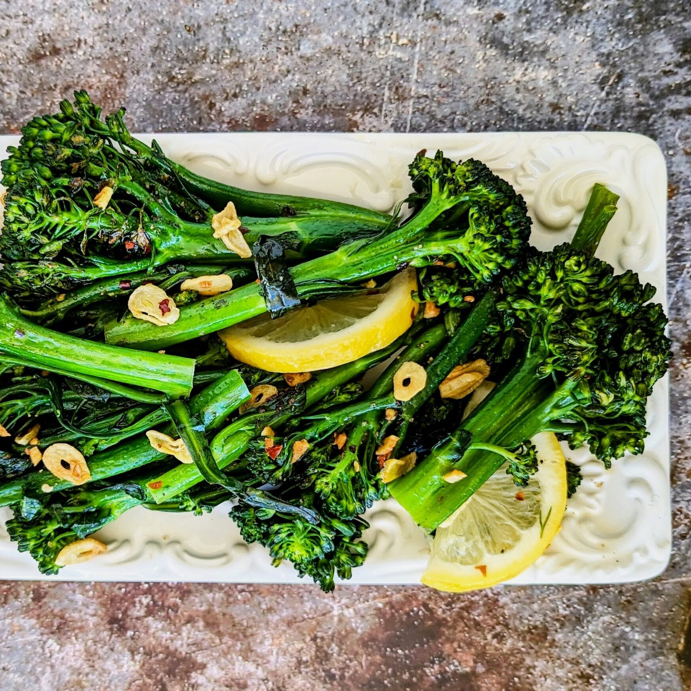

# Broccolini all'Aglio

*Italy's garlic broccolini: long-stemmed broccolini blanched, then sautéed in olive oil with lots of crushed garlic, red pepper flakes, lemon zest and a splash of pasta water. The Italian everyday green side, quick, garlicky, properly Mediterranean.*

**Serves:** 4

**Prep Time:** 10 minutes

**Cook Time:** 10 minutes

## Overview
Broccolini all'aglio (literally "broccolini with garlic"; broccolini is a hybrid between broccoli and Chinese kale, long thin stems with small florets) is Italy's everyday green vegetable side and one of the most beloved Italian preparations of the cruciferous family: broccolini blanched briefly in salted water, then sautéed in olive oil with lots of crushed garlic, red pepper flakes, a touch of lemon zest, salt and pepper, finished with a splash of lemon juice. The dish takes 10 minutes once the water boils; it's the traditional Italian green side that turns up alongside any main course or as part of an antipasto platter. Substitute with broccoli rabe (rapini), regular broccoli florets, or sprouting broccoli outside the seasonal availability of broccolini. Blanch first; a 90-second blanch in salted water cooks the broccolini just enough, and the sauté then crisps and flavours. Plenty of garlic, sliced thin rather than crushed for more visible texture. And generous olive oil, the Italian standard.

## Ingredients

- 600 g broccolini (or broccoli rabe; or regular broccoli florets); trimmed
- 2 tablespoons salt (for blanching water)
- 6 tablespoons extra virgin olive oil
- 8 garlic cloves (sliced thin)
- 1 teaspoon red pepper flakes
- 1 teaspoon fine sea salt
- ½ teaspoon ground black pepper
- Zest of 1 lemon
- 1 tablespoon fresh lemon juice
- Extra olive oil for finishing

## Method

### Stage 1 - Blanch
1. Bring a large pot of salted water to a rolling boil.
2. Add the broccolini; blanch 90 seconds.
3. Drain; rinse briefly under cold water to stop the cooking.

### Stage 2 - Sauté garlic
1. Heat the olive oil in a wide pan over medium heat.
2. Add the sliced garlic; cook 60 seconds till just pale gold.
3. Add the red pepper flakes.

### Stage 3 - Add broccolini
1. Add the blanched broccolini to the pan.
2. Sauté 4-5 minutes, tossing, till the broccolini is tender and slightly charred at the edges.
3. Add the salt, pepper and lemon zest.

### Stage 4 - Finish
1. Squeeze lemon juice over.
2. Drizzle extra olive oil.

### Stage 5 - Serve
1. Tip onto a serving plate.
2. Serve warm.

## Notes
- **Blanch first:** for proper tenderness.
- **Plenty of garlic, sliced.**
- **Don't brown the garlic:** pale gold only.
- **Lemon at the end:** brightness.

## Variations
- **With anchovy:** add 2 anchovy fillets to the oil with the garlic; gives umami.
- **With pine nuts:** add 30 g of toasted pine nuts; gives crunch.
- **With raisins:** add 30 g of raisins; gives sweetness (Sicilian style).
- **Cheesy:** add 50 g of grated Parmesan at the end.

## Serving
- **Alongside any Italian main:** bistecca, osso buco, pasta, fish.

## Storage
- Best eaten warm.
- Keeps refrigerated 3 days; reheat briefly.
- Don't freeze.
