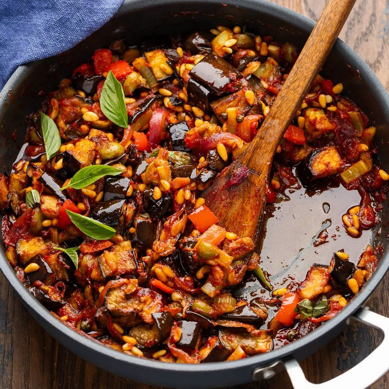

# Caponata

*Sicily's sweet-and-sour aubergine relish: fried aubergine folded through a celery-and-tomato base with olives, capers and pine nuts.*

**Serves:** 6 (as a side)

**Prep Time:** 25 minutes (plus 30 min salting)

**Cook Time:** 45 minutes

## Overview
Aubergine cubes are salted to weep, fried hard in olive oil to deep gold, and reserved. A separate pan is used to soften diced onion and sliced celery in olive oil; garlic joins briefly; chopped tomatoes simmer with red wine vinegar and sugar to make the agrodolce base. Green olives, capers, sultanas (optional) and toasted pine nuts are stirred in. The fried aubergine is returned and simmers for 10 minutes to meld. Off heat, fresh basil is scattered. Rested at least 2 hours (ideally overnight) before serving at room temperature.

## Ingredients

### The aubergines
- 800 g aubergines (2 large, cut into 2 cm cubes)
- 2 teaspoons fine salt (for salting)
- 100 ml olive oil (for frying)

### The agrodolce base
- 1 onion (large, diced)
- 3 celery stalks (sliced 5 mm)
- 4 garlic cloves (sliced)
- 1 (400 g) tin chopped tomatoes (or 400 g ripe fresh tomatoes, peeled and chopped)
- 4 tablespoons red wine vinegar
- 2 tablespoons caster sugar

### The fold-ins
- 80 g green olives (Castelvetrano or Cerignola, pitted and halved)
- 3 tablespoons capers (drained, rinsed)
- 50 g pine nuts (toasted in a dry pan 3 minutes until just gold)
- 30 g sultanas (optional but traditional)
- 1 small bunch fresh basil (about 20 g, roughly torn)

### To finish
- 1 teaspoon salt (to taste)
- ½ teaspoon black pepper
- Extra-virgin olive oil to drizzle
- Crusty bread to serve

## Method

### Stage 1 - Salt the aubergine
1. Place cubes in a colander set over a bowl; toss with 2 teaspoons fine salt.
1. Rest 30 minutes - the cubes will weep visible droplets of dark liquid.
1. Rinse briefly under cold water; squeeze and pat very dry with kitchen paper. Wet cubes soak oil; dry cubes fry crisp.

### Stage 2 - Fry the aubergine
1. Heat 100 ml olive oil in a wide pan over medium-high heat.
1. Fry the aubergine in 2 batches, 6-8 minutes per batch, turning occasionally, until deep golden and tender.
1. Lift onto kitchen paper.

### Stage 3 - Build the base
1. Pour off all but 3 tablespoons of the cooking oil into the original pan.
1. Add diced onion and sliced celery; reduce to medium heat.
1. Cook 8-10 minutes, stirring occasionally, until the onion is soft and the celery just yielding.
1. Add the sliced garlic; cook 1 more minute.

### Stage 4 - Tomato and agrodolce
1. Tip in the chopped tomatoes.
1. Pour in the red wine vinegar; sprinkle in the caster sugar.
1. Simmer 12-15 minutes uncovered until reduced to a thick glossy sauce - the colour deepens to a deep red-brown.

### Stage 5 - Fold in
1. Stir in olives, capers, pine nuts and sultanas (if using).
1. Cook 2 minutes to integrate.

### Stage 6 - Return the aubergine
1. Add the fried aubergine; toss gently - don't break it up.
1. Simmer 8 minutes more. Taste; balance with extra vinegar (for sharpness), sugar (for sweetness), salt and pepper.

### Stage 7 - Rest
1. Off heat; stir in torn basil.
1. Cool to room temperature.
1. Refrigerate at least 2 hours (ideally overnight) - caponata is one of those dishes that genuinely transforms with a day's rest.

### Stage 8 - Serve
1. Bring back to room temperature.
1. Pile into a wide shallow dish; drizzle with extra-virgin olive oil.
1. Serve with crusty bread, alongside grilled fish, on bruschetta, or as antipasto.

## Notes
- **Salt the aubergine, pat it dry:** This is the technique. Skipping the salt step gives bitter, mushy, oil-saturated cubes. The 30-minute weep + thorough pat-dry produces crisp golden aubergine that holds its shape in the relish.
- **Agrodolce balance is by taste:** Vinegar and sugar are the soul of caponata. The ratios in the recipe are a starting point - taste at Stage 6 and adjust until the sweet and sour are in tension, not pulling apart. A common Sicilian habit: a fraction more sugar than feels right; the dish needs sweetness to round the vinegar.
- **Day-two is the dish:** Caponata served the day it's made is good. Day two is dramatically better. The flavours meld, the aubergine drinks in the agrodolce, the relish becomes a single thing rather than separate parts.

## Storage
- Refrigerate 5 days in a sealed glass jar; bring to room temperature 30 minutes before serving.
- Freezes 2 months. Defrost overnight in the fridge.
